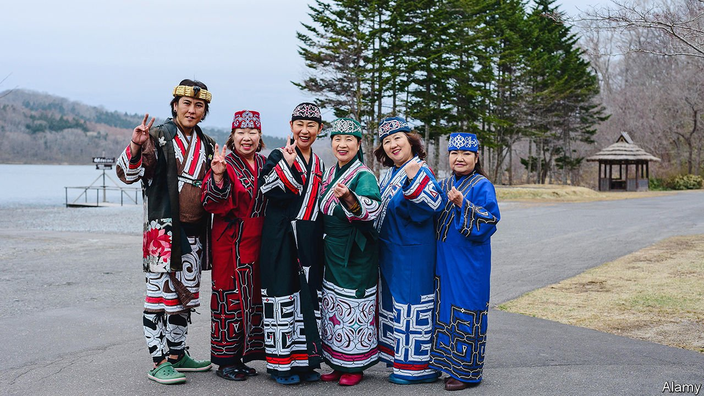

###### The stories we tell

# Japan’s Ainu people have a new museum. Many feel it omits a lot 

##### The history of Hokkaido’s indigenous folk has been cruel 

 

> Jun 24th 2021 

FROM A DISTANCE, the National Ainu Museum glistens. When the sleek concrete-and-glass structure opened in 2020, it became the first national museum dedicated to the oft-forgotten indigenous people of Hokkaido, Japan’s northernmost big island. “Visitors come knowing next to nothing about the Ainu,” says Tamura Masato, a curator. The museum promotes a message of “ethnic harmony” and takes its name from an Ainu word, upopoy, meaning “singing together in a large group”.

Yet for many Ainu, Upopoy epitomises the problems with Japan’s approach to indigenous people. The government is happy to talk about preserving Ainu culture, but prefers not to discuss why Ainu culture was threatened at all. Japanese officials refuse to apologise for past misdeeds.


The Ainu have lived for centuries on modern-day Hokkaido, as well as the nearby Sakhalin and the Kurile Islands (which are both controlled by Russia). Japanese settlers arrived en masse after the Meiji restoration in the late 19th century, when the Japanese government claimed Hokkaido as its own and handed out land free of charge, much as America did to settlers in its vast interior. The Japanese spread diseases and enslaved the local population, forcing the Ainu to adopt Japanese names and the Japanese language. The first law about the Ainu, passed in 1899, made assimilation official policy.

Over the decades, the Ainu population shrank and their culture withered. Only a handful of native speakers of Ainu remain. A survey conducted in 2017 found just over 13,000 Ainu in Hokkaido, though the number of people with Ainu roots is probably much higher. Many fear discrimination or have moved and mixed with the Japanese population. Those who do identify as Ainu are less likely to go to college and earn less than their Japanese neighbours. They can have trouble getting jobs because employers sometimes see them as lazier and less intelligent, an extension of colonial-era stereotypes. They also report romantic difficulties because partners’ families see them as belonging to a lower class.

Japanese are taught little about the Ainu. “I had heard the word ‘Ainu’ in history class, but just the name,” says Kobayashi Maki, a Tokyoite visiting Upopoy. That is in part because the Ainu complicate stories that Japanese tell about themselves. Japanese conservatives treasure the idea of Japan as an ethnically homogeneous nation; the existence of an ethnically distinct minority undermines that. They prefer to portray the growth of the Japanese empire, both in its neighbouring islands and further abroad in Asia, as a process of expansion and modernisation; the Ainu see it as colonialism. “People don’t realise this is part of the colonial history, they think Hokkaido has always been Hokkaido,” says Kitahara Jirota of Hokkaido University.

Some progress has been made. Kayano Shigeru became the first Ainu elected to the Japanese Diet, in 1994; his campaigning led to the repeal of the century-old assimilationist law. In 2007 Japan signed the United Nations Declaration on the Rights of Indigenous Peoples (UNDRIP), which enshrines a host of rights. The following year, the government recognised the Ainu as an indigenous group for the first time. Ainu have become more visible recently, thanks in part to “Golden Kamuy”, a hit manga and anime series featuring Ainu heroes. A law passed in 2019 bans discrimination on the basis of ethnicity and expands measures to promote Ainu culture, chief among them the creation of Upopoy.

Yet although the old assimilationist policy has been replaced, the new one “does not guarantee any collective rights”, as envisioned by UNDRIP, argues Maru yama Hiroshi of the Centre for Environmental and Minority Policy Studies in Sapporo. Activists lament that the law is toothless to stop discrimination and lacks any apologies for past policies. But for the Japanese government, apologising to the Ainu would open a pandora’s box of other uncomfortable historical issues, such as Japan’s treatment of its Korean subjects.

Another draft of history

The Ainu leaders’ demands are modest. They would like, for example, to fish freely for salmon in Hokkaido’s rivers, which they are allowed to do only in special cases and with prior permission from the local government. They would like to see the return of remains that Japanese researchers took from Ainu graves in the early 20th century and have since held in university archives. A few were returned to descendants, but the vast majority—belonging to some 1,300 people—have instead been consolidated in a facility at Upopoy.

While some Ainu embrace the opportunities Upopoy offers—from jobs for young people to a customer base for crafts—others wonder whether the $180m it cost to build could have been better spent elsewhere. The opening date, timed to the originally scheduled start of the Tokyo Olympics last year, underlined its function as a tourist attraction. The core of the exhibition covers hunting, fishing, farming, crafts and language; a brief section on history is relegated to the periphery. The displays make no mention of modern-day discrimination—in order to prevent children from copying the bad behaviour, Mr Tamura insists. Without the necessary context, “people just see something culturally interesting,” laments Mr Kitahara.

Nor does the main exhibition mention the subject of the remains. The austere facility holding them stands on a hillside away from the main grounds of the park, where few visitors venture. The decision to gather them there is based on “the logic of the thieves”, says Kimura Fumio, an Ainu activist. “What was taken should be returned and an apology should be issued—it’s very simple.” ■

