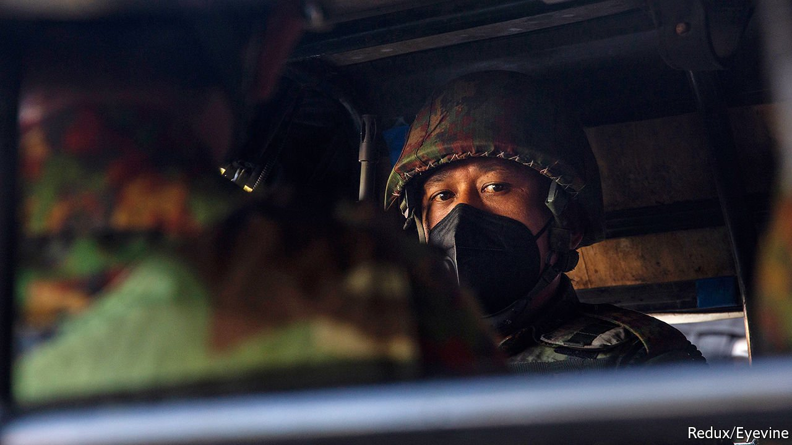
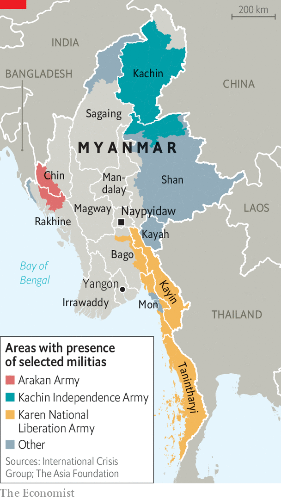

###### The downward spiral

# Myanmar’s civil war is becoming bloodier and more brutal 

##### The resistance is gathering allies, but they are disorganised and divided 

 

> Jun 24th 2021 

MOUNTED ON A bicycle, wearing a T-shirt emblazoned with a corporate logo, Kyaw Tin Tun could pass for one of the many food-delivery couriers zipping through Yangon, Myanmar’s biggest city. But his bag contains no food and his phone no instructions. His getup is there to provide cover for the slow speed at which he rides, for the constant stopping and starting, for eyes darting this way and that—looking not for an obscure address but for nooks in which to plant explosives.

Mr Kyaw Tin Tun (not his real name) belongs to a covert group aiming to destabilise Myanmar’s military junta. Before the army launched its coup five months ago, ending a ten-year experiment with democracy and returning the country to military rule, Mr Kyaw Tin Tun “had never dared to pick up a gun”. In February and March he, like hundreds of thousands of Burmese, took to the streets to engage in peaceful protest against the putsch. But the , in which more than 850 people have died and more than 6,000 others have been arrested, has pushed many Burmese who oppose the coup to change both their objective and their tactics.


The new aim is more ambitious. The resistance will no longer be content merely to reverse the coup. It now wants to tame the army, which has ruled the country for most of the past 60 years, and bring it under civilian control. The tactics have in turn become more ruthless. In cities, people associated with the military government are being assassinated. In the countryside, new militias are being formed and ambushing security forces. Even before the birth of this “revolutionary movement”, as Thant Myint-U, a Burmese historian, calls it, Myanmar was beset by ethnically based insurgencies (see map). Since the coup, many of these , some of which had agreed a ceasefire, have launched big offensives against the Tatmadaw, as the army is known. The army is more embattled than it has been in a generation.

 


The most battle-hardened of the forces arrayed against the Tatmadaw are the ethnic militias. Two of the oldest and biggest rebel groups, the Kachin Independence Army (KIA) and the Karen National Liberation Army (KNLA), started their attacks in March, seizing army bases and police posts. Fighting between the Kachin group and the army near the Chinese border has raged for months. Almost an entire army battalion was reportedly wiped out over two days in April. Anthony Davis, a security analyst, calls it a “meat-grinder” battle.

The Tatmadaw is even losing skirmishes against less experienced rebels armed with home-made rifles. On May 31st the Karenni Nationalities Defence Force (KNDF), a merger of established insurgent groups and new militias from Kayah state, ambushed 150 soldiers. In retaliation, the army deployed helicopters, fighter jets and heavy artillery. The scale of the response suggests it suffered humiliating losses, says Mr Davis, who suspects that experienced troops have probably been deployed to fend off the older militias, leaving less capable ones to tackle new outfits like the KNDF, who know the terrain better. They are also more motivated: “We are defending our land,” says Thomas, the KNDF’s spokesman, who goes by one name. “The regime’s forces were just following orders.”

Unusually, the Tatmadaw must also contend with fury among Bamars, the majority ethnic group, who are clustered in the centre of the country. Thousands of urban activists have received basic military training from ethnic militias in the jungle. Like Mr Kyaw Tin Tun, some have returned to the cities to put their new skills into practice. More than 300 bombs have exploded in police stations, state-owned banks and government offices in Myanmar’s cities since February, according to Radio Free Asia, an American-government-funded news website.

There are signs of co-ordination between ethnic rebels and Bamar fighters. In late April Chinese-made rockets were launched at two air-force bases in central Myanmar. These weapons were almost certainly obtained from the KIA or KNLA, but neither group could have deployed and fired the projectiles in central Myanmar without help from local Bamars. It is the first time that military targets in the centre of the country have been attacked with heavy weaponry.

The creation in May of an auxiliary militia to patrol big cities and towns shows how stretched the Tatmadaw finds itself. As Min Aung Hlaing, the commander-in-chief and effectively the country’s leader, put it in an interview with a broadcaster from Hong Kong last month, “I can’t say [things] are now 100% under control.”

Deposed lawmakers have formed a shadow administration, known as the National Unity Government (NUG), which is trying to knit the disparate anti-regime forces into a standing army. But different ethnic rebels are wary of one another and of the NUG, which was formed by a Bamar political party criticised before the coup for ignoring the grievances of ethnic minorities. Some rebel groups have no interest in taking on the Tatmadaw. Others, such as the Arakan Army, see an opportunity to extract concessions from the army while it is under pressure.

Even were its opponents to band together, the army’s 350,000-odd soldiers would still dwarf the rebels’ combined forces of around 80,000. Though defections from the army have grown since the coup, they number in the mere hundreds. A resolution of the UN General Assembly on June 18th, calling for an embargo on arms sales to Myanmar, as well as an end to violence and the release of detainees, will make little difference. The Tatmadaw’s two biggest suppliers, China and Russia, abstained. In any case, it has built up an arsenal of sophisticated weaponry over the past decade.

The result is a bloody stalemate. Even as the shadow government struggles to bring Myanmar’s multifarious militias together, their fragmented nature also makes it more difficult for the Tatmadaw to root them out. And the Tatmadaw’s brutality has turned the entire country against it, says Salai Lian Hmung Sakhong, the NUG’s minister of federal affairs. This is the first time that Bamars have joined ethnic rebels in fighting the army since some students took up arms after the brutal suppression of an uprising in 1988. The junta, says Mr Lian Hmung Sakhong, “cannot kill the whole people, the entire country.” ■

A version of this article was published online on June 20th 2021

