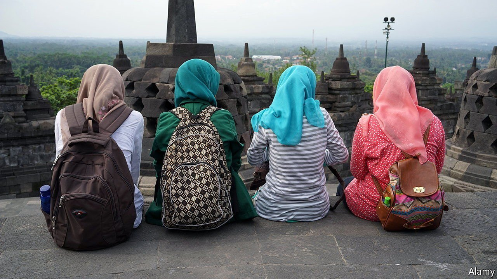
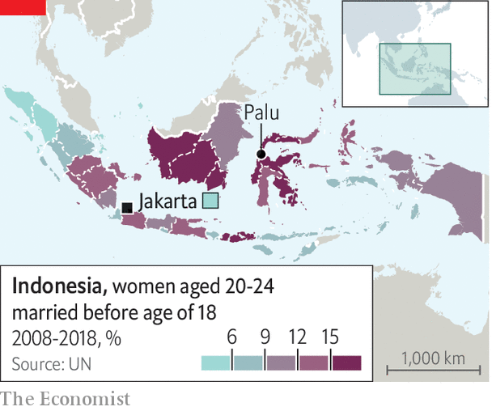

###### Unlawfully wed

# One in nine Indonesian women marries before the age of 18 

##### Religious courts continue to allow grown men to marry girls 

 

> Jun 26th 2021 

WHEN RASMINAH was 13 her parents forced her to abandon her education and get married to a man who was then 27. “I was heartbroken,” she says. “I would watch my friends leave for school every morning wishing that was my life.” When the marriage failed she was married again, aged 15, to a 40-year-old man.

One in nine Indonesian women is married before turning 18. The country’s lawmakers want that to change. Two years ago they raised the legal age of marriage for women from 16 to 19, to match that for men. At the start of 2020 the government restated its ambition to cut the rate of child marriage by 40% within a decade.


Raising the age at which women can marry has sent an important signal. But the new rules contain big holes. Religious courts have retained the right to wave through underage marriages for families who ask nicely. Parents make use of this procedure to arrange hasty weddings for girls who have got pregnant, among other reasons. Almost all requests are granted, often without the knowledge or approval of the child involved. Applications for these dispensations rocketed after the marriage-age was raised.

Meanwhile only about 5% of all marriages involving children go through legal channels, according to a government estimate. In lots of cases authorities are deliberately kept in the dark by families who know that the nuptials are unlawful. But marriages also go unregulated because registering them involves cost and hassle, says Nina Nurmila of the National Commission on Violence Against Women. Asking an official to travel to witness a rural marriage can cost around $40—about one-and-a-half times the monthly wage of an Indonesian living on the national poverty line. Many families conclude that it is sufficient to get the blessing of religious leaders, says Nani Zulminarni of PEKKA, a women’s group.

 


Changing people’s attitudes to child marriage is the hardest task. In February a matchmaking agency made the news after vowing to help women “perform their duties” by “marrying between the ages of 12 and 21 (and no later!) to please Allah”. The government’s strategy emphasises the need to educate families about the downsides of marrying before adulthood.

Experience from past disasters suggests that the pandemic will make things much worse. In 2018 an earthquake and tsunami struck Palu, a city on the island of Sulawesi; the next year cases of child marriage rose from 14 to 48 in just one village, according to LIBU Perempuan (LP), a women’s-rights group. Dewi Rana of LP says some children there were herded into marriage after being orphaned, because locals thought that was a good way to make sure they received support. Some girls who had been sexually abused by men in the aftermath of the disaster were forced to marry their attackers.

Lia Anggie of the Indonesian Women’s Coalition, which represents several charities, says that school closures during the pandemic have made it more likely that girls will have sexual relationships that lead to them being pushed into marriage. Closed classrooms have also interrupted the delivery of new curriculums which, it was hoped, would help youngsters resist pressure to marry. The government estimates that an additional 2.8m Indonesians fell into poverty last year; financial distress makes families more keen to seek husbands for their daughters. It will be hard for officials to untangle this knot.■

