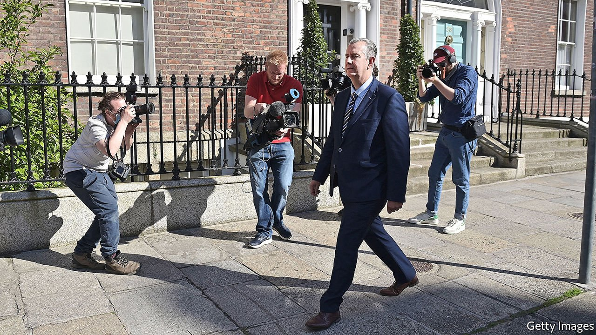

###### A Unionist Pootsch

# After Brexit, devolution in Northern Ireland is in a parlous state 

##### The defenestration after just three weeks of a Unionist leader reveals just how parlous 

 

> Jun 24th 2021 

WHEN EDWIN POOTS was chosen as  on May 14th, he described politics as “a rough-and-tumble game”. Defending his role in ousting his predecessor, , as party leader and Northern Ireland’s first minister—that is, joint leader of its devolved assembly in Stormont—he said: “I would assume that at some stage it may well happen to me.” After he had spent just 21 days in the post, it did.

The proximate reason was a row over the status of the Irish language. Mr Poots needed support from Sinn Fein, the main Irish-nationalist party, to ratify his choice of first minister. An Irish-language bill disliked by his Democratic Unionist Party (DUP) was the price. On June 17th the government in Westminster said it would legislate on the issue if Stormont refused to do so—a promise accepted by Sinn Fein, and by Mr Poots, who feared an election drubbing for the DUP if the devolved government collapsed. But not by his party: hours later just 15% of DUP legislators voted for the deal. His position untenable, Mr Poots stepped down that night.


But the deeper reason for Mr Poots’s resignation is the hard Brexit that the DUP made possible. After Theresa May failed to get her Brexit deal through in 2019, the party backed Boris Johnson to replace her, attracted by his vision of a United Kingdom set adrift from the European Union. That miscalculation is now tearing it, and Unionism, apart.

The deal signed by Mr Johnson took Great Britain out of both the single market and the customs union, but avoided a  by, in effect, leaving Northern Ireland in both. That meant a new customs border in the Irish sea. Before Brexit, Mr Johnson had vowed never to accept such an arrangement. The broken promises have left Unionists feeling betrayed. They had seen in Mr Poots, a creationist from the DUP’s hardline wing, someone who would stop the compromises and concessions, says David Campbell, the chairman of the Loyalist Communities Council (LCC), a (legal) umbrella group for illegal paramilitary organisations.

The row comes at the point in the year when it is most likely to inflame tensions. July 12th is Unionism’s biggest festival, celebrating the victory in 1690 of William of Orange, a Dutch Protestant, over his rival for the English throne, the Catholic King James. The Reverend Mervyn Gibson, Grand Secretary of the Orange Order, which promotes loyalty to the United Kingdom, says the Order will “look at what action we’ll take after the 12th”. Options include protests, breaking off relations with the Irish government and seeking to bring down the devolved executive.

This year, the centenary of Ireland’s partition, should have been a gala one for Unionists, who have managed to stave off all calls for reunification. The most recent results of a long-running survey, Northern Ireland Life and Times, published on June 10th, found that just 30% of people said they would vote for Irish unity tomorrow. But it also found that Protestant support for the power-sharing that re-established the parliament in Stormont in 2007 had fallen from 72% that year to 58% now.

Sir Jeffrey Donaldson, the relatively moderate Westminster MP expected to become both the DUP’s leader and the first minister, will struggle to reimpose party discipline. A snap election for the devolved assembly is a distinct possibility, and would probably see Sinn Fein emerge as the largest party. Doug Beattie, the leader of the less hardline Ulster Unionist Party, has said that if Stormont cannot be restored after an election, devolution will be over for good. But power-sharing is probably the only way that Northern Ireland can survive within the United Kingdom in the long term.

Even staunch Unionists are struggling to keep the faith. “We are the unwanted children of the Union,” says Wallace Thompson, one of the founders of the DUP in 1971. “Unionism is in a dark place, and the old shibboleths and ‘No Surrender’ slogans simply don’t cut it any more.” ■

For more coverage of matters relating to Brexit, visit our 

A version of this article was published online on June 21st 2021

