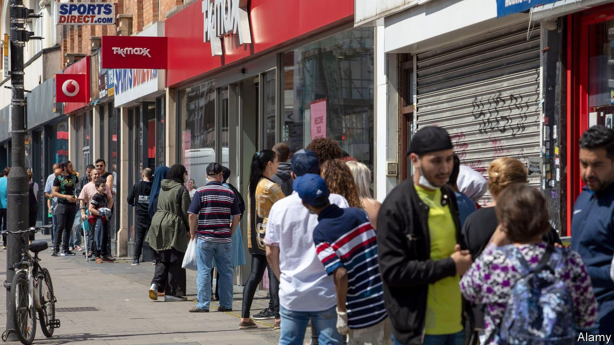
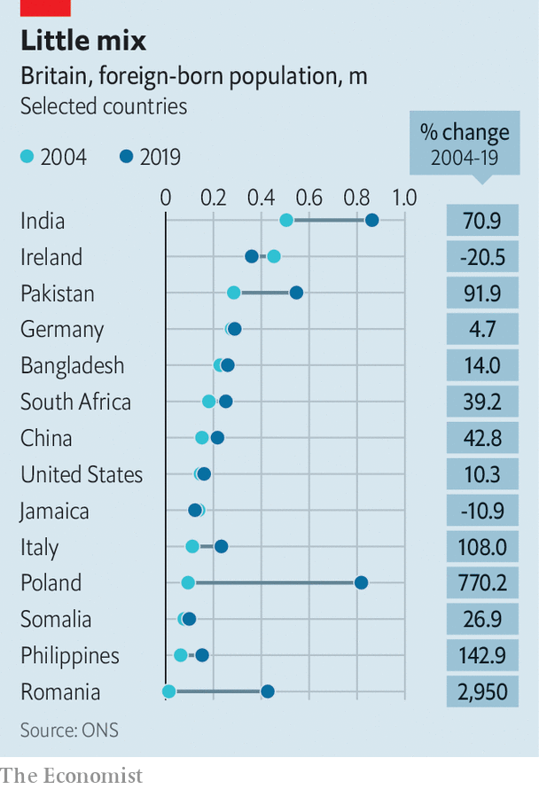

###### Immigration

# Britain, a diverse country for decades, is now superdiverse 

##### The change is mostly good 

 

> Jun 26th 2021 

A  PLACARD IN front of Willesden Food Centre, a convenience store in north-west London, advertises the following kinds of food: Afghan, African, Albanian, Arabic, Brazilian, Bulgarian, English, Greek, Iranian, Latvian, Pakistani, Polish, Romanian and Turkish. The shopkeeper might wish to add more countries to the list, but he has run out of space.

It is a fair reflection of an astonishingly diverse corner of the capital. At the last census, a decade ago, the ward of Willesden Green (which has since changed shape somewhat) contained almost 9,000 foreign-born people out of a total of 15,500. No immigrant group came close to dominance. The largest, from Poland, numbered only 799. Scores of countries, from Angola to Zimbabwe, supplied a few dozen people each. Since then new groups, such as Syrians, have joined the mix.


When the 2021 census releases detailed results, in a couple of years’ time, it will probably show that more places now resemble Willesden Green, with not just a lot of immigrants, but extremely varied ones—a pattern that some academics call “superdiversity”. This is caused partly by changes in immigration and partly by the property market. It is mostly, but not entirely, a good thing.

Many people who came to Britain in the second half of the 20th century had a connection to the country, says Madeleine Sumption of the Migration Observatory, a think-tank. Lots were from Ireland or Commonwealth countries, such as India, Jamaica and Pakistan. They often had family in Britain: in 1991 more than a quarter were accompanying or joining others. That began to change around 2000. Since then the majority have been workers or students, who often turn into workers after finishing their courses.

Most prominent, and politically controversial, are the many eastern Europeans who arrived between the liberalisation of EU migration in 2004 and the slamming of the door at the end of 2020. Poles and Romanians are now the second- and fourth-largest foreign-born groups, according to the Annual Population Survey. But Britain has also seen many smaller waves, which amount to a large movement. The number of Brazilians has risen from 28,000 to 101,000. The number of Filipinos—many of whom work in the NHS—is up from 63,000 to 153,000 (see chart). Britain now contains more people born in the Philippines than born in Jamaica.

 


As a result the immigrant population has diversified. In 1981 the top five countries of origin (then, in size order, Ireland, India, Pakistan, Germany and Jamaica) accounted for 46% of all non-British-born people in England and Wales. By 2001 the top five amounted to 35%; in 2019 just 32%.

That trend is likely to continue. Britain’s departure from the EU ended free movement from Europe, which probably means slower migration from Poland and Romania. But moving from elsewhere is easier, because the salary threshold for people with job offers has been lowered. From July 1st foreign students will be able to work for two years after their courses end. That will probably encourage more settlement by Chinese people—the largest group of international students but only the tenth most numerous foreign-born group overall.

The other cause of superdiversity is the dissolving of ethnic enclaves. Earlier generations of immigrants tended to cluster, partly because they were discriminated against and partly because it was relatively easy. Cities had room: London’s population dropped by more than 2m between 1939 and 1991. These days racism is rarer, and housing is so costly that newcomers must settle where they can afford to.

The result is mixed-up, multi-ethnic districts quite different from traditional enclaves. Ahmed Bassaam, a refugee from Somalia who is now a community worker in Willesden, observes that English is the dominant language in local shops and mosques. Given the multitude of native languages, he says, “English is the only way for us to communicate with each other.” Mr Bassaam, who has developed a taste for Brazilian fizzy drinks and Turkish bread, also argues that superdiversity is good for the stomach.

It has some drawbacks, though. Lacking a dense network of fellow countrymen to interpret and explain, immigrants in extremely mixed areas may struggle to understand the school system or the health service. As one small group among many, they find it hard to acquire political power. Tom Miller, who represents Willesden Green in the borough council, notes that he and his two fellow councillors from the ward are white Britons.

Superdiversity can also be discombobulating for the host society. The Commonwealth immigrants who arrived in the late 20th century played up their Britishness, says Sunder Katwala of British Future, a think-tank. That made it fairly simple for the natives to accept them, although many took their time about it, all the same. The immigrant bazaars that are forming now are harder to comprehend. But at least the food is good, and the signs are in English.■

