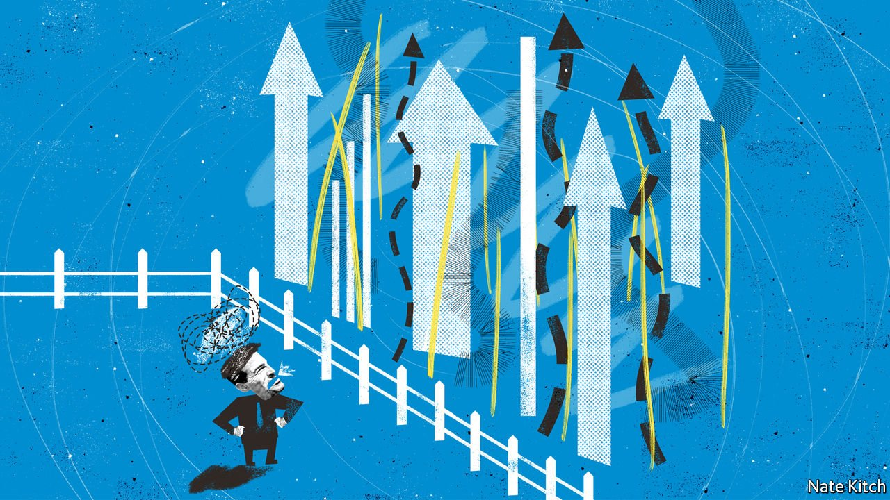

###### Bagehot

# Britain’s government says it wants an economic boom 

##### But its core voters are less keen 

 

> Jun 26th 2021 

THE MODERN Conservative Party has an emotional range of just two notes: hubris and panic. Before the Chesham and Amersham by-election on June 17th, it was boasting that the entire country, apart from decadent cities, would soon be painted Tory blue. After the vote, which saw a Conservative majority of more than 16,000 flip to a Liberal Democratic one of more than 8,000, it is contemplating ruin as long-time Tory voters in the shires flee horrors such as new high-speed rail links and houses, and northerners briefly attracted by Brexit return to the Labour fold.

Both hubris and panic are overdone. An opinion poll published on June 21st put the Conservatives 11 points ahead of Labour—making well over 100 poll leads in a row. Under the lacklustre Sir Keir Starmer, Labour is treading water. As their coalition with the Conservatives from 2010 to 2015 fades into distant memory, the Lib Dems have returned to type as a protest party. A rising Green Party is further splintering the anti-Tory vote. But that by-election did demonstrate something: the Conservative Party has a serious problem with the politics of growth.


Governments love growth for the obvious reason that the more of it there is, the healthier the public finances and the easier it is to do delightful things like cut taxes and increase public spending. But they also fear it because it annoys people. High immigration, both a cause and consequence of growth, bothered many Britons enough that they voted for Brexit. And there is nothing like a new housing development or railway line to get normally mild-mannered types angry and organising.

This universal problem is particularly acute for the Tories. Boris Johnson came to power by promising voters that his version of Brexit would allow much more spending on the things they cared most about—largesse for the National Health Service and a battalion of new bobbies on the beat—while keeping taxes low and pensions high. He is a have-your-cake-and-eat-it type of politician who sprays around promises for flash projects: a bridge from Scotland to Northern Ireland! A new royal yacht! Add to all that the vast, unplanned spending on tackling covid-19 and you get a fiscal nightmare. Without faster growth, only higher taxes and lower spending can bring that nightmare to an end.

But Mr Johnson’s voters are ambivalent about growth: theoretically in favour, perhaps, but opposed if it impinges upon their lives. The party faithful are like J.R.R. Tolkien’s hobbits, who desire nothing more than to live in a well-maintained hobbit hole overlooking river and meadows, and for nothing to change. More than half of Tory voters in the 2019 election were over 55, and a third were retired. A disproportionate share owned their homes and were in defined-benefit pension schemes. For them, growth is all downside. If the economy stagnates they are still snug and cosy, but if it booms they may find their trains overcrowded or their views destroyed.

Squaring the need for growth with voters suspicious of it would be hard enough if growth were easy to come by. But many economists think that the ageing West is entering a long period of Japanese-style stagnation. After a brief post-pandemic boom, they expect growth to settle at around 1.5% a year, much lower than the 2.7% of the early 2000s, let alone above 3%, as in the 1960s. They doubt that policymakers have found a new formula to replace the free-market orthodoxy of recent decades, now out of fashion. And once again these problems are particularly acute in Britain. It long ago consumed the low-hanging fruits of privatisation and deregulation. What remains is shrivelled and hard to reach.

The government is deeply divided on these issues. Mr Johnson is instinctively on the side of big government. He has compared himself to Michael Heseltine, Margaret Thatcher’s leading critic in the 1980s, who promised to “intervene before lunch, tea and dinner”. Rishi Sunak, his chancellor, is more market-oriented, worrying that the prime minister’s commitment to “levelling up”—that is, using policy and spending to encourage growth in left-behind places—could easily lead to 1970s-style waste and bail-outs for failing business.

The government has a few decent growth-promoting ideas. It is right to plan to spend more on infrastructure in the north, which has long been short-changed. Improving Britain’s dismal vocational education and capitalising on its excellence in the life sciences would be worthwhile, too. But these will require what Max Weber, a German sociologist, called the “slow boring of hard boards”, not just slogans and speeches. They will also require taking on the hobbits and, far from levelling up, probably increasing regional disparities. Turning Britain into a scientific superpower, for example, would be best done by focusing development on the already crowded and wealthy golden triangle of London, Oxford and Cambridge.

Digging in

But confusion at the top of government combined with resistance from the Tory electorate may make the slow boring of hard boards impossible. Policies will be torn apart between prime minister and chancellor: insiders complain that Mr Johnson’s big promises are subverted by Mr Sunak failing to find the funds. Hobbits in the shires will argue that houses are certainly needed—but should be built in the north or in cities, not in their own backyards, though that is where prices are highest and demand is strongest. Last year a backbench revolt forced the government to abandon a house-building algorithm intended to take politics out of planning.

That may leave only symbolic policies that do little for growth, such as the free ports that Mr Johnson recently highlighted as one of Brexit’s main dividends. The party faithful may be happy, and the Tories may even keep winning. But the children of Brexit voters in left-behind places will still be left behind, and those of the shire hobbits will be unable to afford holes of their own. ■

