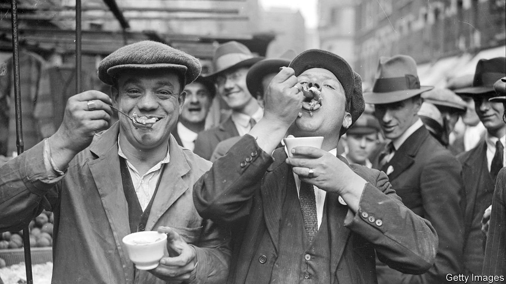

###### A midsummer night’s stream

# Eels are in crisis, but hope is coming on-stream 

##### Eel passes might help save these odd animals from disaster 

 

> Jun 24th 2021 

A  FEW MILES west of Glastonbury Tor, on a midsummer evening, two men stand next to a waterway, waiting for eels. England’s rivers once shivered with eels; her bellies were filled by them; her rents were paid in them. Medieval England ran on eels, part cuisine, part currency. Ely was so eely it was named for them; its abbey received rents in them (26,275 eels from a single fen alone).

Then their social stock tumbled. Jellied and served in pies, they are now the food of commoners. Next, their stocks did. The number of young eels arriving in Europe has fallen by 90-95% in the past 40 years. They suffer many afflictions, including climate change, parasites and water turbines that cut them up, says Andy Don of the National Fisheries Services, “like sushi”. The biggest barrier to eels’ well-being is, however, barriers. European rivers have 1.2m, from tiny weirs to giant dams.


That problem, at least, is now being tackled. Next to the waterway in Somerset, a CCTV camera watches England’s first fully monitored eel pass, a metal channel bypassing a sluice gate. Eel monitors watch the footage, totting up each eel that slithers up. Mr Don had hoped to see a couple each evening. One May night, there were 10,292.

People have long known that fish need help getting up managed rivers. The barons bullied King John into putting fish passes in Magna Carta. The whiff of class tensions lingers still. Britain’s passes work splendidly for salmon and trout, perhaps because legislators like to fish for them. “If there is a fish that is going to be in MPs’ line of sight,” says Mr Don, “it is going to be the salmon.”

But eels have also been overlooked because they are tricky, with a life cycle that is part biology, part poetry, part mystery. European eels spawn in the wide Sargasso Sea before drifting 5,000km or so to England; they ebb and flow in patterns linked to the moon and don’t so much leap up rivers as slither up banks. No human has seen them mate.

Now, however, they can see eels move up passes. And on rivers across England and Wales, on the Avon and the Wye, the Cam and the Severn, eel passes are appearing. The eels are on the move.

