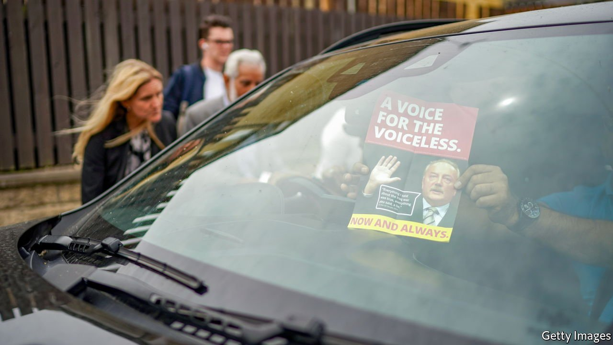

###### West Yorkshire Bank

# Labour could lose a by-election over the issue of Palestine 

##### It is struggling to hold onto Muslim voters in Batley and Spen 

 

> Jun 24th 2021 

GEORGE GALLOWAY is sitting in Starbucks, close to the abandoned nightclub that serves as his campaign base. “Fighting Labour is our number one target,” he declares. An MP for Labour before he was expelled in 2003, Mr Galloway is a political opportunist with a habit of causing trouble at tricky moments. He handed Labour surprise defeats in Bethnal Green and Bow in 2005, and Bradford West in 2012. On July 1st, standing in Batley and Spen for a new Workers Party of Britain (founded to “defend the achievements of the USSR, China, Cuba etc”), he may cause a third upset, albeit by splitting Labour’s vote rather than by winning himself.

Labour has held the seat since 1997. The candidate, Kim Leadbeater, is the sister of Jo Cox, who was its MP until she was murdered in 2016 by a white-supremacist terrorist. Ms Leadbeater’s energy, charisma and work for the foundation set up in her sister’s memory are in her favour. But polling suggests rising support for the Conservatives. And much of Mr Galloway’s projected 6% vote share is likely to come from South-Asian Muslims who feel slighted and ignored by Labour.


The constituency is a complex mixture. The small, prosperous towns of Spen Valley largely vote Tory. Batley, by contrast, is an old mill town filled with working-class white and South-Asian Muslims. It is rundown, with many of the handsome sandstone buildings in the centre lying empty. Leave the centre, and cobbled streets give way to potholed tarmac. Locals complain about fly tipping, too few school places and the closure of Batley police station.

Such gripes usually harm incumbents—and Labour holds not just the constituency but also a plurality on the county council. Ms Leadbeater joined Labour only recently (she felt that party membership conflicted with her charity work), which may help neutralise the anti-incumbency effect. But it has also stirred resentments. Some local Muslims think a Labour candidate should have been chosen from among their community’s councillors. Some of those councillors are rumoured to be campaigning for Mr Galloway.

Inter-communal relations can be rocky. Residents, Muslim and non-Muslim alike, lament increasing self-segregation. Ms Cox was murdered by a white supremacist; far-right groups frequently demonstrate in the area and several are running in this election. In May a teacher at Batley Grammar School was forced into hiding by death threats after he showed a cartoon of the prophet Muhammad in a lesson on blasphemy. He is still in hiding.

Internal Labour politics do not help. Sir Keir Starmer, the party’s leader, has tried to tackle the anti-Semitism that flourished under Jeremy Corbyn, his predecessor. But many of Batley’s Muslims feel he has nothing to say about their grievances, or about Islamophobia. They are angered, too, by his refusal to condemn Israel’s recent bombing of Gaza.

All this is meat and drink to Mr Galloway, whose other pet cause, besides a fondness for anti-Western dictatorships, is Palestine. From 2012 to 2015 he was MP for nearby Bradford West, standing for the Respect Party, a coalition of far-left and Islamist groupuscules. He claims Muslims like him because he helped organise an aid convoy to Palestine in 2008-09, and more generally because of his pro-Palestinian stance and rhetoric.

Doubtless true, but Mr Galloway also evokes uglier sentiments. He once blamed a scandal on the “New York-Tel Aviv axis of evil”. Some of his supporters talk of the “powerful lobbies” that made Sir Keir party leader. Soon the words “Jewish” and “Zionist” are uttered, along with references to politicians “selling their souls” on the issue of Palestine.

Mr Galloway promises his supporters that a defeat for Labour in Batley and Spen will force Sir Keir to step down as party leader. That may be an exaggeration. But there is no doubt that another loss, after Labour’s shock defeat in a by-election in May in Hartlepool, which elected its first-ever Conservative MP, would seriously damage Sir Keir. Hartlepool was one of the “Red Wall” constituencies across the middle and north of England that used to vote Labour, but plumped for Brexit in 2016 and are now tilting Conservative.

That loss emphasised how hard it will be for Labour to keep both the northern, pro-Brexit working class and the southern, anti-Brexit graduates it needs to have any chance in a general election. Losing Batley and Spen would be a sign that a modest but important part of Labour’s multi-ethnic coalition is also at risk. In this constituency and perhaps others, Israel, Palestine and anti-Semitism may function like Brexit: as a wedge issue that prises off one group of traditional Labour voters, stirring up dangerous divisions in the process. ■

