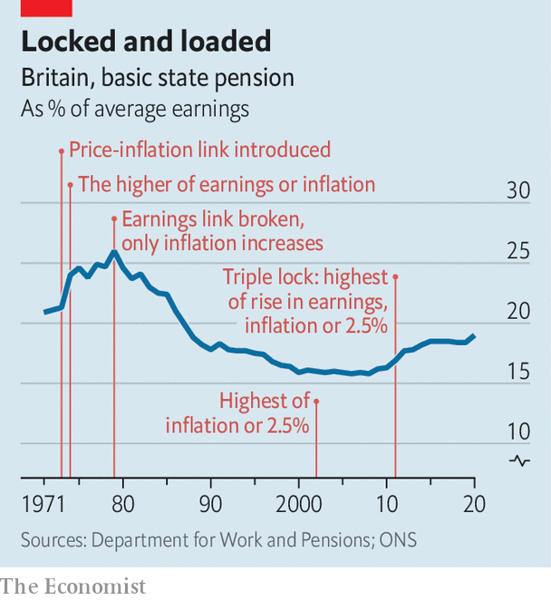

###### Pensions

# The triple-lock rule poses a post-pandemic problem 

##### Statistical quirks could land the government with a pricey pensions bill 

 

> Jun 26th 2021 

THE METHODOLOGY used to calculate economic data rarely receives much attention, but then statistical quirks do not usually come with a £4.4bn ($6bn, or 0.2% of GDP) annual bill. Yet that is what taxpayers may be landed with by the interaction between the “triple lock”, used to increase state pensions, and artificially strong earnings figures as Britain’s economy recovers from covid-19.

Introduced by the Conservative-Liberal Democrat coalition a decade ago, the triple lock mandates that pensions rise each year by the highest of average earnings growth, consumer-price inflation (CPI) and 2.5%. The earnings figure used is the annual rate of growth in average weekly earnings in July, a number released by the Office for National Statistics in September.


This year that number looks set to be around 8%. But actual earnings are growing much more slowly. The disparity is caused by so-called compositional and base effects. First, low-paid workers were more likely than high-paid ones to lose their jobs during the pandemic, pushing the average for those in work higher. Second, the year-on-year comparison with the period of the first lockdown, when the economy was in a tailspin, flatters the current state of affairs. The National Institute for Economic and Social Research, a think-tank, reckons that underlying wage growth will be closer to 2.5% than 8%.

Until 1979 British state pensions, and most other welfare benefits, were indexed to earnings growth. Under Margaret Thatcher, the government switched to linking them to inflation, which gradually lowered their generosity relative to wages (see chart). But in 2011 the coalition government, eager to cement its support among older voters, introduced the triple lock.

 


It has proved much more costly than expected. If the Bank of England was hitting its 2% target for CPI, and productivity was growing, even if modestly, wages would be rising faster than the lock’s 2.5% floor. But in the past 11 years productivity and wage growth have been weak and inflation has often been below target. The 2.5% floor has been used to set pension increases four times. The result has been a big recovery in pensioners’ purchasing power, relative to workers’. Average earnings rose by 22% from 2010 to 2021; state pensions, by 41%.

Rishi Sunak, the chancellor, is keen to avoid an 8% rise. According to the Office for Budget Responsibility, a government watchdog, each percentage-point increase in pensions costs the exchequer around £800m annually. Treasury officials believe a fudge is possible, with some sort of smoothed average earnings used this year. But the prime minister’s office insists that the government remains committed to the triple lock. With Britain’s population ageing, politicians of all stripes are keen to court the pensioner vote.

That may make the triple lock untouchable, even as the chancellor worries about regaining control of spending post-pandemic. In the longer term, however, the steady increase in the pensionable age helps keep predicted costs down. Spending on state pensions is forecast to dip from 4.4% of GDP now to 4.1% by the late 2020s, as the retirement age rises to 67. That threshold will rise further if life expectancy does: the government is aiming for typical workers to spend 32% of their adult lifespan with a state pension. Taking on today’s pensioners may be a step too far for the government, but delaying the retirement of future ones is less politically painful—and saves more money. ■

