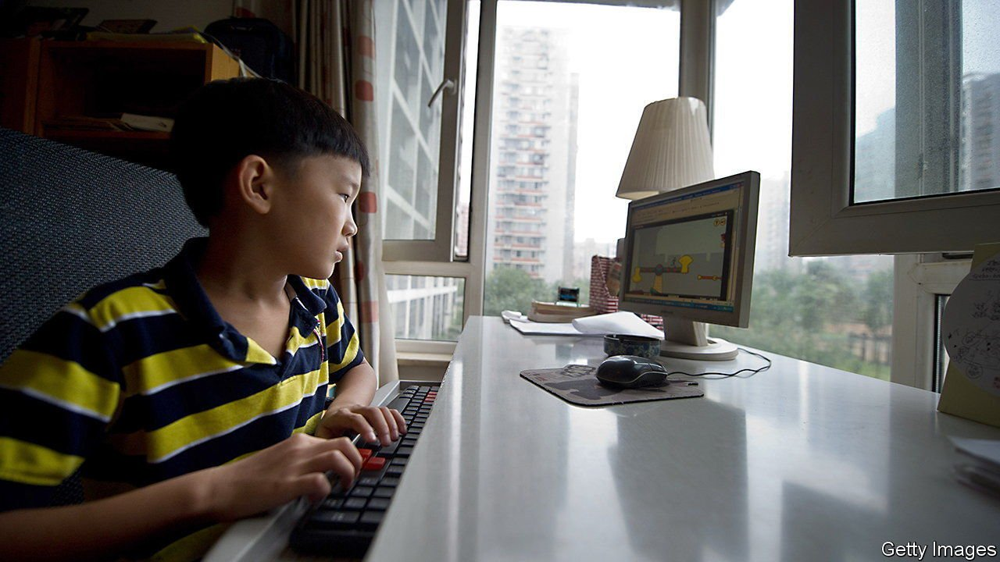

###### Brought to book

# China is clamping down on cram schools 

##### One aim is to ease the pressure on parents’ wallets. It may not work 

 

> Jun 24th 2021 

UNTIL CHILDREN reach the age of about 15 in China, education is free. So why is it that more than half of a typical family’s spending goes on it? The answer is cramming classes: a financial burden so great that it is often said to discourage couples from having children at all. Now officials are trying to rein in the industry, in part, it appears, to relieve the pressure on people’s wallets. Parents are not sure it will work.

As many of them see it, cramming is not optional. Exams for entry to senior high schools are fiercely competitive. Then comes the dreaded gaokao: the university-entrance exam on which a child’s future hinges. But as the People’s Daily, an official newspaper, reported this month, the market for such services is plagued by “endless chaos”. It listed problems ranging from misleading advertising to high prices and the use of unqualified teachers.


Officials began warning months ago that they were preparing to issue regulations to impose order. This sent shivers through the industry. According to Bloomberg, several education firms suspended plans to list their shares. New Oriental, one of China’s biggest cramming companies, saw its share price on the New York Stock Exchange drop below $8, from a high of more than $19 in February. On June 9th the education ministry said a new government department would be set up to oversee such businesses, encompassing both online tuition and lessons in the classroom.

The industry’s growth has been rapid. One firm, Zuoyebang (“help with homework”) says it offers live-streaming classes to more than 170m active users each month. But officials fret about the social impact. They want couples to have more children—the birth rate is the lowest in decades and China is ageing fast. They also say that schoolchildren are overstressed. Urban pupils attend cramming classes for more than 10 hours a week, according to Deloitte, an accountancy firm. There is widespread speculation, including in state media, that the new rules will impose limits on when firms can offer tuition. They may, for example, prohibit classes after a certain time in the evening, during the summer holidays or at weekends.

Some analysts think the government may have another motive. Many of the companies are offshoots of China’s tech giants, including Alibaba and Tencent, which have come under regulatory scrutiny this year for dominating markets and expanding into finance and other areas. Targeting the cramming business could be another way of clipping their wings.

Parents wonder whether they will benefit. Some fret that the new rules will leave them with no choice but to use private tutors, which could prove even more costly. The resentful parent of a secondary-school pupil in Beijing blames the Communist Party: “It’s very simple. They just have to control everything, always.” ■

