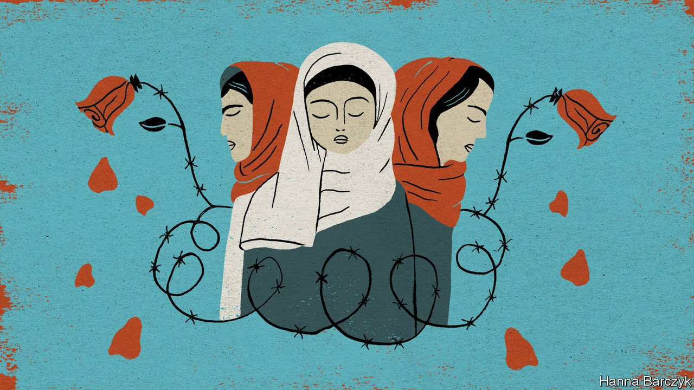

###### Chaguan

# Ferocious birth-control policies in Xinjiang are racially targeted 

##### A visit to China’s far west reveals glaring double standards 

 

> Jun 26th 2021 

WHEN CONFRONTED with uncomfortable facts, China’s usual response comes in two parts. First it tries denial and obfuscation. Should that not work, officials attack the motives of foreign critics. Arguments over Xinjiang, a far-western region that China runs with an iron fist, have reached this dangerous stage.

In recent months America, Britain, Canada and European Union countries, among others, have voiced concerns about Xinjiang. They point to evidence that China has detained perhaps a million Muslims in re-education camps, notably from the 11.6m-strong Uyghur population, imposed sterilisations on ethnic minority women and forced villagers into factory labour. Chinese diplomats call such Western charges a shameless plot to slander China and frustrate its rise. State media hurl ad hominem slurs at foreign researchers who scour government documents, satellite images and open-source materials to expose abuses in Xinjiang, describing them as anti-China zealots or CIA agents. Chinese officials claim that Uyghur exiles who speak to foreign parliaments and news outlets are terrorists, or actors paid to tell lies.


Such smears, though wild, have an impact. Behind closed doors in Beijing, it is not hard to hear Western diplomats and business types grumbling that rows over Uyghurs are disrupting trade deals and climate co-operation with China. Some mutter that reports from Xinjiang are surely exaggerated. It is increasingly easy to meet Chinese who treat foreign concern for the Uyghurs as a cynical attack on their country. On a recent reporting trip to Xinjiang, it was no surprise to be registered by police several times a day, and to be followed by plain-clothes agents in cars, on foot and on bicycles. For foreign journalists, such scrutiny there is routine. It was more startling, and revealing, to be asked “Do you like China?” by an official who had just escorted Chaguan off a packed train, ostensibly for covid-19 checks.

Your columnist is not ready to abandon the notion that China and the West can agree on shared facts, even if they disagree on important principles. This Xinjiang trip was an experiment. The aim was to test the claim that Uyghurs are the targets of racist social engineering, using only government documents and interviews with officials and settlers from the country’s Han Chinese majority, who cannot easily be accused of anti-China sentiment.

Three places were visited. Bachu, a county of cotton fields and fruit farms, is almost wholly Uyghur. Like many majority-Muslim areas in southern Xinjiang, it saw high birth rates not long ago. The county government reported a natural population growth rate in 2014 of almost 13 per thousand people. Using mortality rates for the surrounding prefecture, Kashgar, that figure equates to a birth rate of nearly 19 per thousand people. That is compatible with the average woman having perhaps three or four children during her reproductive years. Rural Uyghurs were allowed three children back then, and officials tolerated extra births to buy social peace.

At a weekday lunchtime, the results of that fertility boom could be seen in Bachu’s main town. Watched by armed police—for the county saw deadly ethnic violence as recently as 2014—a sea of Uyghur children spilled out of primary and middle schools in uniform tracksuits and the red scarves of Young Pioneers. Passing stalls grilling meat and flatbread over charcoal, they greeted a foreign reporter in heavily accented Mandarin.

Those same cheerful crowds alarm Chinese scholars. They write of young Uyghur populations exhausting southern Xinjiang’s water supplies, straining job markets and threatening stability in a border region. In 2017 Communist Party leaders ordered a campaign against illegal births, including cash rewards for locals who reported over-quota children. But legal births were also targeted. In January 2018 Bachu’s government boasted of controlling the population’s “excessive growth”. By 2017 the county’s birth rate had fallen from 19 to 13 per thousand, a highly unusual drop in just three years. Astonishingly, in 2019 Bachu reported a birth rate of 4.15 per thousand people. That is one of the lowest birth rates anywhere in the world, and a decline rarely seen even in wartime.

Li Xiaoxia, a government sociologist in Xinjiang, has called reports of forced sterilisations “slander”. In an essay for state media in January she conceded that between 2017 and 2018, after the strict enforcement of rules, Xinjiang-wide births had fallen by 120,000 in a year. But Ms Li insisted that rural women from ethnic groups had “spontaneously” agreed to be sterilised. Some had taken rewards of 3,000 yuan ($460) or more for women willing to undergo tubal ligation before using their legal quota of children, she wrote. Others’ minds had been freed by officials “from the shackles of religious extremism”. She said Uyghurs and Han Chinese now followed the same rules, promoting “fewer and better” births.

Not all pregnancies are equal

Official documents tell a different story. Tiemenguan is a small town founded by the Xinjiang Production and Construction Corps. The bingtuan, as this paramilitary enterprise is better known, was founded in 1954 to farm the region’s barren plains and bring in Han Chinese settlers. Last year the town advertised for auxiliary police officers, seeking young candidates of Han nationality, and promising to cover 10,000 yuan of medical costs if they were to have a second child. Wang Jian, a statistician from the bingtuan’s6th division, is one of several scholars to recommend, in print, that the corps should encourage Han recruits to have more children, while limiting ethnic minority births. In a park in Shihezi, the largest bingtuan-run city, a father playing with two sons by a tree-shaded pond recalls how officials contacted him with a bonus for his youngest. A Han Chinese mother carrying her second child in her arms explains that his birth landed her a subsidy, extra leave and free milk powder. “They encourage you to have a second,” she says. The double standard should be glaring to admirers and critics of China alike. Facts are stubborn things. ■

