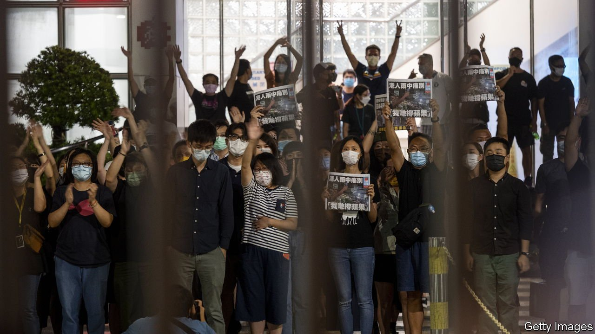

###### Farewell, Apple Daily

# Hong Kong’s leading pro-democracy newspaper has closed 

##### The tabloid is a victim of a draconian new security law 

 

> Jun 24th 2021 

HONG KONG’S largest pro-democracy newspaper, Apple Daily, ceased publishing on June 24th. Under the city’s security law, police in recent days had frozen its bank accounts, raided its newsroom and arrested six people, including its editor and chief executive, who have been charged with colluding with foreign powers. Apple Daily printed 1m copies of the final edition, nearly 13 times more than usual. Newsstands swiftly sold out. Staff are pictured greeting supporters outside the paper’s office.

