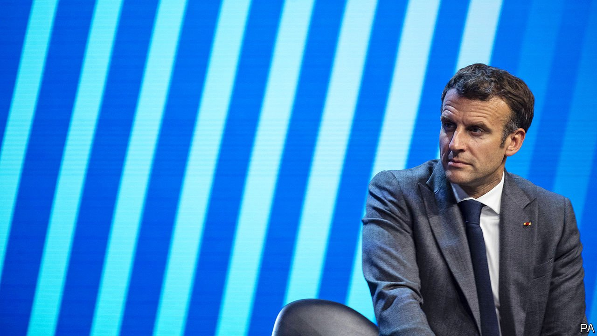

###### Another slap in the face

# French voters punish presidential-poll favourites 

##### This could open up the race for 2022 

 

> Jun 26th 2021 

A  MID-TERM election is seldom a moment for voters to applaud their rulers. But the snub that they handed to President Emmanuel Macron’s party in the first round of voting in French regional elections on June 20th was quite something. Nobody expected La République en Marche (LREM) to come first in any of the country’s 13 regions. But in three of them, its candidates did not get even the 10% needed to go through to the second round on June 27th. Countrywide, his party got just 11%, putting it in fifth place. The day after the vote, as if to try to discount the damage, Mr Macron inaugurated a refurbished Parisian department store, welcomed Justin Bieber to his office, and hosted an electro concert at the Elysée palace.

To be fair, this is a rather odd election. The date was postponed twice because of covid-19. The first round took place just as the French had emerged from a third national lockdown, and on the day that an eight-month-long nightly curfew was finally lifted. Sure enough, the pull of polling stations proved no match for that of bars and beaches. Turnout was shockingly low, at 33%, down from 50% at regional elections in 2015. Only 16% of those aged 18-24 voted, according to Ifop, a pollster.


Nonetheless, the first round carried several lessons, some of which could shape the presidential election in 2022. First, for LREM, which invested too little too late in the campaign, this election was not so much a test of its regional strength as confirmation that it scarcely exists as a meaningful structure outside Paris. Launched by Mr Macron in 2016 as a vehicle for his election in 2017, it has been in a sort of deep freeze ever since. The party is neither a source of ideological debate nor a machine building up local support across the country. Shahin Vallée, a former economic adviser to Mr Macron who is now at the German Council on Foreign Relations, says: “It serves merely as an extraordinary PR agency for the president.”

Nowhere was this more evident than in Hauts-de-France, in the north. Mr Macron, who grew up in the town of Amiens in the region, visited just days before the vote. His trip was part of his aestival “Tour de France”: an attempt to reconnect with people round the country after the end of the latest lockdown (it was during one such recent foray that a member of the public slapped the president in the face).

Critics, though, saw it as an undisguised bid to campaign on the home turf of Xavier Bertrand, the centre-right sitting regional president, who is a former government minister and a rival for the presidency next year. In a last-minute push, Mr Macron put no fewer than five government ministers on LREM’s party list for the region. The result? Mr Bertrand came top, with a handsome 41%. LREM, meanwhile, scored a pitiful 9%, meaning that it has been knocked out of the contest.

Mr Bertrand’s strong showing leads to a second point. Perhaps because voters were hankering for stability after months of living with the pandemic, first-round voting rewarded incumbents, from the right as well as the left. No fewer than 12 of the 13 sitting regional presidents came out on top. They include all five Socialist presidents, in regions such as Nouvelle-Aquitaine, in the south-west. Six centre-right regional heads also scored the most votes, including Mr Bertrand in the north, Valérie Pécresse in the Paris region (Ile-de-France), and Laurent Wauquiez in Auvergne-Rhône-Alpes.

Back in 2017, when Mr Macron won power, LREM, which was billed as being “neither on the left nor the right” and stole politicians from both sides, looked as if it had crushed the established parties flat. Now there are some hopes of a revival. Nationally, the centre-right Republicans and their allies scored 29%. Together, the Greens and Socialists scored nearly 30%.

Third, the only party that looked more glum than Mr Macron’s after the first round was Marine Le Pen’s populist, anti-immigrant National Rally, formerly known as the National Front. Polls had suggested that it would come top in six regions, and win in Provence-Alpes-Côte d’Azur (PACA). In the end, it came first only in PACA, where its candidate, Thierry Mariani (an ex-Republican) leads by a thin margin.

 


The National Rally does not get the older vote, and draws heavily on the working class, so it suffered particularly from poor turnout. When the results came out, a grumpy Ms Le Pen appeared on television and scolded voters for their apathy. It may also be that Ms Le Pen’s attempt to soften the party’s image, in order to make it more electable, has undermined her ability to harness raw anger and indignation, an exercise at which she usually excels.

What does all this mean for 2022? Ms Le Pen’s party could still win PACA in the second round on June 27th. That would ease its malaise, and enable Ms Le Pen to claim that her party’s first regional victory is a step to the Elysée. Even if not, there is still a big difference between a regional election and a presidential race, which is not so much about a party as a person. Less than two-fifths of voters said that they used this poll to judge either the president or the government, while a majority made their choice according to party affiliation. The opposite is true for a presidential vote. Despite poor showings by both their parties at municipal elections last year, for instance, Ms Le Pen and Mr Macron continue to be the pollsters’ favourites to make it to the second-round run-off, as they did in 2017.

That said, the race does now look a little more open. Three centre-right presidential hopefuls—Mr Bertrand, Ms Pécresse and Mr Wauquiez—are set to be buoyed by re-election as regional heads. Each will try to appear in coming months as a better prospect than Mr Macron to beat Ms Le Pen in 2022. The difficulty, notes Michel Barnier, the European Commission’s former Brexit negotiator and yet another centre-right presidential hopeful, is that unlike in the days of Nicolas Sarkozy or Jacques Chirac, this time “no single person dominates.” Both Mr Bertrand and Ms Pécresse have quit the Republicans. Even within the party, nobody agrees on how to pick a single candidate. The same goes for the Socialists and Greens on the left.

As for the president, he will resume his Tour de France in the hope that a lighter summer mood eclipses this defeat. New daily covid-19 cases are back to the low levels last seen last summer. Businesses are creating new jobs again. Even though his party’s score was “very poor”, says Bruno Jeanbart, of OpinionWay, a polling group, “this wasn’t a popularity test of Emmanuel Macron.” One poll puts his approval rating in June at 50%, up seven points on May. Another gives him 40%, far better than that achieved at the same point by his two most recent predecessors, Mr Sarkozy (30%) and François Hollande (14%).

Mr Macron will be hoping that, despite their regional triumphs, the left and the right continue to squabble, thus undermining either camp’s ability to take him on. He will also know better than most, however, that a lot can change in ten months before a vote—and that the last incumbent president to be re-elected was Mr Chirac in 2002. ■

