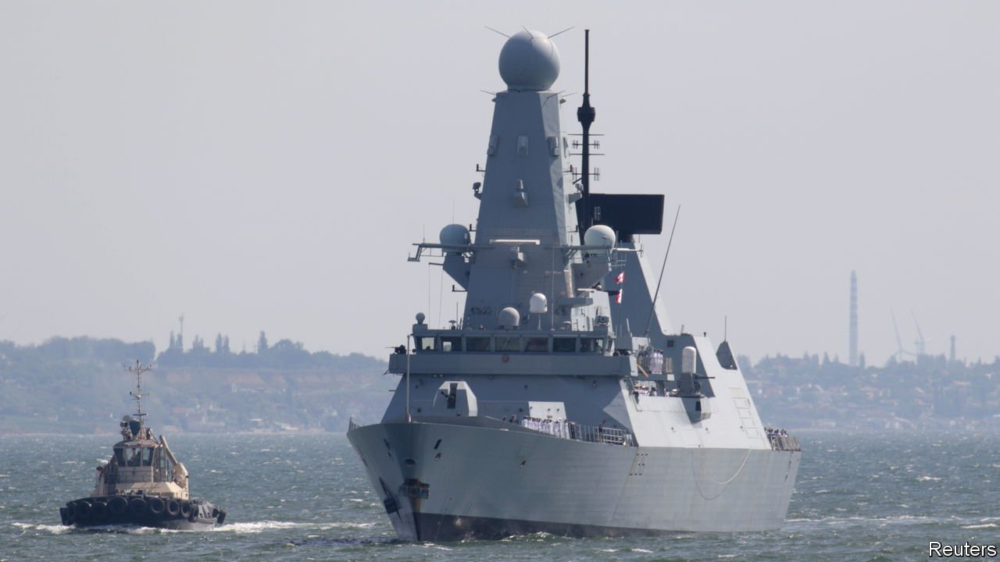
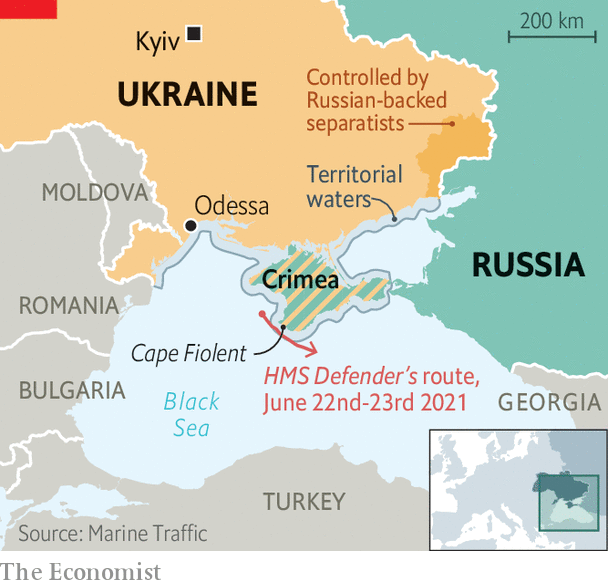

###### Crimea and punishment

# Russian and British forces square off in the Black Sea 

##### Russia claims to have fired warning shots at a British destroyer in disputed waters off Crimea 

 

> Jun 24th 2021 

THE LAST time that Russia fired on a British warship was in 1919, when a Bolshevik submarine torpedoed a destroyer in the Gulf of Finland. The last time it happened in the Black Sea was during the Crimean war over 165 years ago. So it was a surprise when Russia declared that it had not only fired warning shots at HMS Defender, a British destroyer passing through Crimean waters on June 23rd, but had also dropped bombs in its path.

The sequence of events is contested. Russia says that the British warship crossed 3km (two miles) into its territorial waters off Crimea, near Cape Fiolent (see map). When the Soviet Union broke up, Crimea became part of Ukraine. Russia occupied and annexed it in 2014. It thus claims the patch of sea in question, even though most countries, including Britain, regard the annexation as illegal. Russia said it “halted the violation” with warning fire and, 11 minutes later, with bombs dropped from Su-24 bombers.


Jonathan Beale, a BBC reporter aboard Defender, says that the ship did indeed transit Crimean waters, and deliberately so—presumably to show that it still considers the area in question part of Ukraine. Britain’s defence ministry said that Defender carried out a “routine transit” from Odessa to Georgia through Ukrainian waters. There were no shots fired at the ship, it says, nor bombs dropped in its path—just a previously announced Russian gunnery exercise nearby. Mr Beale says shots were audible, though presumed to be “out of range” of the ship, and that more than 20 Russian planes flew overhead.

 


Russian state television played up the incident. It portrayed it as part of an American plot to encircle and undermine Russia. (The Kremlin initially cited NATO aggression as justification for the annexation and subsequent fortification of Crimea.) Had Defender not fled, Russian commentators crowed, all that would have been left of her would have been the lifebuoys.

Whatever happened, it was out of the ordinary. Western countries routinely decry Russia’s occupation and annexation of Crimea—most recently at a NATO summit on June 14th. On June 23rd the European Union extended economic sanctions on Russia stemming from the annexation for an eighth successive year. But neither America nor any other member of NATO is thought to have gone as far as sailing a warship with a journalist aboard through Crimea’s waters to flout Russia’s claims (though Russia accused HMS Dragon, another British destroyer, of doing so last October; there were fewer public fireworks on that occasion).

Britain’s move was bold, but risky. Russia has built up a large military presence in Crimea, including advanced missile, air-defence and jamming systems. HMS Defender was a considerable distance from HMS Queen Elizabeth, the aircraft-carrier that she escorts, currently on the other side of the Bosporus in the Mediterranean. It helps that an American intelligence-gathering plane was watching from above. But Britain’s willingness to run the risk reflects, in part, its torrid relationship with Russia, which has not recovered from Russia’s attempted assassination of Sergei Skripal, a former Russian intelligence officer, in England three years ago.

Britain’s support for Ukraine, which has also lost territory in its east to Russian-backed separatist militias and continues to skirmish with them, is a good example of this. Britain’s armed forces are already training Ukrainian troops and providing military assistance. In September, 250 British paratroopers conducted one of their largest air drops in decades in the country. Then on June 22nd, just a day before Defender’s Crimean foray, British and Ukrainian government ministers met on the ship’s deck and agreed to build patrol boats and naval bases for Ukraine.

Anglo-Russian antagonism is not the only source of tension in the Black Sea. In the spring  close to eastern Ukraine and in Crimea itself, provoking fears of an invasion. Though the build-up was halted in late April, some troops have stayed behind. Now Ukraine is preparing to host “Sea Breeze”, an annual NATO-led naval exercise which will run from June 28th to July 10th, involving 32 navies, including America’s. Russia has complained that the exercise will “increase risks of unintended incidents”.

After a summit between Joe Biden, America’s president, and Vladimir Putin, his Russian counterpart, on June 16th Mr Biden said that he sought “stable and predictable” relations with Russia. But he also drew some red lines, vowing a robust response if Russia were to conduct more cyber-attacks on America or stoke tensions in Ukraine. Britain seems to have focused on the second half of the message. Other European countries seem to be concentrating on smoothing relations. On June 23rd, even as Defender sailed past Crimea, France and Germany called for the EU to invite Mr Putin to a summit of the bloc’s leaders. ■

: The last time Russia fired on a British warship was in 1919, not 1917 as we first wrote. Apologies.

A version of this article was published online on June 23rd 2021

