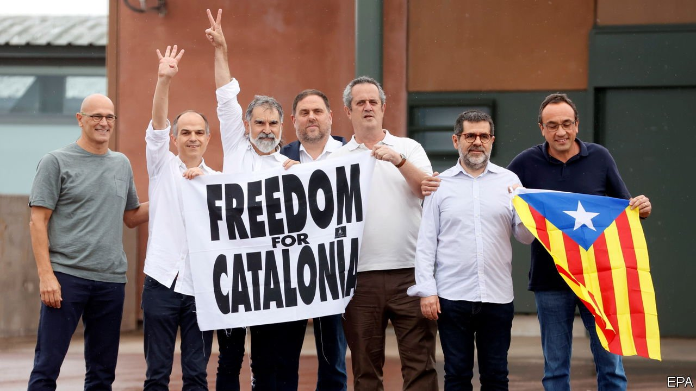

###### From barred cells to Barcelona

# Spain pardons Catalan separatists 

##### The government says it is “in the public interest” 

 

> Jun 24th 2021 

WHEN NINE Catalan separatist leaders walked out of jail on June 23rd after three-and-a-half years inside it was a moment of jubilation for their supporters and of dismay for many others, but perhaps also of modest hope. The previous day the government of Pedro Sánchez, the Socialist prime minister, had granted them pardons, commuting sentences of up to 13 years imposed by the Supreme Court for sedition and maladministration. Their crime had been to organise a referendum in 2017 as regional officials, despite orders not to from the courts, and then to declare Catalonia’s independence. The pardons are intended to ease tensions and open the way to talks to end a conflict that has dogged Spain for over a decade.

The pardons are “in the public interest”, the government argues. They are conditional on not breaking the law again, and do not revoke a ban on holding public office that runs for the same period as the original sentences. For now, at least, the government is not dropping charges against Carles Puigdemont, the former Catalan president who instigated the referendum, and four fellow fugitives who face arrest if they return to Spain.


Nevertheless, Mr Sánchez is taking the biggest gamble of his three years in office. Many Spaniards, including Catalans, were outraged by the attempt to bounce the region out of Spain in 2017. Polls show a majority oppose the pardons; the issue divides Socialist voters. But some 70% of Catalans are in favour, including many who oppose independence, as well as local businesses and the region’s bishops.

The conservative opposition accuses the prime minister of betraying the rule of law. “You are electorally dead,” Pablo Casado, its leader, told Mr Sánchez, calling for a national election on the issue. Critics focus on the lack of repentance from many of the prisoners. Only Oriol Junqueras, Mr Puigdemont’s former deputy and the leader of Esquerra, the most pragmatic of the separatist parties, has admitted that the referendum was not seen as “fully legitimate” by part of Catalan society and that a unilateral road to independence is “neither viable nor desirable”.

Mr Sánchez has powerful arguments. Outside Spain the charges and sentences were widely seen as disproportionate. That is why courts in Germany and Belgium refused to send the fugitives back. Above all, freeing the prisoners drains much of the poisonous emotion from Catalan politics. For these reasons the pardons were opposed by the more radical separatists.

The government plans to open negotiations with its Catalan counterpart, which will focus on how to improve the region’s status within Spain, and possibly on constitutional reform. “We can’t start from scratch, but we can start over…Catalonia, Catalans, we love you,” Mr Sánchez declared in Barcelona this week. In fact, the talks will be hard-headed and strewn with obstacles. Pere Aragonès, the Esquerra president of Catalonia, continues to insist on a full amnesty and a proper referendum on independence, which Mr Sánchez is constitutionally unable to grant. Trials of second-tier officials are pending. The public-accounts tribunal, an administrative body, is poised to impose swingeing fines on 39 former Catalan officials for alleged mis-spending, on the ground that they promoted independence abroad.

The more realistic Catalan separatists know that they are further away from a majority for independence than they were in 2017 and that no European government is keen to see the break-up of Spain. But the government knows that the conflict within Catalonia disables the country. That is why talks may have a chance. ■

