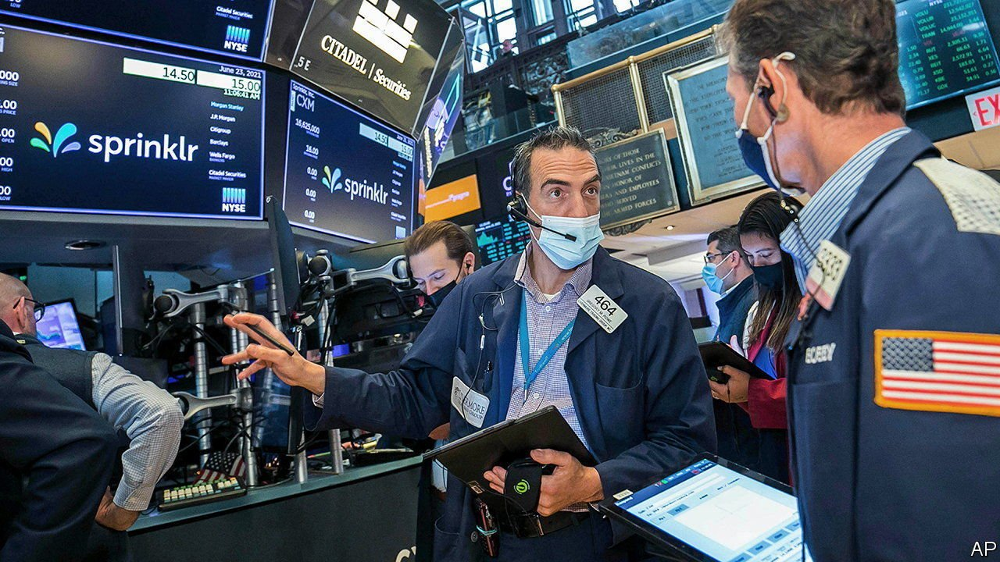
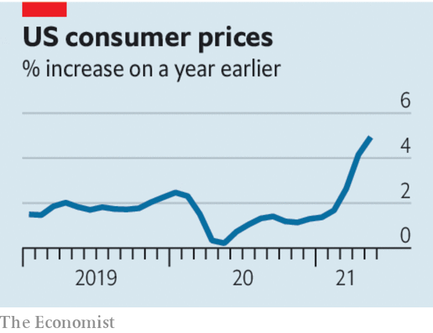

###### New horizons

# Investors can no longer take low interest rates for granted 

##### The Federal Reserve is responding to higher inflation. More is on the way 

 

> Jun 26th 2021 

DURING MOST of the pandemic, exceptional uncertainty about the future of America’s economy has been met with exceptional certainty that monetary policy would stay very loose. No longer. At the Federal Reserve’s meeting in June policymakers signalled that they may raise interest rates in 2023, sooner than they previously thought, and upgraded their inflation forecasts for this year. Investors have spent a week struggling to digest the news. Long-term bond yields, which move inversely to prices, first rose and then fell beneath their initial level. Shares fell steeply and then recovered. Emerging-market currencies, which suffer when American monetary policy tightens, have fallen against the dollar.

The  can suddenly be counted among the many unknowns hanging over the economy as it recovers from the pandemic. Already on the list were the impact of new variants of the virus, the fate of President Joe Biden’s infrastructure plan, the pace at which consumers will spend the savings they have accumulated during the crisis, and the persistence of the bottlenecks that are disrupting supply chains and labour markets. When Fed policy seemed to be set in stone, investors’ evolving views on these puzzles were straightforwardly reflected in their expectations for growth and inflation. Now they must also weigh the possibility that the Fed may step in to forestall overheating by raising rates sooner.


The Fed’s shift appears to have been prompted by the realisation that inflation next year will be higher than it had expected. In the three months to May core consumer prices, which exclude food and energy, rose at an annualised rate of 8.3%, the highest since Paul Volcker was waging war on inflation in the early 1980s. The central bank expects price pressures to subside rapidly. They will leave a mark on future monetary policy even so.

 


The Fed targets inflation that averages 2% over the whole economic cycle, and higher inflation today is already offsetting the slump in prices in the depths of the crisis. The central bank expects its preferred measure of prices to be 3.4% higher at the end of 2021 than a year earlier—or 0.6% higher than it would have been had inflation been on target since the end of 2019. Count from August 2020, when average-inflation targeting was introduced, and the price overshoot will be 1.2%.

The Fed’s change of tune is therefore welcome. Because inflation expectations can be self-fulfilling, a public reminder that the Fed does not want the price surge to get out of hand reduces the chance that it will. A gradual adjustment today also reduces the probability of a panicky spike in bond yields tomorrow, helping avoid a “taper tantrum” like the one in 2013 after the Fed said it would buy fewer bonds.

Jerome Powell, the Fed’s chairman, is striking the right balance between avoiding such a mistake and recognising that the central bank’s job is to hit its economic targets, not to guarantee the tranquillity of financial markets. He could do better still by making the Fed’s frustratingly vague average-inflation target clearer.

More disturbing is the poor quality of the central bank’s forecasts. The Fed has dropped clangers for two straight years, underestimating the jobs rebound in 2020 and being caught out by inflation now. Further surprises are likely. The risk of higher inflation looms particularly large. True, the prices of some commodities, such as copper, have fallen from the peaks seen in May—and they have fallen further since the Fed meeting. But uncertainty in bond markets has risen, oil prices are still going up and many forecasters, including Fed officials, worry that higher inflation may persist into 2022.

It has become clearer that monetary policy will respond to higher inflation, as it should. But that means interest rates—and therefore asset prices—will reflect more of the uncertainty that bedevils the economic outlook. ■

