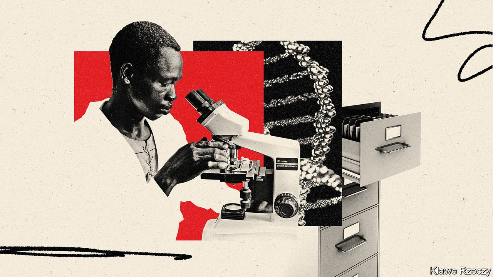

###### Know thyself

# Why the African genome project is so useful 

##### To map the ascent of man, begin at the beginning 

 

> Jun 26th 2021 

RACISM MAY often run deep, but one of the most depressing things about it is how superficial it really is. In most parts of the world it is literally a matter of black and white. A person’s skin colour, however, has little biological significance. It is merely a balance between defending the lower layers of the dermis from cancer-causing ultraviolet light (which favours dark skin) and promoting the beneficial role of ultraviolet in the synthesis of vitamin D (which favours light skin). The farther someone’s ancestors lived from the equator, the paler their skin evolved to be.

Go back far enough, though, and everyone’s ancestors lived in Africa, the continent where Homo sapiens originated. Most non-Africans alive today trace the bulk of their ancestry to Africans who burst forth on an unprepared world about 60,000 years ago. Indeed, the oldest representative of the species yet found in Britain retained the dark skin of his African forebears. Africa is where humanity grew up—and where the bulk of human genetic diversity is found to this day.


Only now is a serious effort beginning to explore Africa’s genetic richness. Better late than never. The , a continent-wide endeavour, proposes to do for the place what has already been done for Europe, North America and parts of Asia—namely to catalogue and analyse the genetic diversity of those who live there. That will be scientifically fascinating, for it will help elucidate how H. sapiens evolved. But it will be medically important, too. It may even help erode that black-and-white excuse for racism.

Genetic diversity brings with it diversity of genetic disease. Cystic fibrosis—in any case rarer in Africa than in Europe—is often caused there by a different mutation from the one involved in the European version, and is thus missed by tests developed in the West. A mutation responsible in Ghana for 40% of inherited deafness is unknown in South Africa. And so on. It also brings a diversity of genetic response to disease. Some of the molecular details of the immune system, for example, vary with geography. Understanding that variation in Africa will improve understanding of immunity to infection, helping Africans and non-Africans alike.

More genetic information will also cast light on evolution. Early H. sapiens migrants from Africa encountered other species of human being on their travels. These were descendants of previous migrations out of Africa of archaic members of the genus. At least two of these other types of human, the Neanderthals and the Denisovans, interbred with the newcomers, and some of their genes are still found in modern Asians and Europeans, doing various jobs including protecting them from disease. Preliminary analysis suggests that those who remained behind in Africa similarly interbred with yet another species of human—but one of which no fossil record remains.

There is an irony in all this. Xenophobia has probably existed for as long as people have. But racist attitudes were reinforced in the 19th century by an enthusiasm for physical anthropology and eugenics. The former attempted to classify human beings on the basis of visible characteristics, such as skin colour, head shape and facial features, that are genetically inherited. If this had been a neutral analysis, it would have been unexceptional. But often it was not neutral. It not only classified, but ranked. White-skinned Europeans put themselves at the top—and black-skinned Africans at the bottom. Add eugenics to that mix and the result was toxic.

The 3MAG project will not, alone, overthrow the legacy of these misadventures and the prejudices they reinforced. The thinking that gave rise to them is still too deeply ingrained in too many minds for it to do that by itself—even, probably, for it to come close. But to those whose minds are open, a group of 21st-century African scientists revealing that the true, glorious genetic diversity of human beings lies in their own continent more abundantly than in any other will be a superb rebuttal to the doctrines of those misguided Victorian European gentlemen. ■

