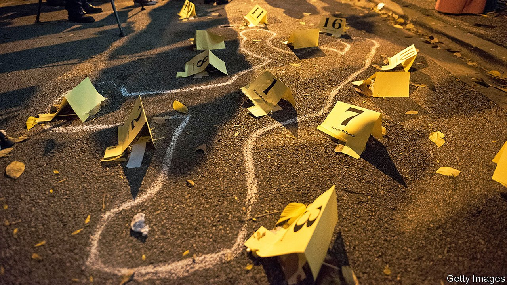
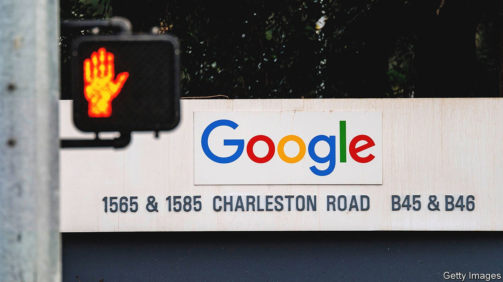

###### On Alzheimer’s disease, crime, art, competition, Vanuatu, Israel, cows

# Letters to the editor 

##### A selection of correspondence 

 

> Jun 26th 2021 


Medical externalities

America’s approval of aducanumab, a drug to treat Alzheimer’s disease, will have a negative impact beyond the United States, especially in middle-income countries (“”, June 12th). Regulators in these countries normally rely on decisions made by stringent regulatory authorities, including the Food and Drug Administration. The World Health Organisation considers such “reliance” to be good practice and a cornerstone of effective regulation. Unfortunately, the FDA undermines this concept by authorising medicines such as aducanumab without any evidence of the clinical benefit. Some argue that post-marketing studies will shed light on these benefits. However, conditional approvals are rare in middle-income countries and low enforcement makes withdrawing a drug unrealistic.


These countries also spend less on health care and their health systems are more vulnerable to financial pressures coming from expensive biologic drugs, including monoclonal antibodies such as aducanumab. The real costs to them of paying for these unproven medicines are huge.

JAVIER GUZMAN

Director of global health policy

Centre for Global Development

Washington, 

 


Rough microplaces

You correctly suggest that violence in America is geographically concentrated in certain neighbourhoods (“”, June 5th). In fact, violence is concentrated in just a few microplaces, each about two blocks square. In Denver 38 microplaces, equivalent to 1.5% of our landmass, accounted for about 25% of all violence in 2020. More important, violent places today were violent five and ten years ago. Meanwhile, most microplaces in “violent” neighbourhoods have little or no violence.

This nuance suggests that, actually, there is no dichotomy between criminal-justice reform and increased public safety. Violence is concentrated in specific places year after year, which strongly suggests that the use of land, built environment and place management all jointly support violence in those areas. Strategies to reduce violence must focus on changing those attributes, rather than on arresting individuals. Such strategies respect calls from the community, especially strong in Denver, to reimagine how police reduce violence. They are also data-driven and represent the cutting edge of criminology and social science.

ZACH MCDADE

BLAKE CHRISTENSON

Senior statistical researchers

Department of Public Safety

City and County of Denver

 


Explain art, don’t hide it

I have been exhausted by the incandescent rage of art-world worthies who are framing the British government’s “retain and explain” policy as some kind of Third Reich power grab for control of the arts sector (“”, June 5th). The government has said that taxpayer-funded institutions which remove artworks from display because of pressure from political groups such as Black Lives Matter may have their funding withdrawn. Such groups want to destroy art depicting historical persons; anyone who lived over 100 years ago is denigrated.

By the standards of 2021, every person before 1900 will realistically have uttered a sexist, racist, homophobic or xenophobic statement at some point in their life. The retain-and-explain policy seeks to keep historically and culturally important items on show, and even grants leeway to have some contemporary interpretation to appease the fashions of the day, hence the “explain”.

The ideology of the curators of these museums has never before diverged so far from the populace at large. People enjoy 18th-century masterworks of sculpture, for instance, as their cultural patrimony and admire the artistry and technical proficiency of a piece. To hide them away because of, say, a tenuous link to slavery is anathema to the public. This is the crux of the issue.

Surely the real chilling effect on museums’ independence comes from groups pressing them to conceal a significant part of their collections. Isn’t the onus on a museum to conserve a collection for posterity rather than hide works that are unfashionable at any given time?

JOSHUA SWERLING

London

 


Loony logic

The late great Screaming Lord Sutch of the Monster Raving Loony Party would have been pleased to learn that “competition authorities are increasingly competing among themselves” (“”, June 12th). After all, it was he who proactively asked, “Why is there only one Monopolies Commission?” Why should the responsibility of fostering competition be given to one monopoly institution that has no competitor? Especially when the tech giants who compete for convenience don’t play by the same rules as the textbooks would prescribe. Rather than reduce output and increase costs they are increasing output and reducing costs.

WILL PAGE

London

 


A misinformation campaign

Indonesia’s attempts to exert greater influence over social media extend beyond its borders (“”, June 5th). Here in Vanuatu, Facebook users have long-endured inaccurate sponsored “news” items critical of those campaigning for human rights in Papua, an Indonesian province, and of the Vanuatuan government, which supports them. These posts, paid for and authored in Indonesia, are accompanied by thousands of comments from people who appear to know or care little about Vanuatu but nevertheless take the time to write lengthy opinions on such enlightened topics as the resemblances between Melanesians and monkeys. Who farms these trolls is officially unknown, but significant time and money clearly goes into their work. Facebook happily accepts the money.

ANDREW GRAY

Pentecost Island, Vanuatu

 


Independent judges

Israel’s Supreme Court has “great power and little accountability”, you say (“”, June 5th). In countries without codified constitutions, such as Israel and Britain, the courts have a vital role in checking the otherwise unconstrained powers of the legislature and executive. This is not activism, but the rule of law in action. When faced with the Conservative Party’s plans in Britain to rein in the powers of supposedly activist judges, The Economist rightly decried it as contrary to the essence of British democracy (“”, February 22nd 2020). Israel’s Supreme Court is one of the country’s essential institutions of liberal democracy.

ELIJAH GRANET

San Diego

 


Buttergate, eh?

I don’t see how lockdowns are to blame for the deception by dairy farmers in Canada of adding palm oil to cows’ diet (“”, May 29th). Canadians should have the right to know the ingredients of the foods they eat. Palm oil hidden in butter is an unnatural and, frankly, undesirable additive. Supply management, lockdowns and tariffs should not interfere with consumers’ informed consent. This loyal customer has moo’ved on.

DENISE HARTFORD

Toronto

