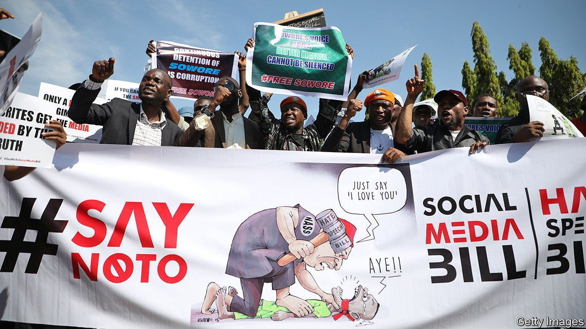

###### A bonfire of satire

# Nigeria’s government wants to gag the press 

##### A draft law echoes the old days of dictatorship 

 

> Jun 26th 2021 

IF NIGERIAN JOURNALISTS have misgivings about the government’s plan to grab more power to fine them and close media houses, it is with good reason. Many remember how in President Muhammadu Buhari’s first days in office as a military dictator in 1984, he passed Decree 4, which allowed him to close down newspaper houses and jail journalists who criticised his junta, ridiculed its officials or published information the state deemed false.

Now, more than two decades after democracy was restored, many Nigerians see history being repeated. Lawmakers are trying to push through parliament a bill that would allow the government to jail journalists, fine newspapers up to 10m naira ($20,000) or close them for up to a year if they publish “fake” news.


To be fair, the bill predates Mr Buhari’s administration. Press unions have fought earlier versions of it since 1999, when they dragged the government before a court in Lagos. A judge struck down the legislation in 2010, ruling that 17 out of its 39 clauses were unconstitutional. But after the government appealed, a higher court ruled in its favour. Still, the tussle continues. The body representing Nigeria’s newspapers has lodged an appeal of its own against the new ruling. That case has yet to make its way through the country’s scandalously slow courts.

The lack of a final judgment has not stopped parliamentarians from pressing ahead. This month they gave the bill another reading. They insist that it is not an attempt to gag the press, which has been increasingly critical of the government, but is simply aimed at stopping fake news and hate speech.

Journalists are not buying it. Mustapha Isah, the head of the Guild of Editors, described the government’s action as “an onslaught on press freedom”. Moreover, the latest efforts to push through the law come just weeks after Nigeria’s government banned people from using Twitter, and amid increasingly heavy-handed restrictions on broadcast media. Last year Nigeria fell five places (to 120th out of 180) in a ranking of press freedom compiled by Reporters Without Borders, a watchdog.

Mr Buhari seems not to have learned what should have been the key lesson of Decree 4: nothing makes a government look sillier than when it makes it a crime to ridicule the state. ■

