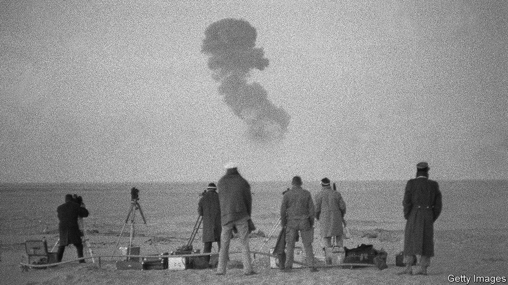

###### Lingering fallout

# The long legacy of France’s nuclear tests in Algeria 

##### Locals at least want to know where France buried its nuclear waste 

 

> Jun 26th 2021 

ABDELKRIM TOUHAMI was still a teenager when, on May 1st 1962, French officials in Algeria told him and his neighbours to leave their homes in the southern city of Tamanrasset. It was just a precaution. France was about to detonate an atom bomb, known as Beryl, in the desert some 150km away. The blast would be contained underground. Two French ministers were there to witness the test.

But things did not go as planned. The underground shaft at the blast site was not properly sealed. The mountain above the site cracked and black smoke spread everywhere, says Mr Touhami. The ministers (and everyone else nearby) ran as radioactive particles leaked into the air. Nevertheless, in the months and years after, locals would go to the area to recover scrap metal from the blast for use in their homes.


France carried out 17 nuclear tests in Algeria between 1960 and 1966. Many took place after Algeria's independence from France in 1962, under an agreement between the two countries. There are no good data on the effects of the explosions on public health and the environment, but locals note that some people living near the test sites have suffered cancers and birth defects typically caused by radiation. The sites, say activists, are still contaminated.

They also say the French have not been sharing information. In 2011 Mr Touhami founded Taourirt, a group dedicated to identifying the location of nuclear waste left by France. All that exists in the public domain is an inventory of the contaminated materials buried somewhere in the desert. (The known test sites are poorly secured by the Algerian government.) Others are pressing France to clean up the sites and compensate victims. There has been some progress in this direction, but not enough, say activists.

In 2010 the French parliament passed the Morin law, which is meant to compensate those with health problems resulting from exposure to the nuclear tests. (France carried out nearly 200 tests in French Polynesia, too.) But the law only pertains to certain illnesses and requires claimants to show they were living near the tests when they took place. This is difficult enough for Algerians who worked for the French armed forces: few had formal contracts. It is almost impossible for anyone else. Only a small fraction of the claims filed have come from Algeria.

In May officials from France and Algeria, part of a working group created in 2008, met in Paris to discuss the cleaning of test sites. Little has come of the talks. But earlier this year Emmanuel Macron, France’s president, decided to launch a “Memories and Truth” commission on his country’s role in Algeria. Benjamin Stora, the historian who will run it, wants to look into the nuclear testing and its aftermath.

In Algeria the nuclear issue has been overshadowed in recent years by worries about hydraulic fracturing, or “fracking”, to extract gas trapped in impervious rocks in the Sahara. Some locals fear this may affect their health (though evidence from America, where it is widespread, suggests it is reasonably safe). Others fear it will damage the environment, or object to the involvement of foreigners, or to the lack of transparency from their own government. Big protests have been held. Many residents of the Sahara feel they are still being treated like guinea pigs, says Mr Touhami. ■

