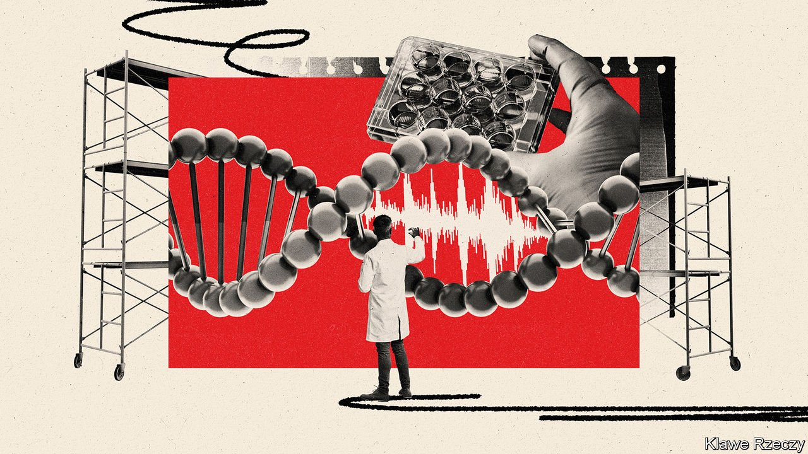
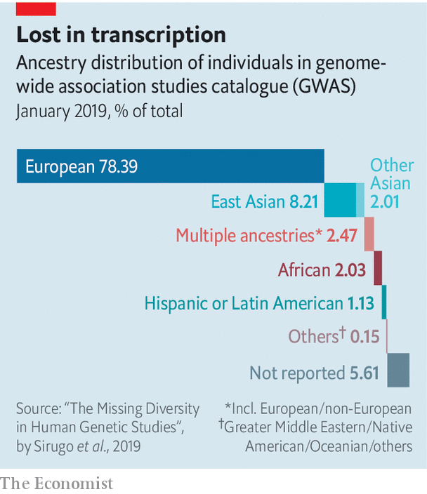

###### Where human life began

# The promise of the African genome project 

##### A Cameroonian professor hopes to illuminate human genetic diversity 

 

> Jun 26th 2021 

WHEN THE Mutambaras’ first son was a about 18 months old they began to worry about his hearing. The toddler did not respond when asked to “come to Mama”. He was soon diagnosed as deaf, though no doctor could tell the Zimbabwean couple the cause. Several years later their second son was also born deaf.

This time a doctor referred them to Hearing Impairment Genetics Studies in Africa (HI-GENES), set up in 2018 by Ambroise Wonkam, a Cameroonian professor of genetics now at the University of Cape Town. The project is sequencing the genomes of Africans with hearing loss in seven countries to learn why six babies in every 1,000 are born deaf in Africa, a rate six times that in America. In Cape Town, where Mr and Mrs Mutambara (not their real names) live, a counsellor explained that the boys’ deafness is caused by genetic variants rarely found outside Africa.


What is true of deafness is true of other conditions. The 3bn pairs of nucleotide bases that make up human DNA were first fully mapped in 2003 by the Human Genome Project. Since then scientists have made publicly available the sequencing of around 1m genomes as part of an effort to refine the “reference genome”, a blueprint used by researchers. But less than 2% of all sequenced genomes are African, though Africans are 17% of the world’s population (see chart). “We must fill the gap,” argues Dr Wonkam, who has proposed an initiative to do just that—Three Million African Genomes (3MAG).

 


The evolutionary line leading to Homo sapiens diverged 5m-6m years ago from that leading to chimpanzees, and for almost all that time the ancestors of modern humans lived in Africa.

Only about 60,000 years ago did Homo sapiens venture widely beyond the continent, in small bands of adventurers. Most of humanity’s genetic diversity, under-sampled though it is, is therefore found in Africa. Unfortunately, that diversity is also reflected in the greater variety of genetic illnesses found there.

The bias in sequencing leads to under-diagnosis of diseases in people of (relatively recent) African descent. Genetic causes of heart failure, such as the one that caused the ultimately fatal collapse of Marc-Vivien Foé, a Cameroonian football player, during a game in 2003, are poorly understood. The variation present in most non-Africans with cystic fibrosis is responsible for only about 30% of cases in people of African origin. This is one reason, along with its relative rarity, that the illness is often missed in black children. Standard genetic tests for hearing loss would not have picked up the Mutambara boys’ variations. And such is the diversity within the continent that tests in some countries would be irrelevant in others. In Ghana HI-GENES found one mutation responsible for 40% of inherited deafness. The same variation has not been found in South Africa.

Bias also means that little is known about how variations elsewhere in the genome modify conditions. With sickle-cell disease, red blood cells look like bananas rather than, as is normal, round cushions. About 75% of the 300,000 babies born every year with sickle-cell disease are African. The high share reflects a bittersweet twist in the evolutionary tale; sickle-cell genes can confer a degree of protection against malaria. Other mutations are known to lessen sickle-cell’s impact, but most knowledge of genetic modifiers is particular to Europeans.

Quicker and more accurate diagnosis would mean better treatment. The sooner parents know their children are deaf, the sooner they can begin sign language. Algorithms that incorporate genetic information, such as one for measuring doses of warfarin, a blood-thinner, are often inappropriately calibrated for Africans.

Knowing more about Africans’ genomes will benefit the whole world. The continent’s genetic diversity makes it easier to find rare causes of common diseases. Last year researchers investigating schizophrenia sequenced the genomes of about 900 Xhosas (a South African ethnic group) with the psychiatric disorder. They found some of the same mutations that a team had discovered in Swedes four years earlier. But those researchers had to analyse four times as many of the homogeneous Scandinavians to find it. Research by Olufunmilayo Olopade, a Nigerian-born oncologist, into why breast cancer is relatively common in Nigerian women, has revealed broad insights into tumour growth.

Dr Wonkam’s vision for 3MAG, as outlined in Nature, a scientific journal, is for 300,000 African genomes to be sequenced per year over a decade. That is the minimum needed to capture the continent’s diversity. He notes that the UK biobank is sequencing 500,000 genomes, though Britain’s population is a twentieth the size of Africa’s. The plummeting cost of technology makes 3MAG possible. Sequencing the first genome cost $300m; today the cost of sequencing is around $1,000. If data from people of African descent in similar projects, like the UK biobank, were shared with 3MAG, that would help. So too would collaboration with genetics firms, such as 54Gene, a Nigerian start-up.

The 3MAG project is building on firm foundations. Over the past decade the Human Heredity and Health in Africa consortium, sponsored by America’s National Institutes of Health and the Wellcome Trust, a British charity, has supported research institutes in 30 African countries. It has funded local laboratories for world-class scientists such as Dr Wonkam and Christian Happi, a Nigerian geneticist.

There are practical issues to iron out. One is figuring out how to store the vast amounts of data. Another is rules around consent and data use, especially if 3MAG will involve firms understandably keen to commercialise the findings. Dr Wonkam wants to see an ethics committee set up to review this and other matters.

At times he has wondered whether his plan is “too big, too crazy and too expensive”. But similar things were said about the Human Genome Project. Its researchers used the Rosetta Stone as a metaphor for the initiative and its ambition. In a subtle nod, Dr Wonkam has a miniature of the obelisk on a shelf in his office. It is also a reminder of how understanding African languages, whether spoken or genetic, can enlighten all of humanity. ■

