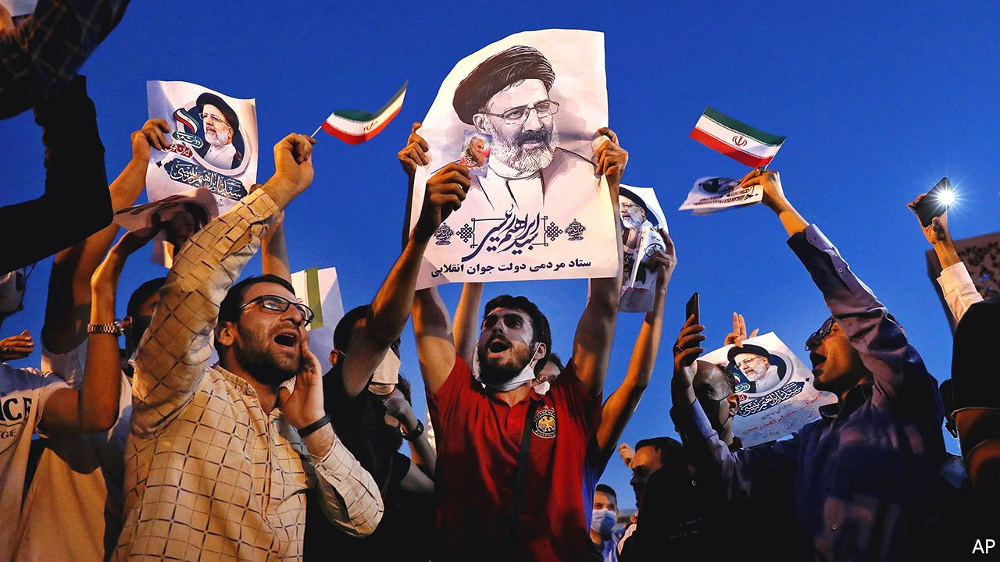

###### A hardliner wins, democracy loses

# What Ebrahim Raisi’s election means for Iran and the nuclear deal 

##### The supreme leader is consolidating power. The new president may help 

 

> Jun 24th 2021 

EBRAHIM RAISI will not meet Joe Biden. Nor will he negotiate over Iran’s missile programme. And he’s certainly not going to stop supporting the militias that project Iranian influence in the region. Soon Mr Raisi will be president of Iran. At his first press conference since winning office the hardline cleric and former head of the judiciary offered a preview of his administration. He seems keener to confront the world than engage with it.

That is no surprise. Mr Raisi is a protégé of the supreme leader, Ayatollah Ali Khamenei, who is consolidating power in the hands of hardliners. The election on June 18th was anything but fair. Of the nearly 600 candidates who registered to run, all but seven were disqualified by the Guardian Council, including a former president, a current vice-president and Iran’s longest-serving speaker of parliament. (Three of the seven dropped out later.)


The council, a group of clerics and lawyers who vet candidates, essentially  for Mr Raisi. And he duly won with 62% of the vote. Turnout, though, was less than 49%, a record low, as many liberal and moderate Iranians boycotted the poll.

Mr Raisi appealed to conservative voters and those who believe his promises to stamp out corruption, which is rife. Like Mr Khamenei, he is opposed to deeper engagement with the West and thinks personal freedoms should extend only as far as Islamic law allows (not very far, in his mind). America placed sanctions on him two years ago for his involvement in the regime’s repression of the pro-democracy Green Movement in 2009, after another rigged election. America also cited Mr Raisi’s participation in a “death commission” that ordered the extrajudicial executions of thousands of political prisoners in 1988. When asked about that, Mr Raisi described himself as a “defender of human rights”.

How Mr Raisi is viewed in America matters. Iran has been hit hard by covid-19. Its economy has suffered as a result of the virus, but also because of graft, mismanagement and, most of all, sanctions reimposed by Donald Trump after he yanked America out of the Joint Comprehensive Plan of Action (JCPOA). That is the unwieldy name given to the multinational deal under which Iran agreed to curb its nuclear programme in return for sanctions relief. In response to Mr Trump’s actions, Iran has breached the agreement in several ways, not least by enriching uranium to levels far beyond those needed for civilian use.

President Biden has made clear that he wants to re-enter the JCPOA. Mr Raisi does too, as long as Iran’s interests are met. Talks in Vienna, aimed at bringing America and Iran back to the deal, are said to be making progress. Iranian negotiators, acting under the current (and pragmatic) president, Hassan Rouhani, may hope to wrap things up before Mr Raisi takes office in early August. That might also suit Mr Raisi, who could then reap the economic benefits of a renewed deal, while blaming Mr Rouhani for its flaws.

American officials also hoped to negotiate, at some point in the future, new agreements dealing with Iran’s missiles and its meddling in the region. (The omission of these issues from the JCPOA led Republicans in America to oppose it; ditto Israel, Saudi Arabia and its Gulf allies.) America would retain leverage even if the JCPOA is renewed, as many of its sanctions on Iran would remain in place. Some feel a more coherent Iranian regime will be a less frustrating negotiating partner. But Mr Raisi’s views suggest that such add-on agreements will be hard to reach.

In Iran the election of Mr Raisi may be a harbinger of illiberal changes to the country’s hybrid political system. The clerics have been in charge since 1979, but the government has long pointed to elections and high turnout to bolster its claim to legitimacy. The democratic façade had already been crumbling. Reformists and moderates led by Mr Rouhani made little progress during his two terms (the maximum allowed under the constitution), as the clergy and allied security forces tightened their grip. Before last year’s parliamentary election reform-minded candidates were disqualified en masse. In a recording leaked earlier this year, Muhammad Javad Zarif, the foreign minister, described how he was often sidelined by the powerful Islamic Revolutionary Guard Corps.

Holding such a blatantly rigged presidential election, all but acknowledging that the system's republican features are a sham, is the boldest step yet by the hardliners. There is much speculation about what comes next. Some expect a further purge of liberals from state institutions. Others foresee structural changes, as Mr Khamenei, who is 82, seeks to cement his legacy and prepare the country for his eventual successor. He might, for example, do away with the presidency.

The machinations of Mr Khamenei’s narrow group of clerical advisers are murky and unpredictable. Some believe he is grooming Mr Raisi as his successor, but there are plenty of other candidates (including Mr Khamenei’s son, Mojtaba). What is clear is that Iran’s unelected theocrats and revolutionary guards are tired of being challenged by the reformists, moderates and pragmatists whom voters often choose to represent them. And the regime will remain hostile to Western influence, even if the nuclear deal is renewed. Mr Raisi’s victory bodes ill for any hope of liberalisation in Iran. The Islamic republic looks ever more like an Islamic autocracy, ruled by God’s law and men with guns. ■

A version of this article was published online on June 19th 2021

