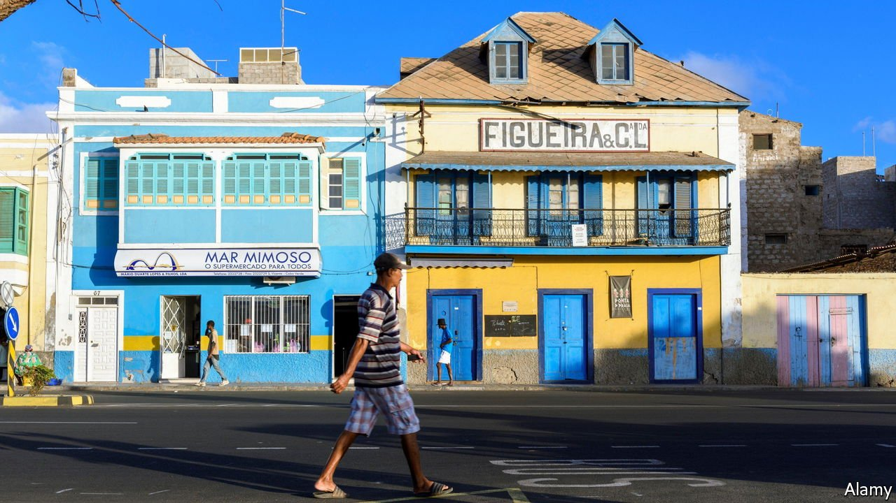

###### Islands of democracy

# Why Africa’s island states are generally freer 

##### Size is important; so is being an island 

 

> Jun 26th 2021 

CAPE VERDE may be best known for white sand beaches. But the archipelago, about 500km off the coast of Africa, has something else going for it. It is one of the region’s few fully fledged democracies.

Africa has more than its share of despots. But archipelagoes like Cape Verde seem to have avoided this curse. Four of Africa’s five island-states with less than 1.5m inhabitants are rated “free” by Freedom House, an American think-tank. This means they are largely liberal and democratic. For the continent as a whole, fewer than one in five countries is “free”.


A study published this month in the Journal of International Relations and Development argues that the size and insularity of these countries—Cape Verde, the Comoros, Mauritius, São Tome and Principe and the Seychelles—hold the key to their freedom. It is part of a growing body of academic research that suggests that being small and being an island are associated with democracy. In Africa, the authors of the study argue, smallness leads to a more personal politics, where constituents can pester officials to keep their promises. Being islands, the authors add, spares these countries from land borders which their neighbours may contest or over which conflicts can spill.

 


Take Cape Verde. After independence it was led by a single party. Though far from democratic, it still held regular elections and allowed some opposition politicians to compete. The authors attribute that relative liberalism to the island’s personal politics. It is a lot harder, they say, for a single party to crack down on dissidents when they are neighbours and friends. In the 1990s it fully democratised, thanks in large part to the relative liberalism of the previous decades. Today Cape Verde sits just below Britain on Freedom House’s democracy ranking.

Identifying the underpinnings of democracy is tricky, especially with such a tiny sample and given that small countries are more likely to be statistical outliers. These islands have a handful of other attributes that could explain their politics. They lack natural riches, such as diamonds and oil, which prop up despots in other places. Instead, many of the islands rely on tourism, which tends to provide jobs and income to a wide swathe of society, and so can foster stability and development. But the five are varied in other respects, having been colonised by different countries, bequeathed different political systems and attained different levels of development. The Seychelles has more than four times the GDP per person of Cape Verde or the Comoros. Mauritius has a parliamentary system inherited from Britain. The Seychelles and the Comoros are presidential. Cape Verde and São Tome and Principe have semi-presidential systems.

The success of small islands is not instructive for the rest of Africa. Mainland countries cannot break up into tiny states and drift into the Atlantic. Even if they could, small island democracies have flaws. Cape Verdeans complain about graft, which, ironically, may stem from the same personal politics that allowed democracy to flourish. The Comoros struggles with political instability. The Seychelles had its first peaceful transition of power in decades only last year. What the study does illuminate, though, is the potential of African countries to be democratic and well-run, even if for now, most are not. ■

