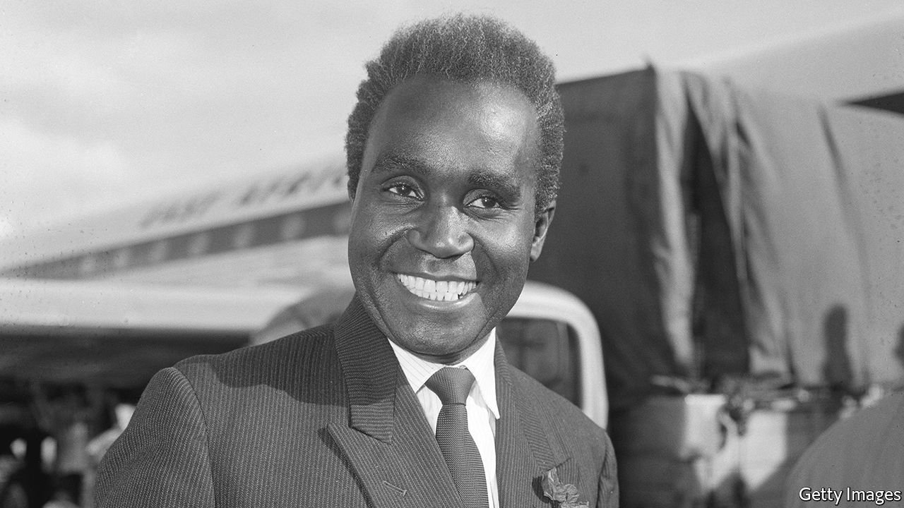

###### Man and superman

# Kenneth Kaunda died on June 17th 

##### The founding president of Zambia and icon of African liberation was 97 

 

> Jun 26th 2021 

WHEREVER HE TRAVELLED, Kenneth Kaunda took with him a very large white handkerchief. He gripped it in his left hand as he gave speeches in conference halls or at village meetings, and draped it over his left knee at sit-down interviews. Sometimes he used it to wipe away the sweat of exhorting his people but, more often, it dabbed away tears.

He was not, by nature, a melancholy man. Dazzling smiles came easily too, as well as ballroom dancing, joking and singing, with his guitar in tow and his hair teased up to give him extra height. He grew emotional, though, whenever he spoke of the plight of his country under British colonial rule. The sight of his father, for example, a reverend at a mission in Lubwa near the border with Congo, sitting on a hard wooden bench in church, while the white ministers sat on cushions; or the poor African women he had seen manhandled at a white butcher’s shop for protesting at the high prices and the rotten meat he sold them. As he told these stories the tears would inevitably flow, and he let them, without embarrassment.


Deep emotion did not, however, lead him into violence. His parents had given him two commandments that stuck with him, Jesus’s words: Love God, and love your neighbour. Do unto others as you wish them to do unto you. To pick up a gun, as most fighters for independence did, made you no better than the killers you faced. When his early political organising took him in and out of British-run jails he read Gandhi, whose writings went straight to his heart. He resolved to live simply, give up drink and smoking, and take back his country without bloodshed. The new Zambia, no longer Northern Rhodesia, was to be a land of respect for people of all races, colours and religions. Facing down his more vengeful colleagues, he called his liberation push in the early 1960s the “cha-cha-cha” campaign, for a nation where everyone—Africans and Europeans, children and the unborn, even domestic beasts, even the queen—would dance together.

Behind the whimsy lay an iron resolve to keep Zambia united. “If I say ‘Let’s sing,’ just sing,” he told his followers. From 1964 he was president-strongman of a free country, his white handkerchief now a totem of his power, leading crowd-choruses of “Tiyende Pamodzi”, “Let’s walk together”. In Africa, he believed, opposition to the ruler spelled destruction. In Zambia, a land of many tribes and languages, multi-party democracy would let its enemies, the white-minority regimes to the south, undermine it and break it apart. For 26 of his 27 years in power he suppressed even the thought of it. Hundreds of political opponents were jailed and beaten, while he ceaselessly reshuffled the posts in his own party to keep all ethnic groups on his side.

His Zambia had a uniting moral philosophy to live by, his own invention, a mixture of Christianity, socialism and African traditions that he called “Zambian humanism”. Its main principle was the importance of man: no fellow should be richer than another, no man should exploit another, each person had value and dignity. He set the pace, living as his party’s leader in a house that had no power or running water, and as president steadily building schools, clinics and new roads, to give all Zambians a better chance. The people loved him for this, chanting “God in heaven—on earth, Kaunda!”, and calling him “KK” for short. Since he was a proud football fan, sometimes turning the whole cabinet out for a public kickabout, the national football team became the “KK11”. When they won international matches he would invite them to dinner at State House, humbly serving them himself on plates decorated with Zambia’s coat of arms.

The economy, though, foxed and frustrated him. The country was fundamentally rich, with huge reserves and exports of copper that paid for his social improvements. But if he was truly to eliminate all classes and close the gaps between rich and poor, miners and farmers, he had to bend the economy to his will, like everything else. He therefore nationalised the copper mines, froze miners’ wages and also froze prices, only to find that his policies discouraged farmers from planting and mining firms from investing. Then in 1974 the copper price fell off a cliff, trade to and from his landlocked country was disrupted by regional wars, and Zambia rapidly became one of the world’s most indebted nations. Hating to be told what to do, he resisted going to the IMF, but in 1989 at last accepted its terms. An austerity programme forced him to end food subsidies; the riots that followed led to the multi-party elections he dreaded, and in 1991 he was voted out of power.

He went graciously. That was the best way to keep Zambia together, and also the best example for Africa as a whole. He was only the second African president to step down after an election, but it fitted with his long-term efforts to bring conciliation to the continent. His Zambia became a refuge for anti-colonial strugglers from all over southern Africa, but he also did not hesitate to talk to John Vorster and P.W. Botha, South Africa’s racist leaders, man to man, to try to build bridges. Though he had no luck, it was more than other black leaders cared to do, and made him the natural chairman of pan-African organisations. In 1987, after he had lost his son Masuzyo to AIDS, he not only admitted it publicly but began a campaign to combat HIV/AIDS across the continent. With KK as its spokesman, carefully non-aligned Zambia punched well above its weight in both African and world affairs.

He did not, however, leave it in good shape. As he stepped down, a country that had been one of the region’s richest was $7bn in debt. More than 70% of Zambians lived below the poverty line. Country folk and town folk were still far from equal. So although he had given the people multi-party elections in the end, they had decided against him in a landslide. And although his reputation recovered with the years, until he was once again the beloved father of his country and an icon of the liberation struggle, in public he still clutched the large white handkerchief in his left hand, power and regret together. ■

