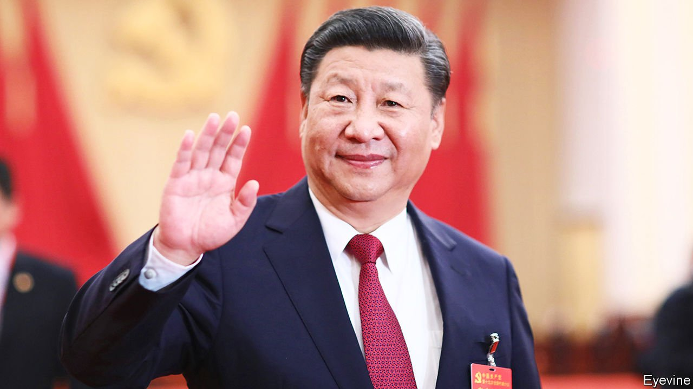
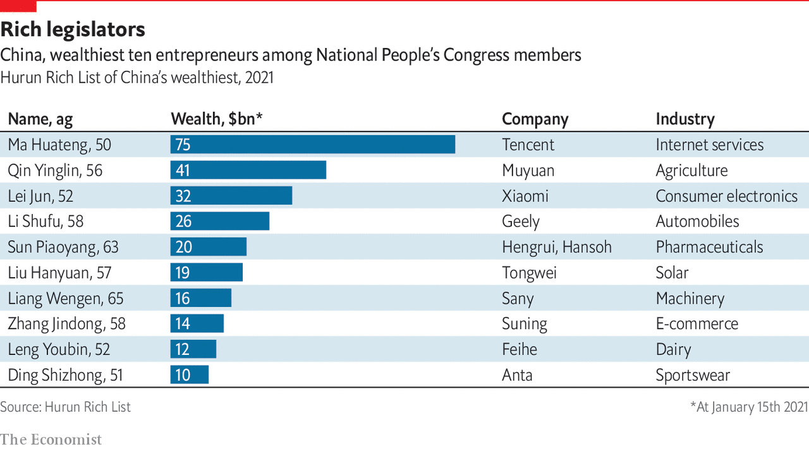

###### The party’s next century?

# A future, but with Chinese characteristics 

##### Communist Party leaders do have dreams other than just remaining in power. But achieving communism is no longer really one of them 

 

> Jun 23rd 2021 

AS COLUMNS OF smoke rose from Tiananmen Square and tanks took up positions along Beijing’s central thoroughfare, it was hard to imagine the Communist Party celebrating its 100th birthday still firmly in charge. It was the day after the army had slaughtered hundreds, if not thousands, of people on June 3rd-4th 1989. The massacre had crushed a nationwide pro-democracy movement. But the city seethed with anger. How could that fury remain bottled up for ever?

Few people had heard of Xi Jinping, then party chief in Ningde, in Fujian province. Now he is Uncle Xi—the “people’s leader”, as the Politburo called him in December 2019, just as covid-19 was brewing in Wuhan. That tested the party again. Rage boiled up over the death of a doctor reprimanded by police for daring to discuss the new virus online. Some observers hoped the cover-up would be China’s Chernobyl: an episode that helped force political change. Once more they were proved wrong.


In the West the party’s resilience causes surprise and disappointment. Its ability to adapt to the demands of a fast-growing middle class, tweak its message to suit the public mood and even act on public suggestions is underappreciated. The leadership blamed the cover-up in Wuhan on local officials and honoured the late doctor (a party member) as a “martyr”. The party emerged seemingly unscathed. But it is also a mistake to dismiss party leaders’ fears. A book published by the party last September was entitled “Extracts from Discourses by Xi Jinping on Countering Risks and Challenges and Responding to Sudden Incidents”. The 251-page volume ranges from soaring debt and property bubbles to plots by the West to foment “colour revolutions” in China.

The unrest in Hong Kong in 2019 is often derided as one such foreign-orchestrated attempt to undermine the party. This explains the viciousness of the response, which has made it clearer than ever that China’s government is calling the shots in the territory (the party still does not operate openly there, but the central government’s representative is chief of the “Hong Kong Work Committee”). Taiwan looks anxiously on. The island has been in the party’s sights since 1949, when the government of Chiang Kai-shek, defeated by Mao’s forces, fled there. Its rulers say Taiwan is an independent country. The party says it is ready to use force to “reunify” it with the mainland if other means fail. That appeals to China’s nationalists, who often bray for a showdown.

But Mr Xi is cautious. That is evident in his remarks about Taiwan. He talks of China’s great rejuvenation by 2049, and links that idea with reunification. But he makes no promise about achieving this on his watch. He wants to appeal to nationalists, not tie himself down. His threatening military manoeuvres in the Taiwan Strait and his talk of inevitable reunification play well at home. Nationalists buy his promise that China will be “prosperous, strong, democratic, culturally advanced, harmonious and beautiful” by mid-century—even though they know that “democratic” is party-speak for an efficient dictatorship.

So it is with Mr Xi’s professed belief in Marxism. By vaunting it, he ensures support from party conservatives. But he does not let it hamstring policies, which display the same ideological pragmatism that all leaders of the post-Mao era have shown. They give priority to the needs of urban residents: migrants from the countryside are second-class citizens. The super-rich are showered with honorary titles. Of about 5,100 people who are members of China’s parliament and its advisory body, more than 140 have fortunes of at least 2bn yuan ($320m), reckons Hurun Report, a Shanghai-based group (see chart). Between 2013 and 2018 the combined wealth of the 100 richest delegates (about 3.9trn yuan) had doubled.

 


In the build-up to the party’s birthday, Mr Xi has tried to show support for underdogs. On his watch, the final 100m people have been declared free of extreme poverty, helped by public spending of more than 1.6trn yuan. But income inequality is high and the welfare net is thin. Mr Xi is wary of those who take Marxism literally. Several members of a Marxist club at Peking University were arrested in 2018 for supporting strikers in Shenzhen. Censors often delete articles on WeChat groups run by neo-Maoists, who denounce the “bureaucrat-capitalists” running China.

Mr Xi occasionally puts the squeeze on tycoons, not because they are rich but because he wants to ensure they do not challenge the party. Several wealthy businessmen have been arrested or otherwise reined in. One recent target is Jack Ma, founder of the e-commerce giant, Alibaba (and a party member). Mr Ma’s business empire seems one the party should like. Alibaba and its financial-services company, Ant Group, have more than 200 party branches with 7,000 members, said Alibaba’s party chief in 2018. Yet Mr Ma stepped out of line by attacking regulators in a speech. That led to the halting of what would have been the world’s biggest initial public offering: listing Ant Group on exchanges in Hong Kong and Shanghai. Mr Ma dropped out of public sight for three months. Regulators forced Ant Group to restructure and fined Alibaba more than 18bn yuan for violating antitrust law.

The plight of such businesspeople suggests a difficulty with Mr Xi’s mission to keep the party in power while turning China into a technological and financial colossus. Most industries at the forefront of innovation in China are private. But with his relentless emphasis on ideology and occasional blows against uppity entrepreneurs, Mr Xi spreads fear among those whose support he most needs if China is to challenge American economic supremacy. In 2018 a social-media account owned by Qiushi, a party journal, published an article entitled “The theory of the communists may be summed up in the single sentence: abolition of private property.” The revival of that sentence from the Communist Manifesto sowed alarm. Mr Xi went on to reassure private businessmen that their property was safe, but many still wonder.

By demanding unquestioning obedience, Mr Xi is also creating another problem. One secret of the party’s longevity has been its willingness to give low-level officials freedom to be creative and even bend the rules. They have usually been judged more on their ability to boost economic growth than on their ideological correctness. A big drawback to this laissez-faire approach has been collusion between party officials and mafia-like gangs in industries such as property and transport. Mr Xi’s war against “black society”, as such criminality is called, has been popular. But he has also terrorised the bureaucracy, sucking the initiative out of local government. Jessica Teets of Middlebury College in Vermont says there are “really high resignation rates” among local officials.

None of these problems suggests a party that is near collapse. But Mr Xi may test it over his own succession. Since 1949 the party has managed only one smooth transfer of power, from Jiang Zemin to Hu Jintao in 2002, and that was hardly a full transfer as Mr Jiang (now 94) remained military chief for another two years. Before Mr Xi, leaders tried to avoid traumatic successions by picking a replacement before stepping down. Mr Xi shows no sign of doing this. His sudden death or incapacity could throw Chinese politics into turmoil that could also destabilise society.

But after Mr Xi may come another like him. For all the misgivings about Mr Xi that are doubtless shared by victims of his purges, as well as their associates, many senior officials share his view of the party’s vulnerabilities. It would take much daring for a new leader to loosen the reins. The party may not remain a political force in 100 years’ time. But the world should be prepared for it (and Xi-style rule) to last long into the future.■

Full contents of this special report


The party’s next century?: A future, but with Chinese characteristics*

