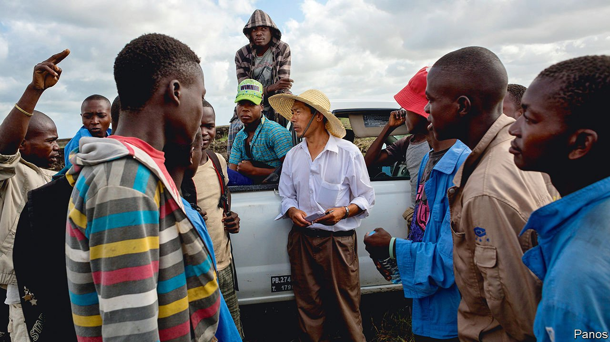

###### The Communist Party abroad

# As Chinese citizens head overseas, the party does likewise 

##### With China’s global footprint expanding everywhere, so is the Communist Party’s—not always openly 

 

> Jun 23rd 2021 

“PARTY-BUILDING has no borders.” So intones the Communist Party to encourage Chinese firms to set up party branches abroad. “No matter where the project, that country will have a party organisation,” is another slogan. China’s rise has expanded the party’s influence abroad. As Chinese citizens head overseas for work and study, its branches are spreading too.

Browbeating the West to show more respect is the task of party organs in Beijing. The foreign ministry does the grunt work, but the party’s Foreign Affairs Commission, headed by Mr Xi, sets policy. The Publicity Department spreads propaganda through state media such as CGTN, a television network, and Xinhua, a news agency. The United Front Work Department (UFWD) controls organisations seeking to boost the party’s influence abroad, especially among ethnic Chinese. The ASPI Australian think-tank says the UFWD oversees Confucius Institutes, the government-supported cultural centres on university campuses abroad.


Officials know the party is not an attractive brand in the West. So these organs keep the party’s name out when operating abroad. At home, Mr Xi says China’s state media “must be surnamed ‘Party’”, to serve the party’s interests. But CGTN broadcasts do not advertise the connection. The station sometimes employs anchors who are not Chinese, with backgrounds in Western media such as the BBC or CNN. (America has designated CGTN and Xinhua as “foreign agents”; Britain has banned CGTN’s broadcasts.)

Chinese ambassadors are also party secretaries, though they rarely advertise this. This gives them authority over party bosses in Chinese state-owned firms in their countries. They may meet locals as ambassadors, but put on the party hat for talks with Chinese expatriates. Chinese firms often hold party meetings in China’s diplomatic missions, says Chen Yonglin, a diplomat who defected in 2005. And the party wants to develop more structures overseas. The aim seems to be to keep members engaged and ensure they are not seduced by Western political thinking. The party guards against ideological deviance, so its re-embrace of members when they return home is conditional on proof of loyalty.

Before the pandemic, 1.6m Chinese were studying abroad and 1.5m people worked overseas for Chinese multinationals. The share of students in the party was low: many would have gone abroad from school, at an age when few are members. But many graduate and exchange students join before leaving China. And membership is high in state-owned firms: more than 40% of the staff of centrally owned ones belong to the party. So there could be tens of thousands of members abroad.

The party is still coy. In 2017 a newspaper revealed that Chinese firms overseas were guided by a principle called the “five not-opens”: they keep quiet about the existence of their company’s party organisation as well as its activities, do not reveal their employees’ roles in the party or even their links with it, and do not make public any party documents. But under Mr Xi, state-owned firms abroad have to set up party branches. They appear to be complying. “Along the belt and road, the party flag is flying,” state media proclaim, referring to China’s global infrastructure-building.

The All-China Federation of Industry and Commerce has also called for the establishment of party organisations in the overseas operations of private firms. Huawei, a tech giant that has alarmed Western countries because of fears that China may exploit its network equipment for spying, employs thousands of party members. The firm’s policy is to set up party structures in its overseas businesses “according to local conditions”.

On foreign campuses, in deference to Western sensitivities, the party does not appear to be trying to create explicit branches among Chinese students and academics. But Chinese students are often eager to maintain party connections when abroad so as to restore ties when they return. One way to show political commitment is to organise meetings to study Mr Xi’s speeches. Some students abroad have formed cells for this purpose. University websites and social media in China have reported this at Nottingham University in Britain, South Korea’s Kyung Hee University and Missouri State University in America. In 2017 Chinese scholars formed a branch at the University of California, Davis, but soon dissolved it since American law requires those acting for a foreign political party to register with the government.

If party members form explicit organisations on campuses, they may find their freedoms constrained by the need to report on each other. But China can monitor the behaviour abroad of members and non-members alike even without a party presence. The Chinese Students and Scholars Associations that have been set up with government backing on most campuses with lots of Chinese students have no explicit links with the party, but their leaders report to Chinese diplomatic missions.

The party’s most intimidating global arm is the Chinese security apparatus. Unlike the army, police and civilian intelligence agencies do not belong to the formal party structure. But they are at its beck and call. China’s spies travel abroad to monitor troublesome dissidents. Wherever they are, they read citizens’ messages on social media. Chinese abroad who speak against the party take a risk: family members in China may suffer. There is little need for a party presence to instil fear. The tried and tested methods used by authoritarians the world over serve the party well.■

Full contents of this special report


The Communist Party abroad: Flying the Chinese flag*


