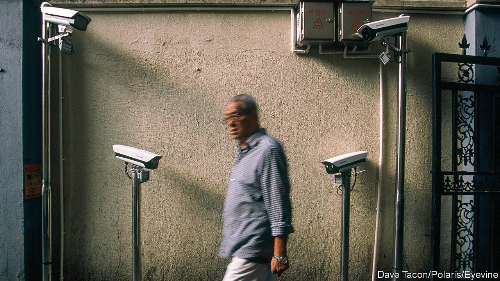

###### China’s methods of surveillance

# Busybodies, backed by AI, are restoring the party’s visibility 

##### How Communist Party members help to keep a close eye on Chinese citizens—and on each other 

 

> Jun 23rd 2021 

IN 2018 XI JINPING visited one of Shanghai’s grandiose new structures, a ponderous, low, glass-clad building that had been used mainly as an exhibition centre. A space inside had been taken over by the district government for an entirely different purpose. On one wall a vast screen showed live feeds from street cameras. With the help of artificial intelligence, it could alert officials to problems as subtle as a builder not wearing a safety-helmet or a flat being rented by too many people. They nicknamed the system that supplied this information the “big brain”.

Mr Xi says city management must be “as fine as embroidery”. As officials put it, there must be no “blind spots”: every corner must be watched and any problem dealt with immediately—whether an illegally parked car, a missing manhole cover or a “sudden incident” (as the party calls everything from the truly dramatic to a gaggle of protesters complaining about unpaid wages). The big brain in Pudong district is pioneering a technological answer, collating data from sources ranging from the ubiquitous cameras to police patrols. Informants selected by the party supply information, too. One reason why Mr Xi is rebuilding the party at the grassroots is to use its members to keep watch.


Throughout the Mao era and into that of Deng Xiaoping, the party was everywhere. In the countryside, where most Chinese then lived, village party chiefs were all-powerful. In cities most people worked for state-owned companies or for government institutions, where party bosses were just as mighty. Get on the wrong side of one and it could ruin not just your career, but your entire life. The workplace was responsible for allocating housing (there were no privately owned homes). Its permission was needed to marry, travel or get a passport. When they graduated, all students had to accept whatever jobs were allocated to them by the state. A black mark from a party apparatchik could mean a dreary post in a dismal, faraway town.

In 2002 Perry Link, an American academic, likened the party’s ability to keep people in line to that of “a giant anaconda coiled in an overhead chandelier”. Normally the snake does not move. “More often than not, everyone in its shadow makes his or her large and small adjustments—all quite ‘naturally’.” As social change accelerated in the 2000s, the metaphor became less apposite. Working-age villagers moved en masse into cities where their transient lifestyles made it much harder for the party to monitor them. Housing had been privatised and far fewer people worked for the state. Students could find their own jobs and people could travel where and when they liked. The snake had become less visible and less threatening. Growing numbers of NGO activists, rights lawyers, citizens aggrieved by local injustices and internet users were even daring to give it a poke.

The party cleans up

Mr Xi wants to restore its visibility. Busybody party members are making a comeback. Even before he took power, experiments had begun in some cities with a new system of control called “grid management”. This involved dividing communities into groups of households, or grids, and assigning people (often retirees and usually party members) to keep watch on other grid residents. Mr Xi has extended this system nationwide. The big-brain screen in Pudong shows the locations of grid monitors. When something worrisome happens, it can help officials to decide who should take a closer look.

An official newspaper gives an example. Its journalist saw one camera home in on a piece of wastepaper on a street. That information was relayed to a grid monitor, who disposed of it. A trivial example, seemingly, but some readers may have taken note. Had the scrap been an anti-party flyer scattered by a dissident, the perpetrator could have been whisked away as quickly as the paper.

At the top of the grid hierarchy sit neighbourhood party committees. These have been beefed up by putting local police chiefs in senior positions and giving them more authority over other party committees, such as those in businesses. The committees relay the intelligence they gather from grid managers to the police. Universities cause particular anxiety. Every big anti-government upheaval for more than a century has seen students at the forefront, including the May Fourth Movement of 1919, in which Mao participated. There is no sign of rebelliousness on campuses today. But Mr Xi is watchful. For universities to be run well, he said in 2016, they must be “firm strongholds” of support for the party. Some, he lamented, were not strong enough. Two years later he called for “resolute” measures to prevent the spread of “incorrect political trends of thought” among students.

Once again, party members are used as his footsoldiers. Since the unrest of 1989 student party members, or applicants to join the party, have been deployed as xinxiyuan, or informants. Their job is to submit regular reports to the party on topics being discussed by students and to snitch on anyone, including their own tutors, deemed to be erring ideologically. Under Mr Xi, their role has become more institutionalised, with campuses divided into grids. Each deploys xinxiyuan to monitor fellow students in their dormitories. Their intelligence is fed into campus computer systems.

Mr Xi has also put more effort than his post-Mao predecessors into ensuring the party operates inside private enterprises and NGOs. Employees who are party members have formed cells (xiaozu) or branches (zhibu), one function of which is to keep an eye on workers and report potential trouble. Their chiefs often take part in neighbourhood party meetings that discuss threats to social stability. Under Mr Xi, the party is getting back into business. ■

Full contents of this special report


China’s methods of surveillance: They’re always looking at you*


