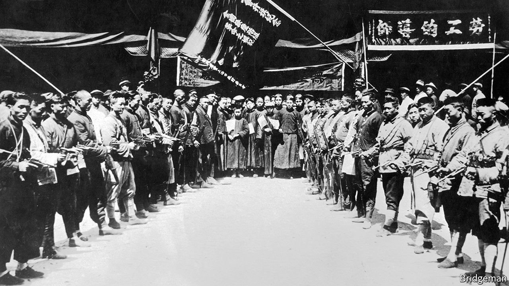

###### China’s corporate sector

# The party is eager to expand its influence within business 

##### In private workplaces, the Communist Party—once almost non-existent—is taking root once again 

 

> Jun 23rd 2021 

IF IT EVER was Shanghai’s tallest building, the 40-metre-high headquarters of the North China Daily News did not remain so for long. Skyscrapers became fashionable before the Communists took over in 1949 and turned China into a world leader for them. In 2015 the tallest building in China (and second-highest in the world) opened in Lujiazui, Shanghai’s Wall Street, on the far side of the Huangpu river. Chinese officials call the 632-metre edifice Shanghai Tower, a symbol of the financial capital’s might.

The sinuous, 128-storey structure, designed by an American firm, purports to evoke a dragon’s twisting form. It is home to Chinese and foreign financial firms betting on China’s rise. JPMorgan, an American bank, occupies four floors. But the Communist Party is there as well. It has taken a large, airy space high up to run a political operation about which it is open and proud. Its focus is on companies in Shanghai Tower and other skyscrapers. For private firms in China, there is an echo of 1921, when industrialists wondered what the Bolsheviks were up to. Once again, Communists are eager to establish themselves in the workplace. There are worrisome implications.


Before his inspection of the big brain in 2018, Xi Jinping visited Shanghai Tower. On his way up in the world’s fastest lift to its observation deck, he stopped at the party-building service centre on the 22nd floor (a separate lift goes directly to it). One room displayed his slogan calling on party members to cleave to the ideals that inspired activists a century ago: “Don’t forget the original intent, keep the mission firmly in mind, struggle forever.”

Those words appear on billboards across China. The “original intent” phrase is from a Tang-dynasty poem. Mr Xi says it means working for people’s well-being and China’s rejuvenation. The aim is not to whip up a Maoist frenzy or encourage workers to rise up. The strike-fomenting Bolshevik menace which worried industrialists in Shanghai in the 1920s is of no concern now, since the party abhors labour unrest. “Stability is paramount” is its mantra. Today the worry is different: that a more assertive party will muscle into boardrooms and keep them on a tighter leash.

It has always been the case that, in a workplace with three or more party members, they should, with approval from a higher level, form a branch or, with 100 or more members, a committee. But some businesses were cool to the idea and the party did not always insist on it. Mr Xi wants complete coverage, with no excuses for non-compliance. “Party organisations must extend wherever party members work and live,” he said on the 22nd floor. They should be “strongholds for combat”. There are now 40 party-building centres covering the 280-plus towers in the financial district. Work began last year to set up yet another layer of control, with a party-led building-affairs committee in each multi-occupant commercial property. These committees include party chiefs of tenant firms, as well as police. State media call this injecting a “red gene” into property management.

Within private firms, efforts to install a party presence have been ramped up. Since Mr Xi took over, the proportion that have embedded party organisations has risen from just over 50% to more than 70%. As an academic at the Central Party School, Cai Xia conducted research into party-building efforts in private firms. In those pre-Xi days, she says, the aim was mainly to give scattered party members a greater sense of belonging and encourage them to be model workers. Now, says Ms Cai (who has lived in America since 2019), the purpose is to help the party maintain social stability and “supervise and control” their firms.

Some foreign firms are anxious. Those operating in sectors that China considers vital to its economy, including financial services, must often form joint ventures with state-owned companies. In 2017 party bosses in some state enterprises began pressing their foreign partners to agree to wording in the charters of their businesses that guaranteed a management role for the party. Companies are required to have officially approved charters. Failure to abide by them could be deemed a crime.

A rare retreat

Remarkably, amid an outcry from foreign investors, party officials backed down. No longer are they arm-twisting foreign firms to specify a role for the party in the running of joint ventures, says Joerg Wuttke, president of the European Chamber of Commerce in China. As for wholly foreign-owned businesses, the chamber says it has not heard of the party having a business-management function in any of them. Indeed, among nearly 585 European firms it recently polled, nearly 65% said they were unaware of any party presence in their firms. Of those with branches, only just over 1% said the party could veto business plans.

Foreign companies have always had to be mindful of the party’s wishes. But it may be that the party does not see strengthening its presence in foreign firms as a political priority. Mr Wuttke says that in foreign businesses party branches often operate “like Rotary Clubs”. But even if most of them keep out of business decision-making, there may be an anaconda effect among staff. Chinese often say they like to work in foreign firms because of their freer atmosphere. Lester Ross, the Beijing representative of WilmerHale, an international law firm, says expatriate bosses, who seldom have a strong command of Chinese, may not easily spot changes in the mood of local employees.

It is a different story with private Chinese businesses, which provide 80% of urban jobs. They are the titans of online and high-tech industries. To ensure control over Chinese society, the party wants to boost its influence among such firms both at board level and among ordinary employees. It wants to ensure that China’s influential tycoons, and their staff, toe the party line. A directive in 2017 called for measures to “strengthen the sense of loyalty” among entrepreneurs and party leadership over them.

A widely touted model is Hodo Group, a family-run manufacturer of garments and textiles with 30,000 employees in Jiangsu province. Mr Xi has praised its party-building efforts. Zhou Haijiang, the chief executive, is also the party secretary. Other senior managers hold corresponding roles within the group’s party committee (which oversees Hodo’s more than 100 party branches and their membership of around 1,000). The head of the human-resources department is in charge of the party’s organisational affairs, the person responsible for brand development is the party’s propaganda chief, and the chairman of the firm’s board of supervisors is the party’s head of discipline.

In 2018 foreign business grandees attending the China Development Forum, an annual get-together with Chinese counterparts and government leaders, were surprised by their hosts’ decision to flaunt the party’s role in economic matters. Hodo’s Mr Zhou was among those wheeled out to make the point. He regaled the audience with his party-building exploits and sang the praises of what officials now call a “modern enterprise system with Chinese characteristics”—meaning one with the party very much involved.

It is easy to see why the party likes the Hodo model. In about 50% of private firms with party branches, the boss is already a party member. For such a person, taking on the additional role of party secretary is not difficult. The bosses may even accept the idea as the least bad option: better to manage the company’s party affairs oneself than allow someone else to take the job. And there may be benefits. Being a party secretary can open doors with officialdom. Businessmen prize such access. Privately, some Chinese entrepreneurs describe their party-building efforts as a box-ticking exercise. Party members in their companies know to whom they must be loyal in order to keep their jobs: the firm.

In the Shanghai Tower, state media say Mr Xi’s visit has been a boon (as has support from the state-owned company that owns the building). Every month, on average, one company pays a visit to ask for help setting up a branch. It has also boosted demand for party membership. The service centre offers enticements: a place to relax and enjoy the view. There is a gym on the same floor.

But party-building in Lujiazui is also about controlling members. The 22nd floor is pioneering a new way of making them stay on their toes. It involves an app that shows members how many points they have scored for volunteer work, for taking part in political study sessions or for submitting “thought reports” (a device much-loved by the party for ensuring discipline, as it forces members to expose their own weaknesses). Score less than 60 points in a year and you could be summoned for a chat with a party official, or sent for retraining at a party school.

That may sound scary, but well-educated Chinese still flock to join the party. Even on campuses, where curbs on free speech have become tighter under Mr Xi than at any time since Tiananmen, many students are keen to sign up. That is because membership can confer lifelong benefits.■

Full contents of this special report


China’s corporate sector: It’s the party’s business, too*


