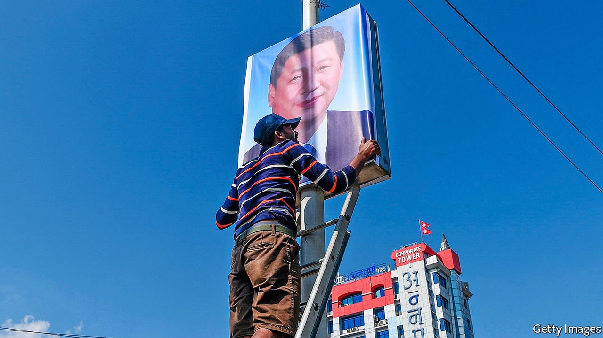
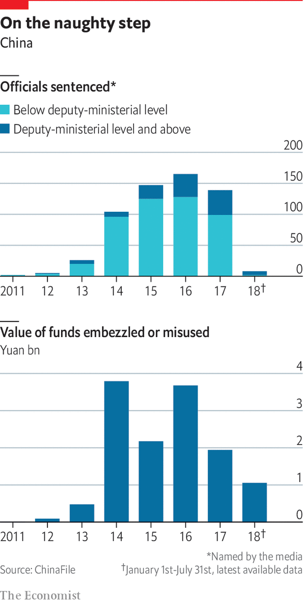

###### Internal rifts

# Trying to heal the party’s wounds 

##### The party Xi Jinping inherited had been torn apart by infighting. He now wants to ensure that no one in the party defies him 

 

> Jun 23rd 2021 

A  FEW DAYS after he took power in November 2012, Xi Jinping convened a “collective study” session of the Politburo. Looking at the 22 men and two women round the table in an imperial-era building in Zhongnanhai, the party’s headquarters, he may have felt uncomfortable. Most owed their positions to his predecessors, not him. The party had been traumatised by a fierce power struggle. Who was reliable? Beyond the high-walled compound, Chinese society was changing at a dizzying pace, with the emergence of a large middle class. An internet-fuelled information revolution was under way. Could the public be trusted?

Against a backdrop of an ink-brush painting of China’s iconic scenery, Mr Xi aired his concerns. The party’s ability to fulfil its “historical mission” and cope with change was beset by “many shortcomings”. Some members had lost their sense of conviction, he said. Their bones were “losing calcium”. Mindful of the recent Arab spring, he warned that in other countries, public resentment had led to social turmoil and the collapse of governments. In China, he said, corruption could “destroy the party and the country”.


It was a phrase Mr Xi’s predecessors had also used. Yet he meant not just common graft, but a political malaise within the party, of which rampant corruption was a warning sign. Mr Xi’s accession came after the biggest rift in the party’s top echelons since the 1980s. The most prominent targets of the campaign that Mr Xi was about to wage were high-profile party grandees whom he accused of being “extravagant and dissipated” and plotting to “usurp the party and seize power”—in effect, to stage a coup.

To see why Mr Xi is changing the party, purging it of corruption and expanding its powers, it is important to understand the challenges facing him in 2012. Their scale was suggested by the coup-plotting charge, which had not been laid against party members of such rank since the arrest of Mao’s widow, Jiang Qing, and her “Gang of Four” in 1976. Those implicated were among the most powerful in China. They included Bo Xilai, a former party chief in Chongqing; Zhou Yongkang, who had overseen China’s domestic security services and legal institutions, including the police and the courts; and Guo Boxiong and Xu Caihou, two generals who had been the highest-ranking officers in the armed forces. All are now in prison or, in the case of General Xu, dead (taken by cancer).

Even now, a decade on from that intrigue, little is known about exactly what these men did that so alarmed Mr Xi. But officials still refer, cryptically, to their machinations, suggesting the trauma they inflicted was deep. The only detail released has been about their corruption. Phoenix Weekly, a magazine in Hong Kong with strong party backing, claimed investigators had found more than a tonne of dollar, euro and yuan banknotes in Xu’s basement.

But what is clear is that Mr Bo, backed by Mr Zhou, posed a serious political threat. Like Mr Xi, Mr Bo is a “princeling”—a son of one of China’s revolutionary founders. In the build-up to Mr Xi’s appointment as general secretary, Mr Bo had upstaged him in Chongqing by fighting mafia-like gangs, splurging on home-building for the poor and encouraging Mao nostalgia, especially singing “red songs”. It showed how politics was changing. In the age of Weibo and WeChat, a provincial politician could become a national celebrity without the help of state media. Mr Bo’s arrest in 2012 followed his wife’s murder of a British businessman and the flight of his police chief to the American consulate. It was the biggest political scandal of the post-Mao era.

As Tony Saich of Harvard University observes in a forthcoming book, the political sparring in which Mr Bo and his allies engaged “represented different visions for China’s future and different approaches to politics” from those of China’s then leader, Hu Jintao. Mr Bo tapped into public resentment of corruption and inequality. The red songs harked back to a time when life seemed fairer, albeit more austere. Mr Xi must have pondered Mr Bo’s popularity. His own approach to politics is now strikingly similar.

There was little sign in 2012 that the public was on the brink of revolt. But the internet, even if censored, had become a powerful weapon, helping people to organise protests over local issues. Anxiety about where this would lead must have focused Mr Xi’s mind on the Soviet Union and the dangers of its pre-internet form of information revolution: Mikhail Gorbachev’s glasnost.

Xi has a dream

Soon after that Politburo meeting Mr Xi lamented that nobody had been “man enough to stand up and resist” as the Soviet party crumbled. A few weeks later he recalled how it had fallen “suddenly with a loud crash” after more than 90 years in existence and more than 70 in power. “Why?” he asked. “Because everyone could say and do what they wanted. What kind of political party was that? It was just a rabble.” In 2018 he talked again about the Soviet party’s collapse, noting that, with just 2m members, it had defeated Hitler, but with 20m it had lost power. “Why? Because its ideals and beliefs had evaporated.” Under the slogan of “so-called glasnost” it had let members criticise the party line.

Mr Xi talks of a “Chinese dream” of a “great rejuvenation” by the next big centennial celebration: the 100th anniversary of Communist rule in 2049. Protecting the party from the fate of its Soviet counterpart and a repeat of Tiananmen is vital to that dream. As Mr Xi describes it, only the party can make China richer and stronger. Without it, he says, China will descend into chaos.

 


It may be thought that Mr Xi could relax. His mimicry of Mr Bo’s political style appears to be working. Another Tiananmen is unlikely. Airport-style security in the square helps, but support for the regime seems genuine. In a new book, “The Party and the People”, Bruce Dickson of George Washington University says few Chinese are willing to call for democracy “because they believe it is already happening”. Improved governance, a growing economy and a better quality of life are seen as evidence, he says. Democracy means ruling in the public interest, many believe.

But Mr Xi remains vigilant. Last year he launched another purge of the police, secret police, judiciary and prison system of which Mr Zhou (who was jailed for life in 2015) was once the overlord. Again, the aim is to eliminate corruption, but this time also “deeply and thoroughly eradicate the pernicious influence” of Mr Zhou. Thus the war on graft remains a political campaign, with the struggles of a decade ago in mind.

The extent of Mr Xi’s fretting is not so evident in remarks translated into English. His three-volume tome, “The Governance of China”, touted as a distillation of “Xi Jinping thought”, contains only anodyne speeches, with grittier parts removed. Pore through those available only in Chinese and a different picture emerges. In 2016 he talked of party members who “openly curse the party”. In 2018 he said: “Political problems within the party had not been fundamentally resolved.” He accused some members of “paying only lip-service” to the party’s leadership, and of remaining corrupt. Speaking in January at the Central Party School, a training academy for senior officials, Mr Xi said the country faced an “unprecedented increase” in domestic and external risks.

One of Mr Xi’s preoccupations is cementing the party’s grip on the army (of which he is commander-in-chief). In 2017, soon after the party’s Central Committee called him the “core” of the party leadership, Mr Xi gave a speech to military commanders. He again recalled the collapse of communism in the Soviet Union, the Arab spring and various colour revolutions. A big cause of these upheavals, he said, was that “At critical junctures armies stood by and watched, or even changed sides.” And in a rare mention of Tiananmen, he said a key reason why it had been possible to end the protests “quickly” in 1989 was because the army stayed loyal.

Mr Xi’s war on graft is in part about protecting the party from threats within. It has been the most sustained since the reform era began. More than 200 serving and retired officials with the rank of deputy provincial governor or above, including a dozen senior generals, have been investigated by the party’s internal-discipline agency. About three-quarters have been sentenced to prison or are facing trial. In Mr Xi’s first five years in office the agency handed to prosecutors an average of nearly 12,000 officials annually, more than twice as many as in the previous five years. A far greater number were punished in other ways, such as by dismissal. New regulations in 2017 supposedly offered more protection for those seized, such as a requirement that families be notified within 24 hours and that interrogations be videotaped. But the party’s agents have sweeping powers to work in secret should they reckon that informing people might impede their investigations. Torture is believed to be rampant. The public applauds Mr Xi’s resolve.

At the top, Mr Xi has taken a different approach. Far from giving more power to its highest institutions—the Central Committee, the Politburo and its standing committee—he has sucked it away. This has involved creating new mechanisms to ensure that power is concentrated in his own hands. He has set up commissions to supervise such areas as the economy, foreign affairs and national security. He heads them all. A constitutional revision in 2018 makes it easier for him to remain supreme leader for life (he is almost certain to win five more years at a party congress next year).

The party had lost its moorings when Mr Xi took over. Well into the 1980s almost every workplace had a party boss. Since then private business had created a middle class whose members had little direct contact with the party. Under Mr Xi, it has “reinserted itself into every organ of society,” says David Shambaugh of George Washington University. Once again, it is becoming a powerful force in people’s everyday lives. ■

Full contents of this special report


The party’s internal rifts: Trying to heal the wounds*


