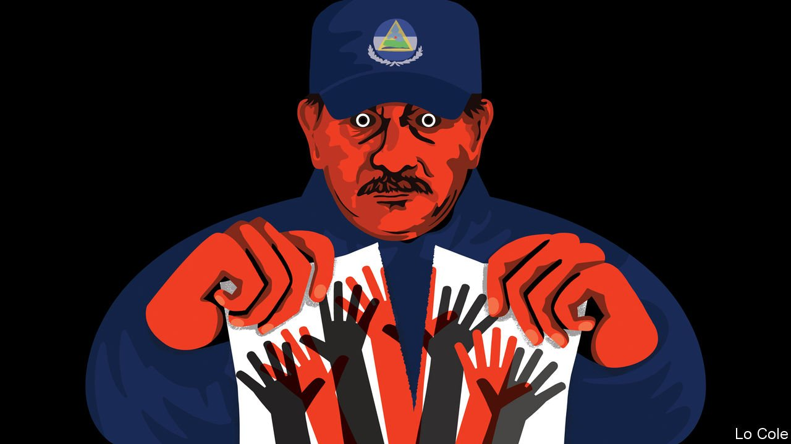

###### Bello

# Daniel Ortega tears up all pretence of democracy in Nicaragua 

##### Not since the 1970s has there been such a brazen crackdown in Latin America 

 

> Jun 26th 2021 

ON DECEMBER 27TH 1974 Hugo Torres was among a dozen Sandinista guerrillas who burst into a Christmas party attended by close cronies of Anastasio Somoza, Nicaragua’s brutal dictator. They swapped their hostages for a plane to take 14 of their imprisoned comrades to Cuba. Those freed included Daniel Ortega, who had spent seven years in jail and suffered torture. After the Sandinista revolution triumphed Mr Ortega would become Nicaragua’s president, at the head of a collective leadership, until defeated in an election in 1990. Returning in 2007, he has ruled ever since as an elected autocrat. This month his police arrested Mr Torres, now a retired brigadier and potential opposition candidate in an election due in November. “I risked my life to get Daniel Ortega out of jail,” he said. “Those who once embraced principles have betrayed them.”

Mr Torres is one of a score of prominent opponents of Mr Ortega who have been arrested since late May. They include five presidential aspirants. One of them, Cristiana Chamorro, whose mother defeated Mr Ortega in 1990, is the country’s most popular political figure, according to a leaked poll. She was the best bet to unite the opposition. Others include the head of Nicaragua’s largest bank and Dora María Téllez, a heroine of the revolution who was punched in the stomach and dragged from her house by 60 police. All are accused of conspiring with foreign interests against the sovereignty of Nicaragua.


Not since the 1970s has there been such a brazen crackdown in Latin America. In its seemingly indiscriminate nature and suddenness it goes beyond even the repression of opponents by Venezuela’s dictatorial regime. Why has Mr Ortega torn up all pretence of democracy in Nicaragua? And will he get away with it?

The obvious answer to the first question is that he and his wife and vice-president, Rosario Murillo, fear defeat in November. Although he still leads the Sandinista party, rather than adhere to its socialist past Mr Ortega has, since 2007, echoed the Somozas, complete with their nepotism and dynastic pretensions. While taking control of the legislature, the judiciary and the electoral authority and muzzling the media, he forged an implicit alliance with private business and with the churches. He kept support among the poor with social programmes paid for with $500m a year in aid from Venezuela. When this dried up, austerity prompted a national uprising in 2018 which involved Sandinista supporters as well as their opponents. More than 300 people were murdered by Mr Ortega’s paramilitary goons. That pushed the private sector, and the United States, into opposition.

Since then Mr Ortega has rallied the Sandinista base while the opposition has fragmented, notes Mateo Jarquín, a Nicaraguan political scientist. Mr Ortega is still seen favourably by 39%, according to the poll. The first couple sell sandinismo as synonymous with the nation, the state and its social programmes. “The vast majority of Nicaraguans are focused on finding work and putting food on the table,” says Mr Jarquín. And fear is doing its job, too.

Ms Murillo is the public face of the government and is younger than her husband. Many had assumed that the regime’s plan was for her to be the candidate this year. But she is widely disliked within sandinismo. One reason for the crackdown may be to clear the way to foist her on the country. But it may simply be that, having once lost power, Mr Ortega has no intention of doing so again. The Sandinistas were originally a mixture of romantics and hard men. The romantics are now in the opposition.

Will the Ortegas get away with this? The United States has imposed sanctions against 31 individuals, including Ms Murillo. It orchestrated a condemnatory vote at the Organisation of American States this month. If the election in November is indeed a farce, the administration of Joe Biden is likely to do more. But would pressure work? Cynthia Arnson of the Wilson Centre, a think-tank in Washington, points out that Mr Ortega survived a civil war against US-backed contra rebels in the 1980s. “He probably thinks he can take whatever the United States can dish out,” she says.

With his pre-emptive round-up Mr Ortega has equipped himself with human bargaining chips to use after November. He is staking out new rules for the exercise of absolute, dynastic power in Latin America. It is not much consolation to recall that in the end this did not work for the Somozas.

