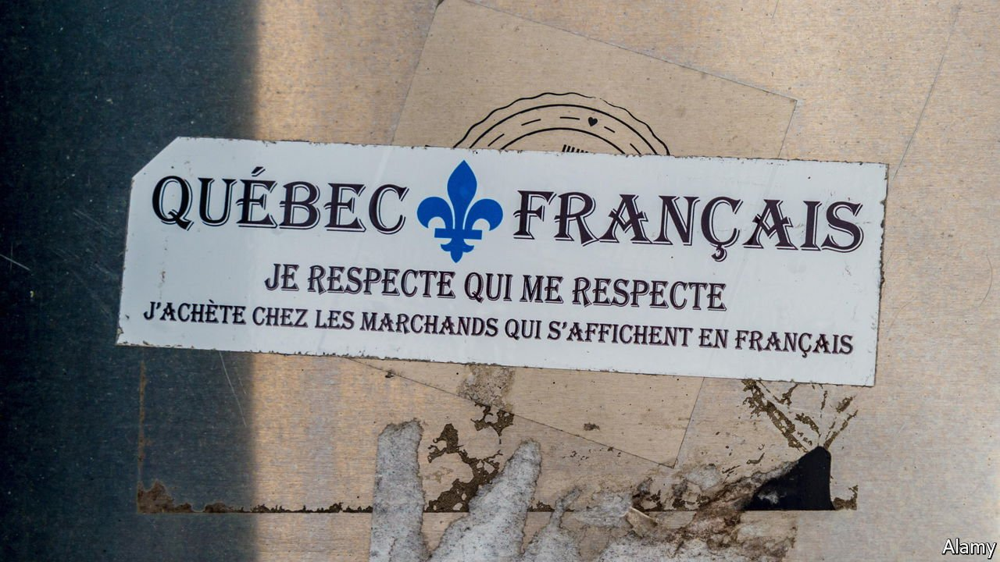

###### Bonjour, hi

# Politicians in Quebec try to make people speak French 

##### A minister was upset to hear a song in English, poor thing 

 

> Jun 26th 2021 

FOR OLIVER MAYERS, a native of Montreal, living in a bilingual city is special. “It’s ‘bonjour-hi’,” he says, referring to the local hybrid greeting. Around two-thirds of people in Montreal regularly use English at work. “You can do both.”

Others say you should not. On May 13th Coalition Avenir Québec, the conservative party in charge of the Quebec national assembly, put forward a bill to bolster French as the province’s sole official language. It is likely to come into force later this year.


The bill mandates that businesses must have their signs mostly in French. Companies with 25 or more employees, moreover, will have to form “francisation committees” to monitor the use of written and spoken French. Staff who misuse the subjunctive will not be referred to human resources. At least, not yet.

New immigrants will have six months to learn the language; after that, all the government’s letters to them will be in French. The bill also seeks to add clauses to the parts of the Canadian constitution that refer to Quebec, declaring it a “nation” within a unified Canada.

It is not the only attempt to boost French. On June 15th the federal government proposed a bill to safeguard the language nationwide. On June 20th Nathalie Roy, Quebec’s minister of culture, announced that most music heard when calling a government agency, or when in a government building, should henceforth be made in Quebec and be in French. (When unveiling the policy, according to the Montreal Gazette, Ms Roy spoke of a terrible injustice: “I was on hold with the culture ministry’s phone line and I was taken aback to hear an American singing a little song in English to me.”)

Few Quebeckers are pushing for independence. After two referendums, most Canadians consider the matter closed. But if the Supreme Court rejects the attempt to declare Quebec a nation, it could rekindle a desire for autonomy, thinks John McGarry of Queen’s University in Ontario. Like Quebec, the Spanish region of Catalonia tried to define itself as a “nation” in regional statutes, but the constitutional court argued that the term had no legal force.

Meanwhile the bill has been criticised by indigenous peoples and Anglophones. Marie-Claire Lafrenière, an English-speaking mother in Terrebonne, complains that recently at a drive-thru she was told to speak French. “I feel as though I’m living under a dictatorship,” she says, showing the sense of proportion for which Quebec is increasingly renowned. ■

