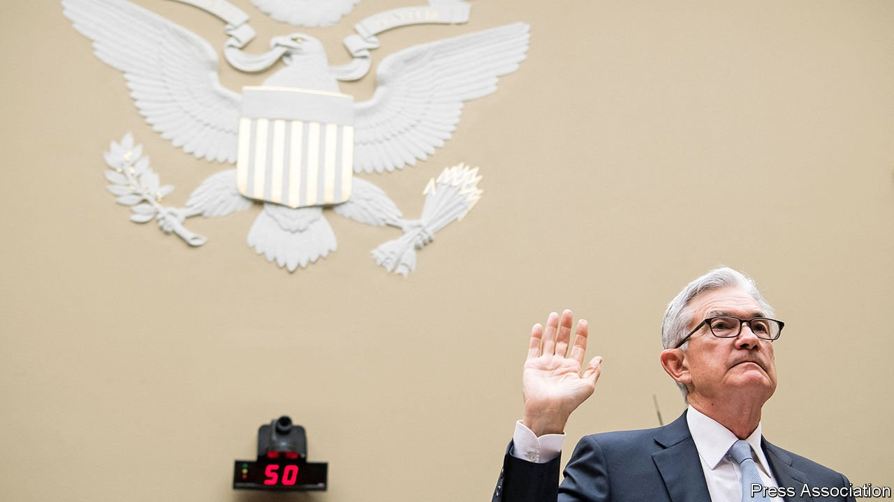

###### 

# Business this week 

#####  

 

> Jun 24th 2021 

In testimony to Congress, Jerome Powell, the chairman of , admitted that prices are increasing at a faster pace than central bankers have forecast, but reiterated his view that pressures will eventually ease, avoiding any return to 1970s levels of inflation. Fed officials now think consumer prices in America will be 3.4% higher in the fourth quarter than a year before, up from 2.4% in an earlier projection (in May a different measure of inflation hit 5%). Mr Powell pointed out that price rises are sharpest in sectors linked to the reopening of the economy, and will recede.

An exclusive club


Microsoft’s market capitalisation reached $2trn, making it only the second American company, after Apple, to do so. It hit a valuation of $1trn in April 2019. Microsoft’s share price is up by 20% since the start of the year, outperforming Amazon and Apple, but not Alphabet, which has seen its stock rise by around 40%.

The median price of a home in America (excluding new builds) was $350,300 in May, a record according to the National Association of Realtors and up by 24% year on year. The NAR has also reported that sales are rocketing of vacation homes, “a hot commodity” as people seek peace and quiet to work remotely.

China’s central bank stepped up its clampdown on bitcoin and other digital currencies, hauling in officials from the country’s biggest banks to discuss the problem of “cryptocurrency speculation”. China eventually wants its citizens to use a government-backed cryptocurrency that is being tested in pilot projects. The price of bitcoin, meanwhile, recovered somewhat after falling below $30,000 for the first time since January.

The market for iron ore is also attracting the ire of Chinese regulators. The National Development and Reform Commission, an agency of the State Council, has said it will investigate “malicious speculation” in trading for iron ore and “severely punish” any wrongdoing. China is eager to dampen soaring commodity prices, which are pumping up inflationary pressures.

The share prices of Fannie Mae and Freddie Mac, which guarantee American mortgages, plunged by more than 30% after the Supreme Court rejected most claims brought by a group of hedge funds, including Bill Ackman’s Pershing Square. They claimed the government, attempting to recoup bail-out funds, illegally seized $100bn of profits earned by Fannie and Freddie since 2012. The justices disagreed.

America’s Federal Trade Commission is to evaluate  Amazon’s proposed takeover of MGM film studio. The commission’s new chairwoman, Lina Khan, is an outspoken critic of Amazon and other big tech. Amazon also faces a broadside over its working practices. The Teamsters union is looking to escalate its fight to organise workers at Amazon warehouses.

The European Commission opened a formal antitrust investigation into Google, to establish whether it favours its own online display advertising technology across its platform. The review will probe the heart of Google’s monetising model, including ad buys on YouTube.

This week’s special offer

Morrisons, Britain’s fourth-biggest supermarket chain, rejected a takeover approach from a private-equity firm. Its share price leapt amid speculation that other buyers may be about to join the queue with their own bids.

John McAfee, the eponymous founder of the computer-security company, died in a suspected suicide in a Spanish prison, where he was awaiting extradition to America for tax evasion. Mr McAfee sold his firm in 1994, and had since led an unsettled life, fleeing Belize after the death of a neighbour and running for president in America as a Libertarian. He had recently been promoting cryptocurrencies.

The Brazilian congress approved a bill to float the shares of Eletrobras, Brazil’s state-owned electricity provider and the biggest utility in South America, on the stockmarket. The government hopes to reap $20bn from the sale, which would be the first major privatisation under President Jair Bolsonaro.

America’s big banks took further steps to prepare workers for a return to the office. Press reports suggest that Morgan Stanley will not allow staff or clients to enter its offices in New York unless they have been fully vaccinated and that JPMorgan Chase wants its employees to register their vaccine status on an internal website.

Peloton, meanwhile, rolled out a corporate-wellness programme for businesses that offer subsidies for its digitally connected fitness bikes, exercise programmes and other workouts for those aspiring to be svelte. That is one incentive that could entice workers back to the office. Or maybe not.

