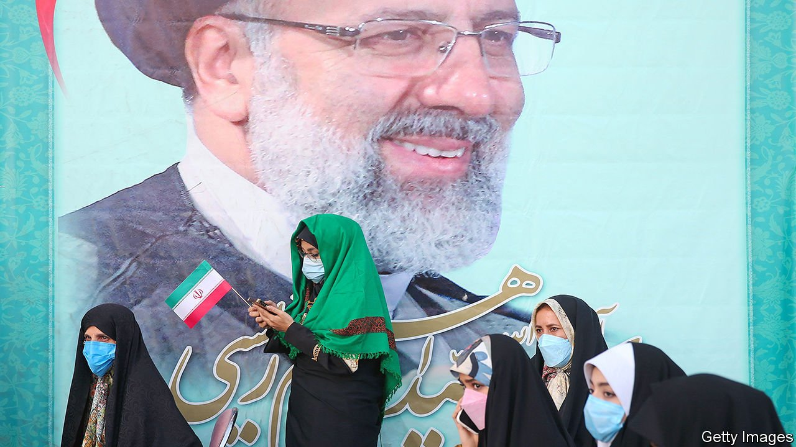
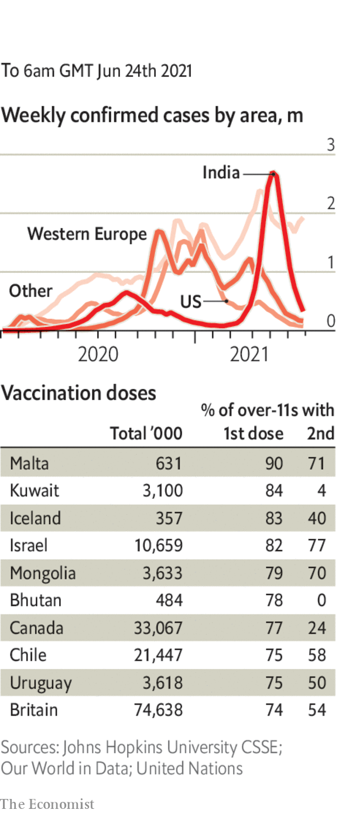

###### 

# Politics this week 

#####  

 

> Jun 24th 2021 

Ebrahim Raisi, a conservative cleric and former chief of the judiciary, won  with 62% of the vote. His main rivals had all been barred from running. Turnout was less than 49%, a record low, as many liberal and moderate Iranians stayed at home. Mr Raisi promised to continue working with America and other world powers to resuscitate the nuclear deal signed in 2015, but said he would not meet Joe Biden. And he insisted that Iran’s ballistic missile programme and its support for foreign militias were not negotiable.

, the founding president of Zambia, died at the age of 97. He is remembered as a giant of Africa’s liberation from colonial rule and for stepping down when he lost an election in 1991. He also locked up opponents and crashed the economy.


Leaders of the 16 countries in the Southern African Development Community, a regional bloc, agreed to send an armed force to Mozambique to battle jihadists, who have caused nearly 1m people to flee their homes.

Ethiopians voted in a parliamentary election marred by the arrest of opposition leaders and the disenfranchisement of a fifth of voters. The election was not held in four of the country’s ten regions because of conflict or mishaps, such as misprinted ballot papers.

, , published its last issue following the arrest of its editor and other staff for running articles calling for sanctions against the city’s and China’s governments. The persecution of the paper has sent a chill over Hong Kong’s traditionally free media, under pressure more than ever from China’s Communist Party to toe its line.

The first trial began in Hong Kong of a person charged with violating the city’s national-security law. Tong Ying-kit is accused of inciting secession and terrorism, allegedly by riding a motorbike into police while showing a flag calling for Hong Kong’s “liberation”.

A row erupted between Australia and UNESCO, after the UN body said the Great Barrier Reef would be added to its list of heritage sites that are in danger. Australia says it is being singled out. Some suspect China, which currently heads the heritage committee and has fallen out with Australia, of pushing for the change.

The Supreme Court of Japan ruled that laws requiring married couples to use the same surname are constitutional, rejecting a challenge by petitioners seeking to keep their original surnames.

Brazil’s environment minister, Ricardo Salles, resigned amid a police investigation into an illegal wood-smuggling ring. Under Mr Salles’s watch the rate of deforestation in the Amazon soared by over 40%. His replacement has ties to Brazil’s farming lobby.

Republicans in the American Senate deployed a filibuster to obstruct a wide-ranging bill that seeks to shore up voting rights, known as the For the People Act. The Democrats may now turn to a compromise bill put forward by Joe Manchin, a Democratic senator from West Virginia.

Eric Adams led the count in New York City’s Democratic primary for mayor. Mr Adams, who vowed during his campaign to fight crime, fell short of 50% of the vote, so the election will be decided by a new ranked-choice system.

Carl Nassib became the first-ever regular player in America’s National Football League to declare that he is gay. Mr Nassib, 28, plays for the Las Vegas Raiders.

Joe Biden signed a law making , which commemorates the end of slavery, a new federal holiday in America.

A British naval vessel entered what Russia claims as its . (Britain, like most countries, regards Russia’s seizure of Crimea from Ukraine in 2014 as illegal.) Russia said it had fired warning shots and dropped bombs to scare off the British ship. The British government said in fact Russia had carried out a routine gunnery exercise.

 delivered a rebuke to President Emmanuel Macron in the first round of regional elections. His party, La Republique en Marche, came a humiliating fifth. The result was also bad for his probable presidential rival next year, Marine Le Pen, an anti-immigrant populist.

, jailed for their part in organising an illegal independence referendum in 2017, walked free after the Spanish prime minister gave them conditional pardons in the hope of improving relations with Catalonia and moving towards a solution to a decade-long dispute.

, lost a vote of confidence. He is allowed a week to cobble together a fresh coalition.

In Britain the Conservative Party co-chairman said that policies such as a north-to-south high-speed rail link, which cuts through the countryside, were a “warning shot” not to take southern seats for granted. This came after the party’s stunning defeat in a by-election in Chesham and Amersham, a pleasant and leafy constituency it had won by nearly 30 percentage points in 2019.

Coronavirus briefs

 


Indonesia recorded its highest number of daily cases—over 14,500—as infections surged following a religious holiday and the spread of the Delta variant. Hospital beds in Jakarta are 80% full. Nationally, less than 10% of people over the age of 12 have received a single vaccine dose.

Japan said it would limit the number of spectators at Olympic events to 10,000, but insisted the games would start on July 23rd.

A court in Brussels chastised AstraZeneca for breaching its contract with the EU on vaccines, but did not support the EU’s demand that the drug company deliver 120m doses by the end of June.

Calls were made for the British government to publish its risk assessment of the recent G7 summit it hosted in Cornwall, after a surge of infections were recorded around the area where the events were held.

