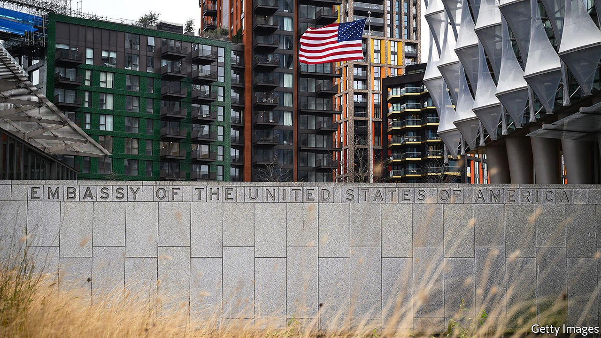

###### The Foreign Not-in-Service

# America says it’s back. But where are its ambassadors? 

##### The painfully slow confirmation process is a window into Washington dysfunction 

 

> Jun 24th 2021 

CERTAIN SIGNIFICANT people were nowhere to be seen as Joe Biden touched down last week in the three countries he visited on his first trip abroad as president: American ambassadors. Mr Biden has yet to nominate envoys to Britain, Belgium or Switzerland, much less to guide them through the bog of Senate confirmation.

In fact Mr Biden has not nominated an ambassador to any of the countries—from Japan to Germany to Canada—that with America comprise the G7, the alliance of prosperous democracies he this month tried to rally to a global contest with the autocratic model of Russia and China. He has not picked an ambassador to the European Union, whose leaders he also met.


He has nominated a representative to NATO, another alliance he called upon. She is Julianne Smith, a deputy national security adviser to Mr Biden when he was vice-president. But she has not been confirmed, and, since the president nominated her only on June 15th, she is unlikely to be for quite some time. America may be back, as Mr Biden likes to say, but its ambassadors are still a long way off.

The impact of an absent ambassador is hard to measure. A chargé d’affaires, generally an experienced foreign-service officer, stands in, and, during the pandemic,  showed its merit as a workaround for diplomats on site. Some ambassadors have done more harm than good. But as Mr Biden put it in Geneva last week, foreign policy “is a logical extension of personal relationships”. The sooner ambassadors are in place the sooner they learn who matters and begin building trust. And as choices of the president, ambassadors speak with particular authority, both to their host government and their own government.

Take Tom Nides, also nominated on June 15th, to be ambassador to Israel. The vice-chairman of Morgan Stanley, Mr Nides was a deputy to Hillary Clinton when she was secretary of state and spent years on Capitol Hill. Had he been in place as tensions mounted last month, he might have had the clout to focus the administration’s attention, and to intervene himself, before Israel and Hamas came to blows. As it was, the administration scrambled to dispatch an envoy after the fact. The most senior official it could spare was a deputy assistant secretary, Hady Amr.

After a  to staffing his administration, Mr Biden has lost steam. As with the trip, during which the allies were tickled just to be meeting with a president who didn’t insult or shove them, Mr Biden’s pace of appointments does not look so bad compared with the record of Donald Trump. But that is a low bar.

By June 23rd, over five months in, Mr Biden had had 70 executive-branch appointees confirmed, compared with just 44 for Mr Trump at the same point. Barack Obama had 165 such officials confirmed by now, according to data kept by the Partnership for Public Service, a non-profit group. These tallies are particularly dismal considering that, in all, a president has to fill some 1,200 vacancies that require Senate confirmation, along with another 3,000 that do not. Only this week did the Senate confirm Mr Biden’s director of the Office of Personnel Management. He has yet to fill two other senior posts focused on making the government run effectively: the leaders of the General Services Administration and of the Office of Management and Budget.

The Senate plays its own role in undermining governance. For example, Mr Biden has nominated most of his candidates for the critical position of assistant secretary of state, some as long ago as mid-April. But the Senate has yet to confirm any. On average it took Mr Obama 510 days, and Mr Trump 525 days, to get each assistant secretary confirmed.

Mr Biden and his aides wisely had more than 1,000 appointees who did not require Senate confirmation ready to start on day one. But confirmations were slow to get under way. The attack on the Capitol, followed by the second impeachment of Mr Trump, distracted the Senate. The administration then fell into a familiar pattern. Those officials who were in place became preoccupied with crises or making new policy. Being both sensitive and dull, questions of personnel are easy to put off. And, of course, the fewer people in place, the more duties they have. In order to hire people, you need to hire people.

Picking ambassadors is particularly tricky. Presidents have tended to use comfortable posts to reward big campaign donors or other political allies. Mr Trump particularly liked to do this, and he raised the proportion of politically appointed ambassadors to 43%, with the other 57% drawn from the professional foreign service. From 1974 on, the share of professionals was closer to 67%.

Antony Blinken, the secretary of state, wants to promote more foreign-service officers into ambassadorships. He also wants to diversify the ranks. In January the Partnership for Public Service found that of 189 ambassadors, just five were black. All these considerations make for complex decision-making, even before members of Congress lobby for their own favourites.

After naming nine ambassadors in April, Mr. Biden followed up two months later by nominating nine more, including Ms Smith and Mr Nides. But, although the administration has floated various names, Mr Biden has still not nominated diplomats to fill the posts in Beijing, Seoul, Manila, Kabul, Islamabad, Riyadh, Warsaw, Kyiv or Delhi—and the list goes on. There is an ambassador to Moscow, but only because Mr Biden held over Mr Trump’s choice, John Sullivan.

Mr Biden has proposed an activist foreign policy and an audacious domestic agenda, but he lacks many of the leaders he needs to pursue either effectively. ■

For more coverage of Joe Biden’s presidency, visit our dedicated 

A version of this article was published online on June 20th 2021

