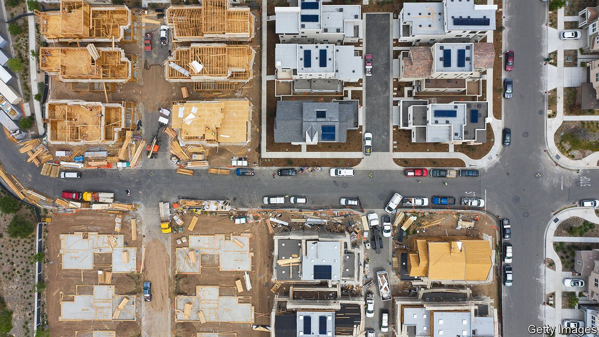

###### Background noise

# An important census product may soon use synthetic data 

##### Advocates say it protects privacy; critics say it will impede research 

 

> Jun 24th 2021 

THE AMERICAN COMMUNITY SURVEY (ACS), which is sent to around 1% of America’s population every year, is one of the most widely consulted scientific resources in the world. Researchers use its data, cited in more than 12,000 research papers annually, to explore relationships between education, health, income, demographics and geography. Yet the Census Bureau, which administers the ACS, may soon swap actual data for synthetic responses generated by a statistical model, which critics say will be useless for research.

The potential use of synthetic microdata is part of an effort already under way by the Census Bureau to protect privacy. The full 2020 decennial census data and data products related to them will incorporate “differential privacy” protections designed to shield respondents’ identities.


The concern is that malicious actors might be able to combine census data with other available information in order to identify individuals. If, for instance, a census block containing 100 people is known to be 1% Hispanic, a miscreant would be able quickly to identify its sole Hispanic resident from that piece of data alone. To try to prevent this, a predetermined amount of “noise”—small, intentional errors that prevent individuals from being identified—will be added to the data.

Critics argue that privacy concerns are overblown. They say that recent experiments by the Census Bureau seem to indicate that only a small portion of respondents can be successfully identified. But there are practical as well as ethical concerns: if, for instance, undocumented immigrants are afraid to take part in the census for fear they may be identified, the final numbers will be inaccurate.

The law imposes strict confidentiality requirements on the Census Bureau, with penalties for non-compliance that include fines and jail time. As technological advances make it easier to remove anonymity from data, in order to avoid falling foul of the law, the bureau may need either to alter or restrict access to the data to protect privacy. Joseph Hotz, an economist at Duke University, says the law should be changed to adjust to the increased risk, ideally shifting the burden of preventing misuse away from the Census Bureau.

Users of the ACS and decennial census data say that the bureau has been largely responsive to their concerns. The amount of noise injected into the decennial data has been reduced to make sure the data are accurate enough for use in the next round of congressional redistricting, and the bureau has been regularly soliciting feedback from data users.

Some concerns remain. Small amounts of noise will even out when the data are used to create large-scale estimates. But planners also use census data to allocate limited resources within small geographical areas. This makes Mike Mohrman, Washington state’s demographer, uneasy. “My experience has been that when you change the numbers,” he explains, “you get different results.” ■

