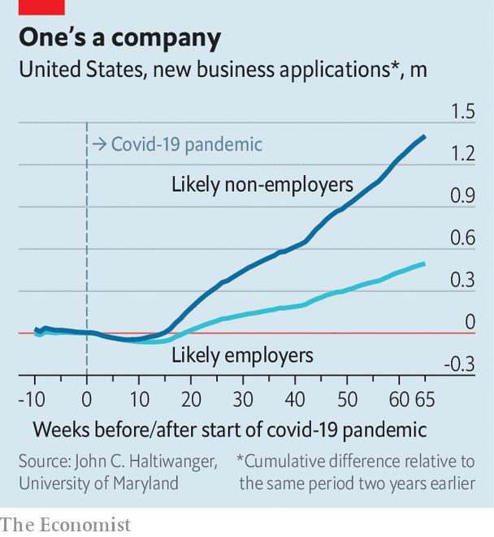

###### Down and up

# New business formation in America goes bezonkers 

##### What lies behind a welcome, and unexpected, trend? 

 

> Jun 24th 2021 

AS THE PANDEMIC unfolded, the usual economic statistics produced the expected dire results. During the stretch in 2020 from February to May, 20m jobs were lost. Businesses were wiped out at a faster rate than during the financial crisis a decade earlier. Grim news was everywhere.

Buried in the deluge, however, was a bit of light, detailed at length in a working paper from the National Bureau of Economic Research published in June by John Haltiwanger, of the University of Maryland, using a Census Bureau data series that he had helped develop. It was distilled from the first step typically taken by an entrepreneur in the creation of a business, an application for an employer-identification number required by America’s tax authorities, the Internal Revenue Service. The applications provide an unusually rapid read on what was unfolding in the economy.


In contrast to the financial crisis, when new-business formation sputtered and then remained depressed, the number of applications began to rise vertiginously after May 2020. “We speculated it was opportunistic necessity,” says Mr Hatliwanger. A possible explanation was that people stuck at home were suddenly creating cottage industries, like mask-production. But that was never entirely satisfactory. The surge peaked in July and August 2020 but remained robust enough to produce the largest number of new businesses for the year since at least 2004, the earliest date for which the data have been compiled. New-business formation was strong in April this year; May trailed only July 2020.

 


Among the many perplexing elements of the boom was how it unfolded during a period that was particularly brutal for small businesses, whose failures were captured in an alternative data series running up to the third quarter of 2020. The death and birth of firms may, however, tell a story of how America’s economy is evolving. Examination of the application forms indicated that ten sorts of business accounted for 75% of the total. By far the largest area, accounting for almost one-third, was retail and in particular e-commerce. The Biden administration may be gearing up antitrust agencies for an assault on technology giants that dominate this area. But new entrants apparently see opportunities.

Other popular sectors include food preparation and accommodation, both of which were badly hit during the past year; trucking (all those packages to deliver); health care; and scientific and technical services—an amorphous category that may be a refuge for skilled individuals cutting loose from large corporations. Geographically, new-business formation was particularly robust in Texas and Florida; in percentage terms, the southern arc of Georgia, South Carolina and North Carolina did better still. New York, New Jersey and California all lagged behind. As America has begun to reopen this difference between states has diminished, but it still remains greater than before the pandemic began.

Perhaps the most striking change is that four times as many single-person companies have been founded since the pandemic began as during a similar time-period in the financial crisis. Obvious explanations, such as more people driving for Uber, do not count in these business-formation statistics. Alternative explanations include the possibility that many of these jobs may be a by-product of families moving, or perhaps evidence of the emergence of new kinds of remote work.

The strong numbers may also underscore how, notwithstanding the devastation of the past year, the country’s banking system remained sound. Neither house prices nor household incomes declined, providing a foundation, of sorts, for building a new business. Inevitably, however, the novelty of the growth in enterprises has raised questions about whether the trend will persist and how much it means. An employer-identification number is, after all, merely a piece of paper.

Impediments exist, including rising wages and high demand for labour, along with government subsidies for staying at home. Tax and regulatory policy may become increasingly intrusive, costly and hostile. But assuming these can be circumvented, the historical pattern has been for business formation to be followed by high levels of job creation, innovation and productivity growth in one to two years. ■

