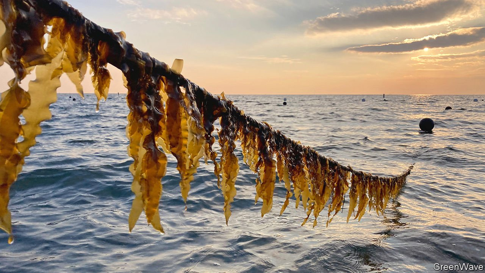

###### Kelp wanted

# Why New England is going wild for wet weeds 

##### Kelp helps farmers’ wallets and the world 

 

> Jun 26th 2021 

THE PINK AND green buoys bobbed gently over the surface of the water as Catherine Puckett steered her boat towards them. Underneath the area demarcated by the buoys, Ms Puckett plants kelp—a type of seaweed—on long ropes that resemble washing lines. In a good year she harvests about five tonnes of the stuff, which is ferried from Block Island to be sold on the mainland.

Seaweed has long been a mainstay of Japanese cuisine, but it is now catching on in America. Dieticians extol kelp’s high nutritional value and its many uses in the kitchen. Online retailers sell burgers, jerky and pasta made of kelp, which has a satisfying chew and a clean, bracing marine salinity. Restaurants offer kelp salads and kelp martinis. And manufacturers use seaweed to make products as varied as toothpaste, pharmaceuticals and compostable straws.


Seaweed also owes its rising popularity to something else. Research has shown that it restores underwater habitats, filters contaminants and, by sequestering carbon dioxide, helps to counteract ocean acidification, making it an appealing way to help mitigate the effects of climate change. Among the projects to be supported by a $100m grant awarded to the World Wildlife Fund by the Bezos Earth Fund, endowed by Jeff Bezos of Amazon, was to study seaweed’s environmental benefits and encourage its production. Sea Grant, a federally funded programme that works with American research universities, launched a Seaweed Hub to serve as a clearing-house for the industry.

Seaweed farming is attracting newcomers, especially women, to the commercial seafood industry. GreenWave, a Connecticut-based non-profit, has a waiting list of about 8,000 people for its ocean-farming programme. Some alumni, such as Ms Puckett, added seaweed as a winter crop to their shellfish farms (islanders affectionately call her “The Oyster Wench”, a name inspired by Shakespeare’s Richard II).

Others, such as Suzie Flores, are switching careers. Before opening her kelp farm in Stonington, Connecticut, in 2017, she was an executive at a higher-education software company. Bren Smith, founder of GreenWave, says one reason ocean farming attracts newcomers is that starting a seaweed farm is easier than becoming a commercial fisherman, which requires permits that come in limited numbers and can cost hundreds of thousands of dollars.

Kelp farmers, however, face several obstacles. Getting the required permits can be a bureaucratic process involving numerous state agencies. Ms Flores says that outside of Maine, infrastructure to process the seaweed crop is limited. Because raw kelp has a short shelf-life, Ms Puckett has to harvest her crop within a five-hour window to get it on a ferry before noon (she hopes to build her own processing plant on the island). And farmers sometimes have to deal with people who complain that the farming gear, though mostly underwater, spoils the view from their seafront villas.

The kelp industry is still young and farming seaweed is not always profitable. But, says Ms Flores, “I find it to be very fulfilling. You are growing food that is healthy for the environment and healthy for people.”

For more coverage of climate change, register for The Climate Issue, our fortnightly , or visit our 

