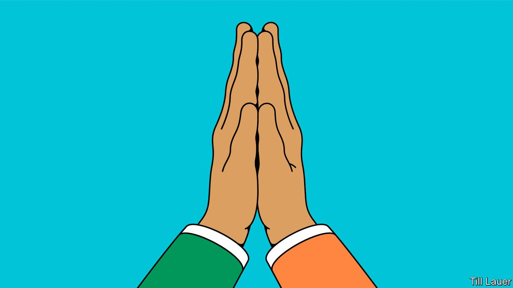

###### Banyan

# Indians of different religions are more alike than they may think 

##### An exhaustive new survey offers evidence of underlying similarities 

 

> Jul 1st 2021 

ON THE AFTERNOON of June 29th Zee News, a Hindi-language television channel, aired a sensational exposé. Against a backdrop of scowling mullahs and spiky minarets, a breathless presenter lauded the brave police of the state of Uttar Pradesh for busting a ring of foreign-financed jihadists. Their devilish mission: to entice vulnerable Indians into abandoning their faith. One viewer was so incensed by the report, he took to Twitter to suggest that “for such people mob lynching and ostracising by public should be done”.

Given the intensity and relentlessness of messaging that portrays Hindus as targets of malevolent but vague forces, it is not surprising that numerous Indian states have passed laws to restrict religious conversion. Nor is it surprising that angry mobs do, with grim regularity, set upon hapless Muslims, or that communal riots erupt. It is also unsurprising that factual evidence seems unable to counter this tide of hate and suspicion.


The makers of Zee News and its like, to say nothing of their viewers, might consider reading a new report on religion in India from the Pew Research Centre, an American institution that conducts polling around the world. Based on face-to-face interviews with some 30,000 people across the country in 17 languages, the 232-page study is the most extensive exploration of Indian attitudes to religion ever undertaken. While the data confirm many common understandings, such as that Indians are broadly tolerant of other faiths, yet highly compartmentalised inside their own, it blows apart plenty of myths.

One of these is the conversion bogey. Asked what religion they were raised in, 81.6% of the Pew study’s respondents said Hindu. Asked what they now identified as, 81.7% replied that they are Hindus. If there was a net gain for Hinduism there appears to have been none for Islam: the same 11.2% of Indians who were raised Muslim also say that they retain the same faith now. As for the exciting notion of “love jihad,” a purported campaign to lure unwitting Hindu women to marry into Islam, Pew’s numbers confirm a drearier reality: less than 1% of all marriages in India are inter-faith. Conversion, in other words, is simply not an issue.

Pew’s data show that while Indians tend to see their country’s multiplicity of faiths as more of a strength than a weakness, they also tend to view other religions dimly. An uncomfortable 85% of Indians said that all or most of their friends were of their own faith. Nearly two-thirds of respondents said their faith was “very different” from the others that the study included, with a majority of Hindus also confessing not to know much about India’s other religions.

Yet, when asked about their devotional habits, Indians revealed striking similarities. Some 97% professed to believe in God and 79% to do so with absolute certainty. Most pray daily (and ask for the same things), attend houses of worship regularly, donate to religious charities, celebrate religious festivals and mark rites of passage with religious rituals.

The overlap between Hindus and Muslims is particularly strong. Exactly equal proportions believe in the evil eye (51%) and in karma (77%), and also agree that women should be stopped from marrying out of their faith (67%). Fully 97% of Hindus say they are very proud to be Indian; so do 95% of Muslims. A good 80% of Hindus say that respect for other faiths is part of their own religious belief; 79% of Muslims say the same thing.

Just as strikingly, the report reveals regional differences within faiths that are nearly as wide as between them. Animal sacrifice is common among Hindus in southern India, but rare in the north. Muslims and Hindus alike are far less observant in the south than in the north, and also more open-minded: 40% of Muslims in northern states say they personally experienced discrimination in the months before the survey, more than twice as many as in the south.

It seems sad that Indians of all faiths are condemned, by and large, to live in silos among their co-religionists. Perhaps it would help if those in power emphasised what they hold in common rather than stress divisions. Aside from absorbing the facts laid out in this penetrating new survey, they would do well to listen to the advice of a wise fellow Indian: “Whoever praises their own religion, due to excessive devotion, and condemns others with the thought, ‘Let me glorify my own faith,’ only harms his own religion.” The author of those words: Ashoka, a Hindu convert to Buddhism, who unified India in 260BC.

