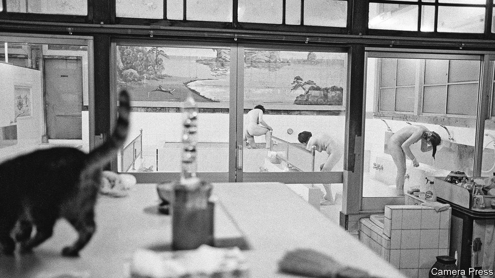

###### Bath variations

# Japan’s dying sento are becoming cool again 

##### Young people are giving traditional bathhouses a new lease of life 

 

> Jul 1st 2021 

VISITORS LEAVE their clothes and their worries at the wooden entrance to Inari-yu, a sento, or public bathhouse, in northern Tokyo. Inside they join the parade of bathers ambling beneath a mural of a snow-capped Mount Fuji. While perched on small stools, they scrub themselves with soap and rinse off with water poured from cypress-wood buckets. Then they soak together in hot pools, and the strict hierarchies and stiff formalities of Japanese life melt away. To cool down, they sip jars of chilled milk by the koi pond in the sento’s courtyard.

Such scenes, once ubiquitous in Japanese neighbourhoods, have become rarer in recent decades. In the 1960s there were more than 2,500 sento in Tokyo alone. Just over 500 remain. But a new generation of sento-philes is working to keep the baths full for the 21st century. Younger sento-owners hope to revive the bathhouses by adding bars, music and event spaces. Sento have started to acquire a retro cachet among a younger crowd. In 2019 the number of sento-goers in Tokyo grew (albeit marginally) for the first time in more than a decade.


Japan’s earliest public baths were attached to Buddhist temples, but the sento really took off in the dense, dirty environments of Tokyo and its precursor, Edo. Their primary appeal was practical: even as Tokyo prepared to host the Olympics in 1964, only around a third of its homes had bathing facilities. But sento also came to play an important role as common spaces that bring together people from different walks of life.

As private showers and baths proliferated—at least 98% of homes in Tokyo now have them—the sento started to dry up. As in lots of Japan’s traditional industries, many owners resisted change. With an ageing clientele, the equally elderly proprietors often decide to call it quits. “It’s becoming increasingly difficult for bathhouses to survive just as bathhouses alone,” says Kuryu Haruka of Sento &amp; Neighbourhood, which works to preserve old bathhouses.

Younger devotees reckon that sento must instead focus on fostering their communities, with a contemporary spin. After taking over Ume-yu, a historic sento in Kyoto, Minato Sanjiro attracted new clients by hosting concerts and flea markets at the bathhouse and by advertising online. His customer base grew from 70 people a day to around 250 before the pandemic hit. Whereas as many as 80% of the bathers were once senior citizens, now some 60% are in their 20s and 30s. Inari-yu is building a community space in an adjacent building, which will function as a lounge for bathers as well as a place for communal meals and exhibitions.

Others have opted for hipster makeovers. The third-generation owners of the 90-year-old Kogane-yu in eastern Tokyo have remodelled the venerable bathhouse; it reopened last year as a sleek modern space with a craft-beer bar and vinyl turntables.

Such changes can be divisive. Older regulars sometimes find the new bells and whistles alienating. Purists worry that turning sento into hipster haunts will ruin their democratic charm. “If you go too far in creating a new style, the idea of sento will be destroyed,” says Mr Minato. “But if we don’t change, the sento won’t survive.”

