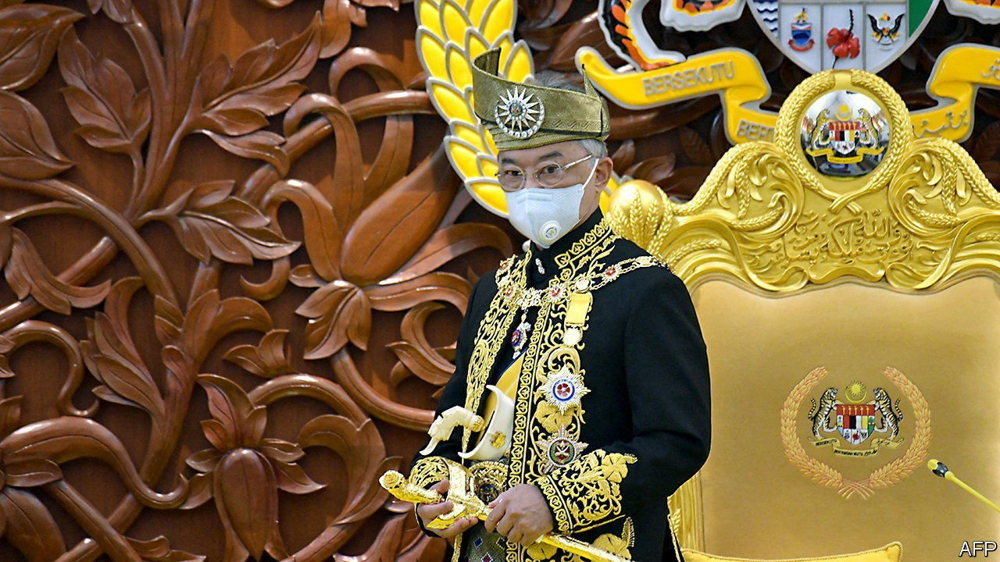

###### Schrödinger’s government

# Malaysia’s democracy gets a boost from an unlikely quarter 

##### The country’s constitutional monarch intervenes in a debate about reopening Parliament 

 

> Jul 3rd 2021 

THE LAST time Malaysia’s Parliament convened was in December, when Muhyiddin Yassin, the prime minister, squeaked through a budget with the narrowest of majorities. Since January a state of emergency to combat the covid-19 pandemic has given Mr Muhyiddin a convenient excuse to shut down the legislature. The ostensible reason is that many lawmakers are old and vulnerable to the virus. The real one is that his shaky coalition may not withstand parliamentary scrutiny. Since the start of the year, multiple defections have left Mr Muhyiddin with Schrödinger’s majority—until it can be measured, it both exists and does not.

No wonder then that the prime minister has been reluctant to put a firm date on reconvening Parliament, offering only a vague timeline of “September or October”. But on June 16th Sultan Abdullah, the king, urged the government to hold a sitting of Parliament “as soon as possible”. Separately, eight of the nine royals among whom the monarchy rotates issued a statement arguing against any extension of the state of emergency. Several state assemblies are planning to meet in August.


Such interventions from Malaysia’s monarchs used to be rare. But what with the permanently embattled state of Mr Muhyiddin’s government, the endless politicking of opponents hoping to bring it down and the worsening covid crisis, the king is a growing presence in politics. It was he, after all, who appointed Mr Muhyiddin early in 2020 and agreed to declare a state of emergency in January. In effect the king is signalling to the prime minister that he had better get his act together. The government’s failure to control the pandemic has caused a public backlash on the monarchy itself, says Wong Chin Huat, a political scientist at Sunway University near Kuala Lumpur, Malaysia’s biggest city.

Mr Muhyiddin, for his part, is toughing it out. He has formed a committee to look into reopening Parliament. The attorney-general, meanwhile, said that only the cabinet can decide when Parliament meets. On June 29th the king summoned the heads of both houses and again “expressed the view that Parliament should be held as soon as possible” so that “check-and-balance mechanisms” could function. The next day, even as Mr Muhyiddin was admitted to hospital with a severe bout of diarrhoea, the pair proposed a sitting before the emergency expires on August 1st.

Whenever Parliament eventually sits, it is unlikely to bring down the government. A motion of no confidence must be accepted by the speaker, and the government must agree to set aside its business for a vote to take place. Neither is likely to happen. Nor do Malaysians want to see more political chaos as they struggle with infections and economic contagion. Instead, the opposition is likely to position itself as a crucial democratic check, questioning Mr Muhyiddin’s handling of the pandemic and providing oversight. “The last six months the government has been involved in a lot of monkey business. All these things are currently rumours on WhatsApp groups,” says James Chin of the University of Tasmania. But if MPs are able to ask uncomfortable questions, he says, “You can embarrass the government and pull it down in the eyes of the people.”

The royal intervention may already be showing results. On June 28th Mr Muhyiddin announced a stimulus package of $36bn targeting small firms and vulnerable people, after mounting criticism of his government’s inadequate economic response. The rate of vaccination has been rising steadily in recent weeks. If Mr Muhyiddin can hang on for a few months more, when many more people have been inoculated and the economy has reopened, he is likely to benefit from public goodwill. His approval rating towards the end of April was still a healthy 67%, up from 63% in January, according to the Merdeka Centre, a local pollster. That was before the latest surge in cases of covid-19. Would things be better if one of Mr Muhyiddin’s many foes were prime minister? Most Malaysians are not keen to find out. ■

