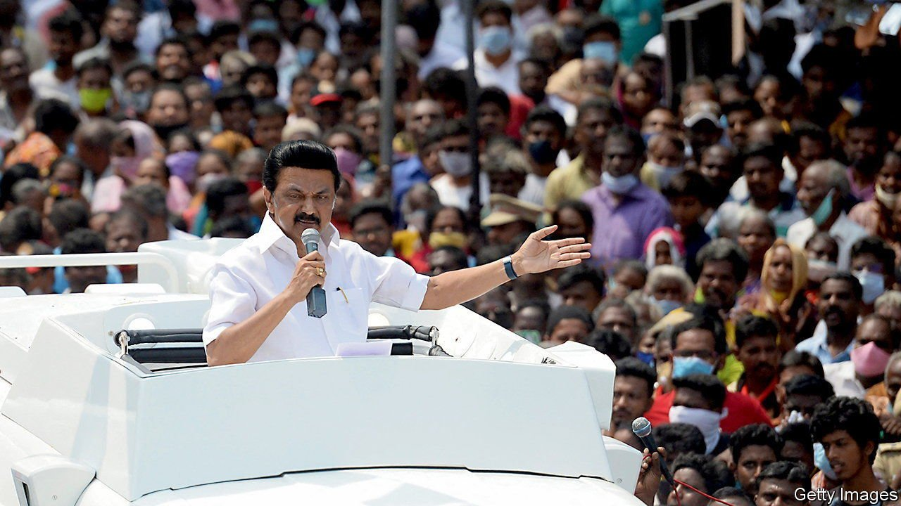

###### The Dravidian Stalin

# Tamil Nadu’s leader offers something India’s does not: competence 

##### What M.K. Stalin lacks in charisma he compensates for with pragmatism 

 

> Jul 1st 2021 

IT WAS DANGEROUS in the Soviet Union to accept a seat in Joseph Stalin’s inner circle. Many members ended up imprisoned or executed—though Jeno Varga, his economic adviser, lived a long and healthy life. That Varga was treated gently is a good sign for the five superstar economists recently appointed to the economic advisory council of M.K. Stalin, the new chief minister of Tamil Nadu, south India’s most populous state.

Mr Stalin’s father, M. Karunanidhi of the Dravida Munnetra Kazhagam (DMK), was a giant of Tamil politics, ruling the state for nearly two decades over five separate terms as chief minister. He is said to have picked his son’s name to honour the passing of the Soviet leader, whose death was announced a few days after the current chief minister was born. Yet it is to Mr Stalin’s credit that his name may be the least interesting thing about him.


Start with the newly appointed economic council. One member, Esther Duflo, won a Nobel prize for her rigorous approach to assessing development schemes. Two others, Arvind Subramanian, India’s former chief economic adviser, and Raghuram Rajan, a former head of the central bank, both clashed with Narendra Modi, the prime minister, in those jobs. The others—S. Narayan, a former finance secretary, and Jean Drèze, a welfare economist and activist—have positioned themselves against Mr Modi’s haphazard decision-making. The appointments are designed to highlight the difference between Mr Stalin and the PR-obsessed prime minister.

That is in keeping with the position Mr Stalin finds himself in: along with Mamata Banerjee and Pinarayi Vijayan, chief ministers of West Bengal and Kerala respectively, he is the face of a decentralised opposition to Mr Modi’s Bharatiya Janata Party (BJP). In the absence of any inspiration from the enfeebled Congress party, it will almost certainly fall to some sort of coalition of regional satraps to take on the prime minister in the next general election, in 2024.

As a young man with a famous, powerful father, Mr Stalin reportedly developed “a thuggish reputation”, as a leaked American diplomatic cable put it, “including alleged involvement in multiple sex scandals”. (Mr Stalin has not publicly responded to the allegations.) That changed during the Emergency of 1975-77, when Indira Gandhi suspended democracy and imprisoned most of her political opponents, including Mr Stalin. He was beaten brutally and one of his comrades died in custody.

He emerged with an air of seriousness and began making investments in his political future. As India’s economy opened up in the 1990s, he made friends within Chennai’s business community, and eventually Karunanidhi made him mayor of the city, which is the state capital. With a dyed-black pompadour, white half-sleeved shirts and traditional veshtis, he started to cultivate an image of his own, albeit piously subordinate to his father’s.

Now 68, Mr Stalin remains aloof. Until recently he kept undistinguished company: party hacks rather than the Tamil intelligentsia whose conversation Karunanidhi sought out. Mr Stalin is not the personality his father was. He does not need to be. The DMK’s chief rival, AIADMK, managed to hang on to power for years after the death of its charismatic leader in 2016 by accepting help from the BJP, ascendant in the rest of India but detested by Tamils. In the general election of 2019, when Mr Modi’s approval rating in most north Indian states was more than 60%, in Tamil Nadu it stood at just 2.2%. That put the kiss of death on the AIADMK. Mr Stalin’s DMK won the recent state election in a landslide.

“Aware of his own limitations—as charismatic leader, orator, ideologue—he seems to want to go down in history as a man of governance,” says A.R. Venkatachalapathy, a historian. He is pragmatic too, retaining the health minister of the defeated government on a covid-19 committee. The pandemic has made Tamils grateful for their relatively strong public-health infrastructure. That is one way in which the state distinguishes itself from the rest of the country. Its quietly competent leader may prove to be another. ■

