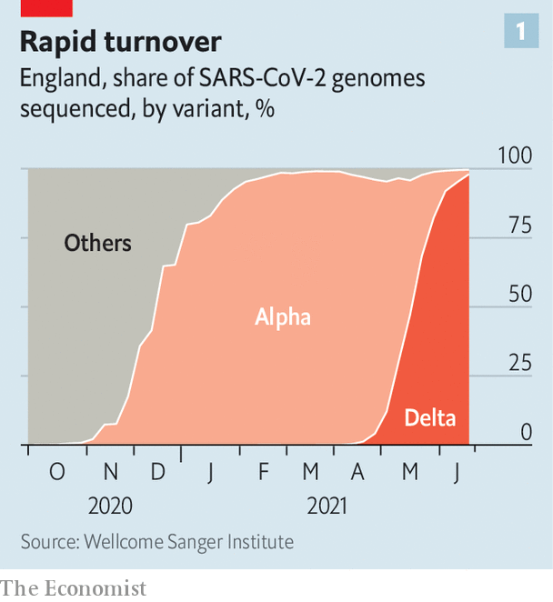
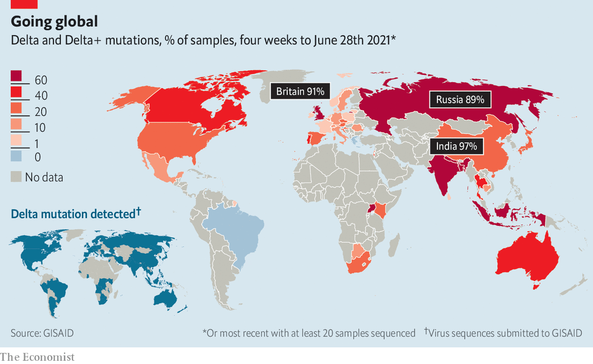
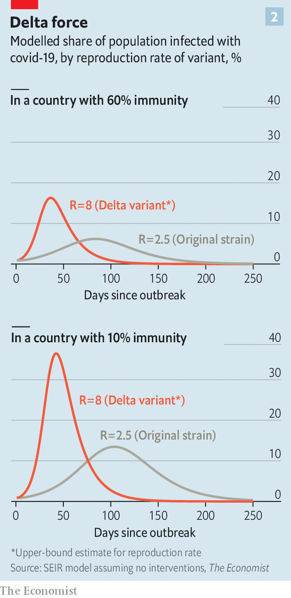
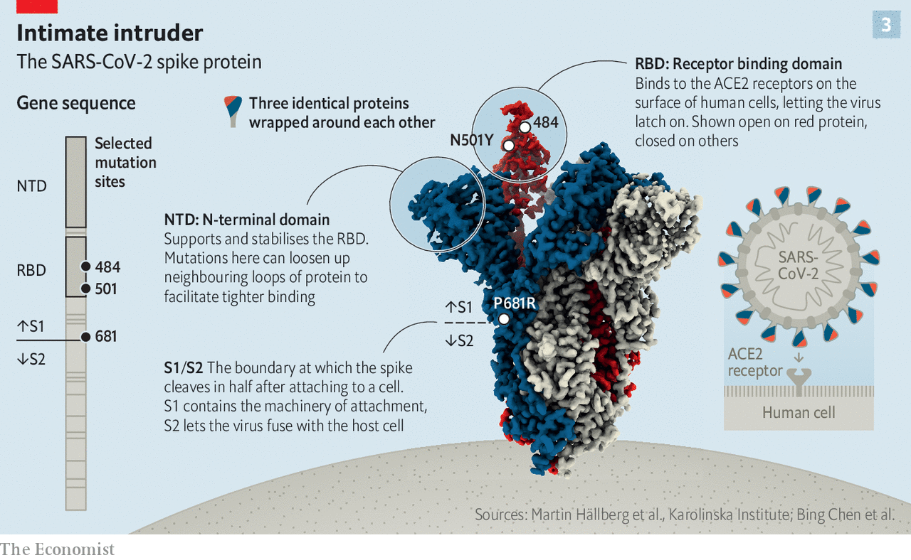
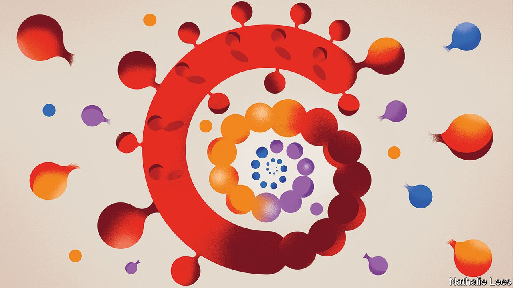

###### Coats of many colours

# The unvaccinated are at risk as evolution accelerates the covid-19 pandemic 

##### Research is unravelling the virus’s deep secrets 

 

> Jul 3rd 2021 

FOR MUCH of 2020 the covid-19 virus was, in genetic terms, a little dull. Early in the pandemic a version of SARS-CoV-2 that was slightly different from the one originally sequenced in Wuhan, and spread a bit better, came to dominate the picture outside China. But after that it was just a case of a letter or two of genetic code changing here and there. Sometimes such mutations proved useful for working out where infections were coming from. But none of them seemed biologically relevant. By September Salim Abdool Karim, a South African epidemiologist, was beginning to find his monthly updates on new mutations “quite boring”. He considered dispensing with them altogether.

He was soon glad that he hadn’t. In the last months of 2020 researchers around the world began to see variants of the virus with not just one or two mutations but ten or 20. What was more, some of these new variants turned out to have new properties—to spread faster, to shrug off antibodies, or to do both.


The first of them, now called Alpha, appeared in Britain in September. By November scientists sequencing virus samples were becoming alarmed at the rate of its spread. Each infection with the original virus, as sequenced in Wuhan in January 2020, had been estimated to lead to roughly 2.5 subsequent infections in the absence of countermeasures like masks, social distancing and lockdowns. Under the same conditions the “reproductive number” for Alpha was reckoned to be almost twice as large: four or five.

 


By November Dr Karim was sitting in his office gobsmacked by evidence of a variant similarly studded with mutations, now called Beta, in South Africa. The Gamma variant, formally identified only in 2021, was beginning to make itself felt in Brazil and would go on to ravage South America. Delta, a key factor in the catastrophic Indian epidemic a few months later, raised the transmissibility bar yet further. British scientists estimate that in unvaccinated populations not taking precautions its reproductive number may be as high as eight. In mid-June, only two months after it first appeared there, Delta had almost fully displaced Alpha in England (see chart 1). It now threatens the rest of the world (see map).

 


All the variants are more transmissible to some extent. Laboratory tests on human airway cells in Petri dishes have shown that Delta replicates more avidly in them than do earlier variants. That would seem to suggest that a smaller initial dose is needed for an infection to take hold. It also means that the amount of virus lurking in people’s airways is probably higher.

Swabs taken from people’s nostrils and throats during testing back this notion up. The amount of virus found in samples from people infected with Delta is higher than for other variants. That probably means that people are exhaling more virus than those infected by an older variant and thus that every encounter between an infected and uninfected person poses a greater risk of transmission.

Vaccination slows this spread down, but it does not stop it. The current vaccines do not stop all infections by any version of the virus. Nor do they stop infected people from passing the virus on, though they do make it significantly more difficult. People vaccinated with Pfizer or AstraZeneca jabs who are subsequently infected with Alpha are about half as likely to pass it on as the unvaccinated are.

British studies have found Delta to be around 60% more transmissible than Alpha. They put roughly three-quarters of that effect down to the fact that it is easier to catch if you are not vaccinated and about a quarter to the increased ease with which Delta infects people who have been vaccinated. Around half of the adults infected in a recent Delta outbreak in Israel were fully vaccinated with the Pfizer vaccine.

Happily, studies of vaccines made by Western companies show them to reduce deaths and severe cases of the disease in people infected with every sort of SARS-CoV-2. This protection means none of the new variants is anything like as potent a public-health threat to a largely vaccinated population as the original version was to an unvaccinated one. Delta’s increased transmissibility, along with relaxed restrictions on travel and socialising, has seen the number of infections and cases in Britain beginning to climb again. But thanks to widespread vaccination, deaths have barely moved. Deaths are, by their nature, a lagging indicator of infection; but widespread vaccination of the most vulnerable is working as hoped.

 


The dangers posed to the unvaccinated and partially vaccinated mean that there is still a public-health case for keeping infections from spreading. Here, unfortunately, the degree to which variants can evade vaccine-produced immunity makes things a lot harder than once they seemed. “If there is a certain degree of immune escape, even if you were to vaccinate 100% of the population, it’s going to keep coming at you for some period of time,” says Adam Kucharski of the London School of Hygiene and Tropical Medicine.

In a population where 60% are immune, either through vaccination or from a past bout of covid-19, the introduction of a variant with a reproductive number of eight would cause a sharp surge in infections unless lockdowns and similar interventions were established right away (see chart 2). For unvaccinated populations the situation is much worse. If no precautions are taken, a reproductive number of eight produces a far more dramatic crisis in an unvaccinated population than one of two or three does. And last year provided ample evidence of how bad things get even with a lower R. Other things being equal, a highly transmissible virus means more deaths and a more acute stress on the health-care system.

Spikes for speedy spread

Other things may not be equal; the danger posed to the unvaccinated by a new variant may not be exactly the same as that posed by older versions. In Britain those infected with the Alpha variant saw a higher level of severe disease than those infected with the original version, but no corresponding increase in deaths.

Whether Delta does the same is unclear. Comparisons with other variants in countries that can measure such things well are made hard to assess by the large numbers of vaccinated people in those populations. The picture emerging from a British symptom-tracking app called Zoe suggests that Delta is presenting with symptoms closer to those for the common cold than those seen with other variants. They rarely have shortness of breath, the hallmark symptom of covid-19 with the variants that dominated the first year of the pandemic. Oddly, vaccinated people who then get infected tend to sneeze more—which is good for the virus not just because sneezes spread diseases but also because it allows covid-19 to be mistaken for hayfever.

So far, though, differences in the severity of disease caused by the different variants have been eclipsed by the simple, deadly fact of their high-speed spread. There is ample room for that to continue. Less than 1% of people in low-income countries have had even one dose of vaccine. In  that are crushing hospitals and killing health-care workers.

Rich countries, including Australia, Japan and South Korea, where the first wave was largely avoided and vaccination has not been a high priority now look highly vulnerable. By the end of June the risk of Delta had seen almost half of Australia put under lockdown orders. Delta is the dominant strain in Russia, where a vaccination rate of 12% and misinformation-driven vaccine scepticism seem set to make its spread easy.

The variants make vaccination programmes more urgent than ever. But though they may march on through the alphabet for some time to come, there is some reason to hope that they will not get all that much worse as they do so. They may be running out of evolutionary room to manoeuvre.

For a clearer understanding of what is going on, focus on the spike protein that adorns the outer envelope of SARS-CoV-2 particles. You can think of it, as you can of any protein, as being like a paper chain in which every link can have one of 20 colours. The gene for spike specifies the sequence in which those colours appear in the protein’s 1,273-link long chain. Mutations in the gene can change the colour of one specific link, add a few new links, or cut some links out. In the Alpha variant six of those links have different colours from those in the Wuhan sequence, and in a couple of places a link or two are missing altogether. The Delta spike has five distinctive mutations.

In reality the links in the chain are 20 different types of amino acid. Each type has subtly different chemical and physical properties. At the time that the chain is created the laws of physics require it to fold up into something more compact. The specific shape into which it folds is determined by its unique sequence of amino acids, as laid out in the gene. And that shape underlies all the protein’s future capabilities. Shape is almost everything in the world of proteins. It is through their shapes that proteins recognise each other. It is through changes of shape that they act.

 


Each of the now-familiar protuberances on the surface of SARS-CoV-2 particles is composed of three copies of the spike protein slotted together into a “trimer” shaped a bit like a golf tee (see chart 3). In the cup of these tees are the virus’s receptor-binding domains (RBDs). Each of the trimer’s constituent proteins can be open or closed at any given time. When they are open ACE2, a protein found on the surface of some human cells, fits quite nicely into the RBD’s carefully contrived nobbliness.

Acey deucey

The ACE2 receptor is the virus’s main target; it normally attacks only those cells that display it. The act of glomming on to an ACE2 molecule changes the spike protein’s shape, revealing a “cleavage site” which is suited to attack by another protein on the cell’s surface. As a result the spike gets cut in two—which sounds bad for the virus, but is in fact the necessary next step in infection. It is only after the spike is sliced asunder that the membranes of the virus and the cell can merge.

Tyler Starr, a researcher at the Fred Hutchinson Cancer Research Centre in Seattle, describes the RBD as a “big, squishy interface” that mutations can reshape quite easily. In 2020 he, Jesse Bloom and their colleagues sought to examine this mutability by making versions of the SARS-CoV-2 RBD in which individual amino acids in the protein paper-chain were replaced by alternatives with different properties. These mutant proteins were then tested to see how well they stuck to ACE2; those that did best, the researchers reasoned, might be mutations that evolution would favour. They were right.

In the original Wuhan genome the 501st position in the spike chain is occupied by an amino acid called asparagine. When the scientists in Seattle put an amino acid called tyrosine there instead, the RBD bound to ACE2 more tightly; it turns out that the change twists a key part of the RBD round by about 20 degrees, making the fit a bit more snug. Mutations which cause just that substitution, known as N501Y (or sometimes “Nelly”) subsequently turned up in the Alpha, Beta and Gamma variants. Another change they spotted, now called E484K (or “Eek”), was found in both Beta and Gamma.

Changes to the RBD can also reduce its susceptibility to antibodies. Antibodies also work by recognising shapes, and though they recognise various other bits of the spike protein, notably another region in the trimer’s head called the N-terminal domain (NTD), the most effective of them are specific to particular aspects of the RBD. Some changes to the RBD, such as N501Y, do not make it less recognisable to antibodies. Others, such as E484K, do. Being a lot less susceptible to some antibodies seems to help E484K’s possessors to infect people who have been vaccinated.

The RBD is not the only part of the spike protein where mutations matter. In a preprint published on June 22nd Ravindra Gupta, a molecular virologist at Cambridge University, and his colleagues put forward an argument as to why Delta is both more infectious and better at evading immunity than other variants. It is based on a substitution at site 681, which is at the point where, after the RBD meets ACE2, the protein is cleft in two.

Not ai, therefore em

Dr Gupta says P681R, helped by two shape-modifying mutations elsewhere, makes it easier for the protein to be cut up and thus get into cells. Its presence also means that, once a cell starts producing particles, their spike proteins can get on to the cell’s surface pre-cut. That can lead to virus particles which are shorn of the RBDs which antibodies recognise and ready to fuse with any nearby cell. It can also encourage infected cells to clump together with others. Dr Gupta’s lab has found evidence of these cell clumps in a living model of the human respiratory system.

A full validation of this work will require a detailed picture of the Delta variant’s structure—something which is not yet available. In theory, it should be possible to predict the shape of a protein using nothing but the sequence of amino acids described by its gene and the laws of physics. Doing so from first principles, though, is impossible. DeepMind, an AI company which is part of Google, has shown that machine learning can help a lot. But as yet its capabilities are best demonstrated on small single proteins. This approach is not much good if the protein is large, anchored in a membrane, and naturally found in a dimer or trimer, as spike is. DeepMind has not attempted to predict spike’s structure.

The best tool for seeing spike’s structure in detail is cryo-electron microscopy. Copies of the protein in question are flash frozen using liquid nitrogen (hence cryo); once they are immobilised beams of electrons are bounced off them and used to build up pictures (hence microscopy). Bing Chen, who has run a series of cryo-EM experiments on the spike protein at Harvard, is at pains to stress the time, effort and computer power required to turn thousands of pictures of the protein taken from every conceivable angle into a three-dimensional image which comes close to resolving the positions of every single atom. But there is no better way to appreciate the changes in the fine details of the protein’s structure brought about by the variants’ different mutations.

On June 24th Dr Chen’s group published long-awaited structures for the Alpha and Beta spike variants. They show the way in which the protein’s complex folding allows mutations that are at some distance from each other in paper-chain terms to have effects on the overall shape that it would be near impossible to predict from the sequence alone. A pair of mutations found called A570D and S982A, for example, act to slightly loosen up the protein’s structure in Alpha. That makes the RBD open up more. The group is now working on a structure for Delta which might confirm Dr Gupta’s insights.

Studies of this sort help reveal how the mutations in the variant spikes work together. But how did these variants come to have so many mutations in the first place? Mutations are normally expected to crop up one at a time; but the named variants each emerged with a whole set of them. That is what has given them sudden and surprising effects.

One way in which they could have emerged fully formed is by evolving in people with compromised immune systems who had very long drawn out SARS-CoV-2 infections. In such cases the virus would be able to continue replicating itself in their bodies again and again, accumulating a number of mutations as it did so. The time required for such a process would help explain why the variants only started to appear towards the end of last year. Studies of five such people have shown that they developed a number of the mutations now seen in variants.

Not all the mutations in the variants are in the spike gene, and some of those affecting other proteins will doubtless also prove to have importance. One of Alpha’s mutations appears to give it an advantage when dealing with a non-antibody-using arm of the immune system. Non-spike mutations probably explain why Delta’s symptoms appear different. But spike still dominates the discussion. Its structure is crucial to the vaccines. And it also seems unusually mutable.

Dr Starr thinks this mutability may be a consequence of the virus’s origin in bats. He points out that most viruses have binding domains that cannot tolerate much mutation, and so they evolve ways of hiding them away from pesky antibodies. The SARS-CoV-2 RBDs are too large for such protection. That would seem like a problem for the virus. But it may be a price worth paying if a larger, more open RBD is easier for evolution to reshape.

The reason that Dr Starr thinks evolvability might be a benefit worth paying for is that, in bats, ACE2 is much more diverse than it is in humans. That means viruses which use the receptors as a target need to be able to adapt the mechanisms by which they do so. The tolerance for mutations that has made new variants of RBD possible in humans may be the “by-product of this arms race...between virus and bats”.

Avoiding Omega

If mutation is comparatively easy, though, it also has its limits. In their experiments last year Dr Starr and his colleagues identified changes to the RBD that seemed advantageous but which do not turn up in the real world—presumably because real spike proteins cannot contort themselves enough to accommodate them.

Seeing similar mutations crop up in different variants also suggests that evolution is sampling a somewhat limited number of possibilities. “The fact is that you’re starting to see recurring mutations,” says Dr Chen. “That would be an indication that there are probably not that many places that the virus can mutate.” Strains with radically different ways of becoming more transmissible or evasive may be beyond evolution’s reach.

 


Another cause for optimism is that spike is not the only part of the process that is complex and mutable. The immune system is, too. The initial infection is the first stage of a protracted struggle in which the immune system has various strategies at its disposal. A study by Jackson Turner of the Washington University School of Medicine and his colleagues which was published in Nature on June 28th showed that the immune response produced by infection with SARS-CoV-2 is long lasting, robust and multifaceted. Among other things, some of the B-cells which produce antibodies produce more effective ones later in the course of infection than earlier on. This may be part of the reason why they provide better protection against severe disease than they do against infection.

It is quite possible, though, that not all vaccines will do so equally well. Hundreds of millions of doses of two vaccines made by Chinese companies, Sinopharm and Sinovac, have been sold to low and middle-income countries; they look like being a large part of the world’s vaccine supply for the rest of the year. But there are some doubts about their efficacy, especially against new variants. The original clinical trial of the Sinovac vaccine found a lower efficacy than in any other covid-19 vaccine trial, just 51%. Studies of the vaccine’s use in Uruguay and Indonesia have been a great deal more encouraging. But there is rising concern in Bahrain, Chile, the Seychelles, Turkey and the UAE, all of which have relied on Chinese jabs. The UAE and Bahrain are worried enough to have started offering a third shot of Pfizer’s vaccine to people who have already been given two shots of Sinopharm’s.

Third shots are being looked at by some other governments, too, including Britain’s. The fact that current vaccines protect people against severe disease and death even when infected by the new variants makes the idea that variant-specific vaccines analogous to seasonal flu jabs will be necessary look less likely. The easier alternative of offering people who have been vaccinated twice a third shot, though, perhaps using one of the other vaccines, has advocates.

But there is as yet no evidence that it is necessary. And third shots pale as a priority compared with first and second shots for those who have had neither, and now need them more than ever. ■

