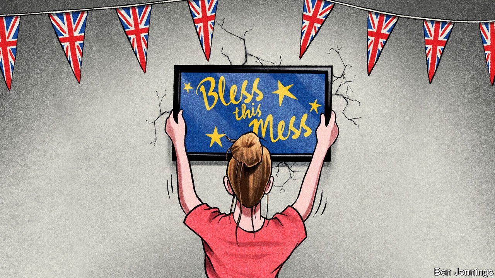
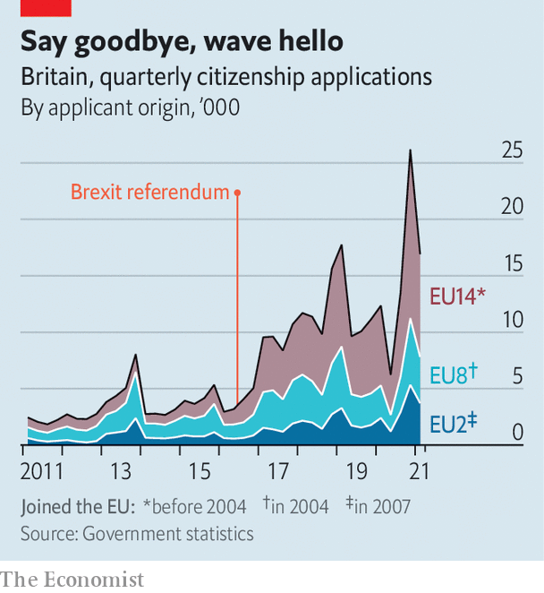

###### Applying for settled status

# Britain is much more European than anybody thought 

##### Some 5m EU citizens want to stay in the UK 

 

> Jul 1st 2021 

SHORTLY AFTER the Brexit vote in June 2016, a group of distraught Europeans gathered in a Bristol pub. They decided on the spot to create an organisation to lobby for EU citizens in Britain. Wanting to convey that group’s weight, they took the then-official estimate of its size, and called their outfit the3million. Now, says Maike Bohn, one of the founders, “we need to rebrand.”

June 30th was the deadline for citizens of European countries, who used to be able to move freely to and from Britain, to apply for . At the last count 5.6m applications had been received, from about 5m people (some applied more than once, for various reasons). Some nationalities proved far larger than official statisticians had thought. Romanians, the second-biggest European group in Britain after Poles, filed 918,000 applications by the end of March—about twice as many as their estimated population in 2019. Italians, who made 501,000 applications, were also twice as numerous as expected. Charities that work with EU citizens say they are sure there was a surge of applications in June.


So huge is the task of processing these applications that some fear disaster. Many European settlers in Britain seem not to have realised that they must apply on behalf of their children: only 15% of applications are for under-18s, which seems low. And whereas some EU countries have given identity cards to British citizens, Britain has recorded people’s status nowhere except on a central database. If a landlord or an employer is unable or unwilling to access it, rights will be lost.

But the inevitable snarl-ups and injustices should not distract completely from what Britain has done. The Home Office, a department known for sloppiness and obduracy, has processed the great majority of applications swiftly and generously. As of May 31st only 2% had been rejected. About half of the successful applicants have been given settled status; the rest, mostly newer arrivals, are “pre-settled” and will be able to upgrade in time. “It has worked, and thank goodness it has worked,” says Alberto Costa, a Conservative MP whose Italian parents went through the process.

Some of the Europeans who have already been granted settled status left during the coronavirus pandemic and may not return. Britain nonetheless finds itself with many more European settlers than the 3.5m-4.1m the government expected. To put the 5m into context, the censuses in 2011 of England, Northern Ireland, Scotland and Wales found 1.5m people of Indian descent, 1.2m people of Pakistani descent and 1.9m black people, not including those of mixed race.

For now, Britain’s European settlers are mostly youthful. Overall, 19% of British people are aged 65 or older. By the end of March only 2% of applications for settled status came from Europeans in that age group. But over time the European immigrants and their descendants will come to resemble everyone else. “They will grow old here,” says Catherine Barnard of UK in a Changing Europe, a think-tank.

They live everywhere—at least, some do. Immigrants from the eastern European and Baltic countries that joined the EU in 2004 settled across the United Kingdom. Small towns that had barely seen an immigrant before sprouted Lithuanian and Polish stores. By contrast, western and southern Europeans are concentrated in cities, as are the Bulgarians and Romanians who mostly arrived after 2013. Just 19% of the Poles who applied for settled status by the end of March live in London, compared with 34% of Romanians, 46% of Italians and 54% of French applicants.

Most European adults who were living in Britain before the end of 2020 can vote in local elections, and in elections to the Northern Irish, Scottish and Welsh parliaments. That gives them some clout. They will gain more if they become citizens. “If even a third become British, it’s really a political force,” says Alexandra Bulat, who came to Britain from Romania and is now a Cambridgeshire county councillor.

Whether that happens, and how quickly, is the crucial question for the future of British politics. Until a few years ago European settlers seldom became citizens. They had lots of rights in Britain, and came from rich, stable countries that they did not fear to return to. But the Brexit vote caused a surge in citizenship applications (see chart). EU citizens accounted for 34% of applicants in the first quarter of this year, a big increase from just 4% in the first quarter of 2010.

 


Applying for British citizenship is expensive, at £1,330 ($1,840) per adult. Some people have been deterred from applying by an obscure requirement about health insurance. And a few European countries, such as Germany and Lithuania, frown on dual citizenship. Nonetheless, many migrants will eventually get round to it, especially if their children grow up in Britain. And the more alarming stories they hear about the bureaucratic mistreatment of Europeans from July 1st, the more they will feel compelled to protect their rights by becoming British.

Strangely, most national politicians are ignoring this enormous pool of potential voters. Hundreds of Labour Party activists have written to their leader, Sir Keir Starmer, calling the party’s near-silence over EU citizens’ rights “inexcusable”—to little effect. Although Mr Costa lobbies tirelessly, the Conservative Party engages even less with EU citizens’ groups than it did a few years ago. “There’s no effort,” says Ms Bohn of the3million.

The big exception is the Scottish National Party. Its leaders speak frequently and effusively about EU citizens in Scotland. In early 2020 the Scottish Parliament, which was and is dominated by the SNP, proclaimed that it had protected their voting rights. The British government quietly announced on June 17th this year that it would do similarly. Unionists might suspect that the SNP is trying to attract new voters to the i and draw a cultural dividing line between internationalist Scots and xenophobic little Englanders. They would do better to copy the nationalists by appealing to the five million. Everybody wants to be wanted. ■

For more coverage of matters relating to Brexit, visit our 

A version of this article was published online on June 29th 2021

