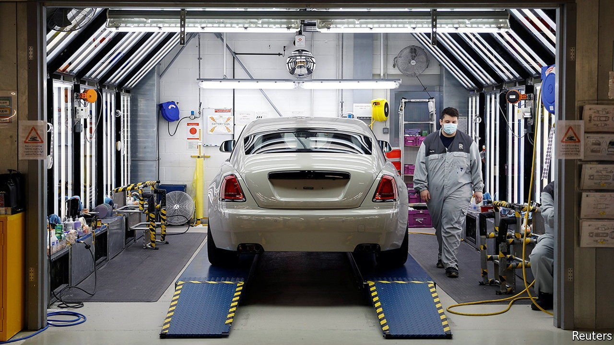

###### Helping handout

# Post-Brexit, state aid will be more flexible and less bureaucratic 

##### But they could snarl up Britain’s single market 

 

> Jul 3rd 2021 

DURING BRITAIN’S multi-year negotiations to leave the European Union, fights over matters weighty (the status of Northern Ireland) and minor (fishing rights and roaming charges) were never far from the headlines. But for the technocrats in Brussels, among the most concerning issues was one that barely resonated with voters: state aid. Would post-Brexit Britain seek to subsidise its domestic firms in order to help them compete with European rivals, and if so, how? On June 30th, six months after the end of the Brexit transition period, Britain finally gave the Eurocrats their answer. Its plans mark a radical break with the past.

Restrictions on state aid are essential to the functioning of the EU’s single market. They ensure that governments do not use public money to grant their domestic companies unfair advantage over others within the trade bloc. But the rules are inflexible. Any policy with the potential to distort markets is banned unless expressly covered by a so-called block exemption, for example for infrastructure or environmental projects, or unless permission has been granted by the European Commission.


Under the new British system, by contrast, subsidies will be permitted as long as they follow general principles about value for money, do not prop up failing firms and are not designed simply to move jobs from one part of the United Kingdom to another. A new unit at the Competition and Markets Authority, an official watchdog, will offer advice on state aid to central government, and to the devolved Scottish and Welsh administrations and local authorities. But it will not have the final say over whether a subsidy is granted.

Brexit presented Britain with an opportunity to tailor a state-aid system to its needs. But that very opportunity also created a headache for the government. Many Conservative ministers wanted to be free of rules they regarded as overly restrictive, and of the red tape involved in ensuring compliance. On the party’s free-market wing, however, some worried that ditching EU rules might enable a return to the dirigisme of the 1970s, when taxpayer cash was splashed freely and governments believed they were clever enough to pick winners.

Whether such fears are justified will take time to become apparent. It is local authorities for which the new rules mark the biggest change, but after a decade of budget cuts, they are in no position to ramp up spending on local firms, even if it would offer a decent return.

Deciding whether a scheme is effective, rather than whether it complies with European law, will require public authorities and ministers to think more carefully. As they consider how to create schemes for incubating new businesses, retraining workers and the like, there should be greater scope for innovation and policy competition between them, says James Webber, a competition lawyer at Shearman &amp; Sterling, a global law firm. The new system might force more candour on politicians too, he adds. “Ministers will have to explain why they don’t want to spend money, instead of blaming the EU.”

Freeing Britain’s economy from the constraints of the single market is among the biggest benefits its government spies in Brexit. But under the new system, preserving the British single market will bring its own problems. The trouble will come when one of the devolved governments seeks to subsidise a local company, and Whitehall decides to challenge it. EU rules were certainly restrictive, but at least they were clear. And Brussels did the nasty business of saying no. ■

