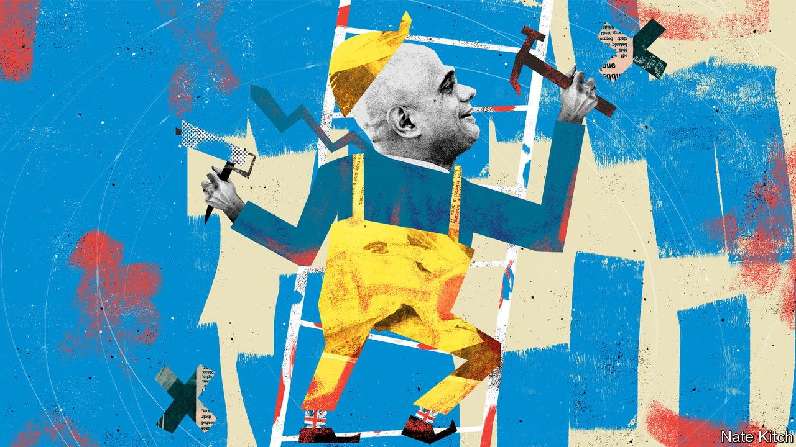

###### Bagehot

# Sajid Javid replaces the hapless Matt Hancock as health secretary 

##### How he tackles a crisis in social care will determine his legacy 

 

> Jul 1st 2021 

SAJID JAVID has got off to a bracing start at the Department of Health. During his first speech in Parliament in his new job, on June 28th, he all but guaranteed that lockdown would end on July 19th, and strongly hinted that the policy of sending entire classes of children home if one tests positive for covid-19 would end soon, too. The next morning he condemned a bunch of yobs for accosting the chief medical officer, Chris Whitty, as he walked across St James’s Park. “We will not tolerate this sort of behaviour towards our public servants,” Mr Javid tweeted at 7.27am.

Mr Javid brings useful qualities to the position of health secretary. High on the list is not being Matt Hancock, his hot-for-it predecessor, who resigned on June 26th after the Sun newspaper printed photos of him canoodling with an aide, Gina Coladangelo. The tiggerish Mr Hancock had increasingly grated as lockdown has dragged on; Mr Javid is reassuringly placid. Mr Hancock is a polished speaker who loves to preen for the cameras; Mr Javid’s mechanical, unpolished delivery makes him seem less ambitious than he really is. Even before Mr Hancock was snapped in his fateful embrace, he was unpopular in his party (the silence on the Tory benches as Jeremy Hunt intoned that “the country is in [Mr Hancock’s] debt” spoke volumes). The man universally known as Saj is widely liked as a straight-shooter and convivial colleague.


He is now the cabinet member with the widest experience, having held five positions in it in the past seven years (culture, business, housing, the Home Office and the Treasury). He served under both Boris Johnson, the current prime minister, and his two Tory predecessors, Theresa May and David Cameron. He has the confidence to stand up to senior civil servants and politicians, but is neither prickly nor abrasive. He is close to his party’s power-brokers, in particular Rishi Sunak, who was his former protégé as chief secretary to the Treasury, and Mr Hunt, with whom he worked when he was community secretary with some responsibility for care homes and Mr Hunt was health secretary. Mr Sunak now controls the purse strings that Mr Javid will need to loosen if he is to succeed in his new job; Mr Hunt is chairman of the parliamentary committee that oversees his work.

By playing the Saj card, Mr Johnson transformed a potential disaster into an advantage. Had he retained Mr Hancock, as he said he would when the scandal broke, he would have faced cries of hypocrisy (the handsy, smooching Mr Hancock was particularly preachy about social distancing) and conflicts of interest (Mr Hancock was Ms Coladangelo’s patron, and the two were university friends). With Mr Javid available on the backbenches, the prime minister went some way towards remedying his cabinet’s tendency towards the lightweight. Mr Javid is not only experienced, but more likely to speak his mind than whippersnappers on the make like the culture secretary, Oliver Dowden, or clinging-on-by-their-fingertips types like the education secretary, Gavin Williamson. Mr Johnson also avoided a premature cabinet reshuffle, leaving him well-placed for one next year that could see his party riding into the next election with a useful combination of old hands like Mr Javid and newcomers unsullied by political combat.

But the range and scale of problems that face the new health secretary would strike fear into anyone, no matter how experienced, likeable or confident. They include the virulent new Delta variety of covid-19, which may force him to revise his plans for re-opening; a backlog of over 5m operations and growing ranks of untreated cancer patients; the prospect of a flu epidemic in a population that may have lost some of its herd immunity during lockdown; and a health-care workforce that is increasingly exhausted and fractious. He must find a replacement for Sir Simon Stevens, the long-serving chief executive of the National Health Service, who has said he plans to step down. (Mr Javid can score a quick win by passing over Dido Harding, his predecessor’s favoured candidate, and choosing an insider such as Amanda Pritchard, Mr Stevens’s chief operating officer). He will also have to decide whether to press ahead with Mr Hancock’s proposals to gather more daily decision-making in the hands of the health secretary, which risks centralising not just power, but also responsibility.

Successful health secretaries such as Mr Hunt, Mr Javid’s predecessor-but-one, and Kenneth Clarke, who served with distinction in the 1980s, have worked out how to plan simultaneously on two levels: operational and strategic. They not only master the day-to-day business of running Europe’s largest employer, but also tackle long-term problems. For Mr Javid, these will include recruitment (the NHS is already chronically understaffed and faces growing shortages of doctors and nurses) and extreme variation between the health service’s best- and worst-performing bits. The thorniest problem in his in-tray is a long-overdue overhaul of Britain’s social-care system, which previous governments dodged because of its fearsome cost and complexity. It can no longer be delayed without pushing care homes into bankruptcy, filling hospital beds with old people who have nowhere else to go—and causing the government he is part of to renege on a pledge to fix social care “once and for all”.

Stepping out

It was Mr Johnson’s former right-hand-man, Dominic Cummings, who expelled Mr Javid from his previous job as chancellor. He greeted the news of Mr Javid’s promotion by dismissing him as “bog-standard”. This says more about Mr Cummings than Mr Javid, but even the new health secretary’s fans worry that he is better at firefighting than at structural reform. In his 11 years in Parliament and five in the government, he has been everywhere but left footprints nowhere: each of the departments he ran looked much the same when he left as when he arrived. Social care certainly offers a chance to leave footprints—but given the complexity of the task, also to fall flat on his face. ■

