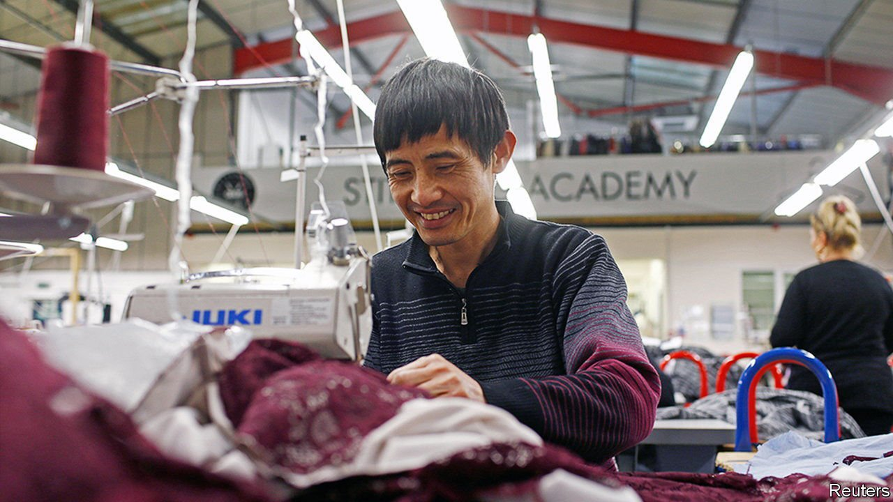
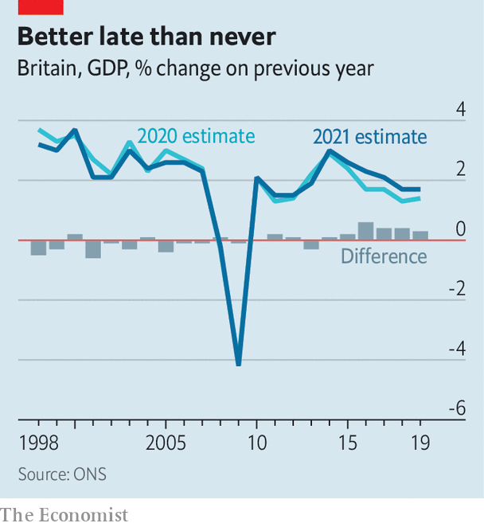

###### Economic statistics

# Statisticians make Britain’s productivity slowdown look less dramatic 

##### They have altered the way they calculate changes in output 

 

> Jul 3rd 2021 

FOR MORE than a decade, a productivity puzzle has baffled British economists. After the financial crisis of 2008, growth in labour productivity slowed around the globe, but Britain’s problems appeared particularly acute. On June 29th the Office for National Statistics (ONS) offered a partial solution to the mystery: mismeasurement.

Better methods for calculating changes in output have partially rewritten the past two-and-a-half decades of economic history. The ONS now reckons the economy grew slightly more slowly before the crisis than had been believed, and slightly faster since (see chart). As employment figures have not been revised, measured productivity growth is up, too. That explains away around a quarter of the apparent slowdown since 2008.


Some of the extra growth was uncovered by a new survey of financial services, which gives official statisticians a better view of output in a major sector of Britain’s economy. Income from fees and commissions that were once estimated can now be measured directly. More interesting and wide-ranging are the effects of “double deflation”. Calculating the real change in economic output means correcting for changing prices by using a price index, or “deflator”. Previously, British GDP data were calculated by applying a single deflator to each industry; now, the ONS has followed a trail blazed by some other statistical agencies and started to use different deflators for the inputs and outputs in each industry’s production process.

 


This transforms the statisticians’ view of clothing manufacturers, with average annual productivity revised upwards from 2.5% to 11.3%. But the effects have been most dramatic in the telecoms sector. Previously, the ONS reported average annual productivity growth of around 6% between 1997 and 2018, which was hard to square with the shift from dial-up modems to internet-enabled smartphones during that period. The new method raises that to an annual average of over 25%.

Not every part of the economy has been cast in a better light. The changes make some sectors look worse than before, and some of the faster growth now chalked up to those that look better has, in effect, been reallocated from others. Of the 66 industries tracked by the ONS, 39 have seen their productivity downgraded after the application of double deflation. Though manufacturing performed better than had been thought since 2008, the slowdown in some services now appears larger. But the overall picture is that Britain’s productivity puzzle is smaller than previously believed, and it no longer looks like a global outlier. ■

