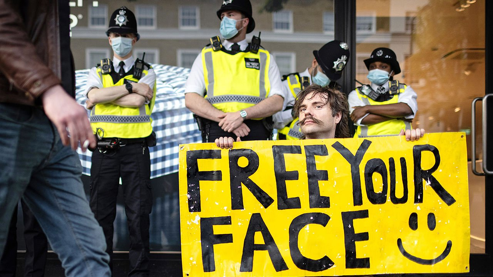

###### Opposites attract

# The anti-lockdown movement is still going strong 

##### It has united the anarchist left and anti-establishment right 

 

> Jul 3rd 2021 

JAM FOR FREEDOM pumps out Oasis and Bob Marley covers, but the band has a political mission too: to oppose covid-19 lockdowns. Young, racially diverse crowds gather to sing along to “We are the 99%”, its anthem. “Stick your poisonous vaccine up your arse,” go the lyrics. The “99%” refrain is borrowed from Occupy, a left-wing movement. But between songs some fans shout “Free Tommy”, a reference to Tommy Robinson, the former leader of the English Defence League, a right-wing group.

Throughout the pandemic opponents of lockdowns have held hundreds of protests, many motivated by a conspiracy theory also popular in America: that covid-19 was faked to provide an excuse for systematic regime change. Groupings include Stand Up X (which accuses Bill Gates, a billionaire philanthropist, of putting microchips in vaccines) and Teachers Against Abuse (set up to “protect children from the dangers and abuses of the covid regime”.) On June 26th several thousand protesters marched in London, and a crowd chanted abuse outside the home of Chris Whitty, England’s chief medical officer.


In America covid-19 conspiracists were backed by Donald Trump as president. In Britain they are countercultural. A poll on June 14th by YouGov found that 71% of English adults supported extending lockdown, with just 24% opposed. Vaccines, too, are hugely popular. Some 85% of adults have had a first shot, and 63% a second.

The delay of “Freedom Day”, which was supposed to see lockdown restrictions lifted almost entirely on June 21st, has probably been a boon for protesters. One says he was surprised by the number of vaccinated people joining in, either because they wanted to get back to normal or because they have become concerned about possible side-effects since being jabbed.

The protests attract both anarchist left and anti-establishment right. Piers Corbyn, the brother of Jeremy Corbyn, Labour’s former, far-left leader, has shared platforms with David Kurten, once a member of the United Kingdom Independence Party, a populist outfit that campaigned for Brexit, and now leader of the right-wing Heritage Party. Activists have united around “freedom”, discussing John Locke and Ayn Rand. Many incorrectly cite Magna Carta, a royal charter from 1215, as proof that government lockdowns are illegal. Some write an oath of allegiance to a baron in Scotland, which they claim absolves them from having to follow laws.

Many want their movement to grow into a libertarian opposition to the “Great Reset”. This is the name given by the World Economic Forum, the organisation that runs an annual talkfest for the world’s great and good at Davos in Switzerland, to the technocratic measures it champions to tackle emerging global problems. Its proposals include digital identification passes and policies to curb climate change. Some plan to campaign for a school voucher system, so parents can save their children from government indoctrination. A member of Jam for Freedom says the band aims to become “the alternative to the satanist paedophiles who run Hollywood”.

Protest movements survive when campaigners form tight friendships. Those opposing lockdowns needed to band together, says one activist, because they were “attacked by their friends and family, just for thinking critically”. Another says he has become close to people on both far left and far right, as well as to feminists who “write about the patriarchy, something that I have no interest in”. Even as lockdowns ease, he insists, the political barriers won’t go back up, because of a “growing understanding that there is a bigger thing happening” that needs to be opposed. “Ideological differences become relatively minor in the presence of a vast cover-up,” says Noam Yuchtman of the London School of Economics. “It makes you feel like you are part of a super-important club.” ■

Dig deeper

All our stories relating to the pandemic and the vaccines can be found on our . You can also listen to , our podcast on the race between injections and infections, and find trackers showing ,  and the virus’s spread across  and .

