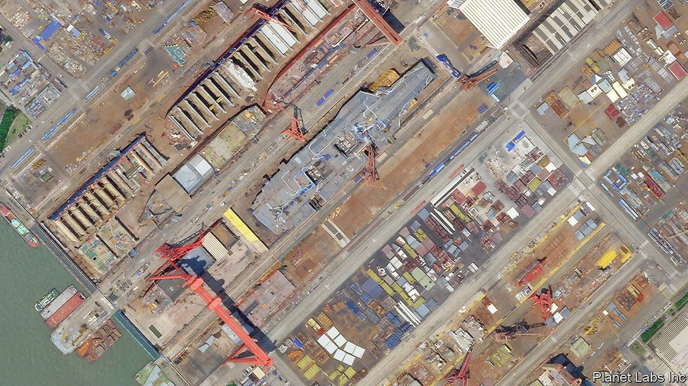

###### Carry that weight

# China’s next aircraft-carrier will be its biggest 

##### The Chinese navy is fast learning how to use them 

 

> Jul 1st 2021 

JIANGNAN SHIPYARD lies on an alluvial island at the mouth of the Yangzi river. It has grown rapidly since it moved there from nearby Shanghai in 2009, churning out destroyers, icebreakers and landing craft for the Chinese navy. The jewel in its crown is under construction. China is saying little about it, but satellite imagery reveals a near-complete flight deck in a corner of the yard where, less than 15 years ago, there was only farmland.

For now, the vessel-to-be is blandly known to military analysts as the Type 003. It will be China’s second domestically built aircraft-carrier and the largest ship that has ever served in the Chinese fleet. Experts at the Centre for Strategic and International Studies (CSIS), a think-tank in Washington, have analysed satellite pictures such as the one above, which was taken in June by Planet Labs, an American firm. They conclude that the ship will be about as long as New York’s Chrysler Building is high: about 320 metres. She will mark another leap forward in China’s advance as a naval power.


China got into the carrier game by an unusual route. In 1985 it bought a clapped-out Australian carrier for scrap, then spent years studying its design and putting its deck ashore for flying practice. Thirteen years later Chinese investors purchased a half-built Soviet carrier and towed it from Ukraine to China, purportedly to turn it into a floating casino. Instead it was refurbished by the navy and commissioned in 2012 as the Liaoning. That helped China to build a knock-off, the Shandong, which was commissioned in December 2019 and has been undergoing sea trials.

The Type 003 could be launched this year, state media say. But building carriers is not the same as sailing them. Flying planes off wobbly decks is hard. In America, thousands of jets and pilots were lost in the formative years of naval aviation. It is also difficult to keep a carrier safe from missiles and submarines, and to integrate one into a “strike group” of warships. “It’s taken us over 100 years to get that right,” noted an American admiral in September. China hopes to be quicker.

There are signs that it is upping the tempo. Last year the navy put both of its carriers to sea at the same time. In April the Liaoning sailed through the Miyako Strait, south of the Japanese island of Okinawa; exercised near Taiwan and in the South China Sea; and returned the same way. Its escorts included the Renhai-class destroyer, one of the world’s most capable ships of its kind, as well as a Fuyu-class support vessel, which can replenish carrier strike-groups far from home.

Some Western analysts are impressed by China’s progress. “Considering what they had to start with, they’ve done a very good job,” says Mark Montgomery, a retired American rear-admiral who commanded a carrier strike-group in the Pacific. China had little to go on, he says, other than “History Channel documentaries” and occasional glimpses of American carriers—back in friendlier times when Chinese sailors were given tours of American ships. Even so, a carrier designed in the early 1980s, and another based on it, hardly represent the cutting-edge of sea power. “I don’t worry from a US Navy point of view,” says Mr Montgomery. “These are just targets for our submarines.”

That is where the Type 003 comes in. CSIS reckons she is already 10 metres longer than her predecessors. She is likely to be the world’s largest non-American carrier for many years, says Rick Joe, who studies China’s armed forces, and “perhaps the most capable conventionally powered carrier of its era”. She will have a larger deck and room for more jets than the Shandong’s complement of around two dozen.

More important than the ship’s size is the way that planes will take off from her. The runways of both the Liaoning and the Shandong, like those of Britain’s newest carriers, are curved at their ends like ski jumps, which limits take-off weight. The Type 003 is expected to have a catapult, a system currently used only by America and France. This would allow her to launch planes with more fuel and weapons—and not just fighter jets. The existing carriers rely largely on land-based aircraft for vital tasks such as monitoring by airborne radar, anti-submarine warfare and aerial refuelling. The Type 003 could accommodate such planes, and thus venture farther.

The Chinese navy does not plan to stop there. It is widely assumed that the Type 003’s successor is being planned. It may be nuclear-powered. That would mark another step-change in capability. More fuel could be carried for planes, rather than for propulsion. The absence of a gas turbine would leave more room for weapons and cargo. A nuclear reactor could also power more potent catapults—ones that use electromagnetic induction motors, rather than steam—and, eventually, high-energy lasers for shooting down missiles.

Mastering these technologies and learning the craft of conducting high-intensity air operations at sea will take years. American carriers can launch and recover waves of 10-12 aircraft more than a dozen times a day. The Chinese navy is far from matching this pace. Its planes are lightly armed, even compared with European counterparts, says Alessio Patalano of King’s College London. “I’ve yet to see a single picture of a Chinese plane taking off from a deck with a full payload,” he says.

Yet the Chinese navy will get plenty of practice. America’s Indo-Pacific Command suggests that China will operate four carriers by 2025. British defence intelligence reckons that it may have as many as five by 2030. The expert consensus is that China plans eventually to build a fleet of somewhere between six and ten. That would put it within spitting distance of America’s fleet of 11, the world’s largest.

American and Chinese carriers are unlikely to be pitted against one another at close quarters. They would be targeted by missiles launched from hundreds if not thousands of kilometres away, from sea or land, long before their jets would clash. “China would not deploy its carriers in the front line,” says Hu Bo of Peking University. But, in peacetime, carriers are potent symbols of power. America’s dispatch of two towards the Taiwan Strait during an escalation of cross-strait tension in 1996 is seared in the memory of Chinese leaders. And carriers could help China to defeat a weaker adversary. The Liaoning’s prominent foray into the South China Sea hints at things to come. Carriers extend a protective aerial bubble over the ships around them. That allows their whole flotilla to patrol farther with confidence. The future air wing of the Type 003 will be almost as large as the entire air force of the Philippines.

And China’s sallies need not be confined to the Pacific—a large pier added this year to China’s naval base in the Red Sea port-state of Djibouti will allow Chinese carriers to dock there and thus make regular trips to the Indian Ocean. The Type 003 may be coming to a port near you. ■

