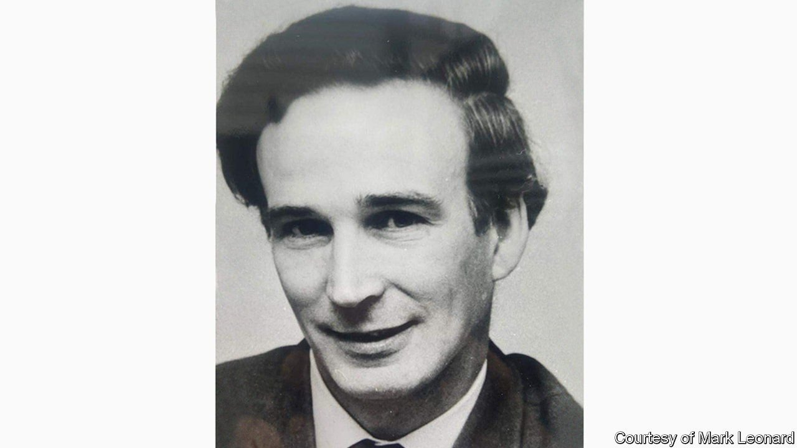

###### Mr Europe

# Dick Leonard remembered 

##### A Remainer departs 

 

> Jul 1st 2021 

THE BRITISH correspondents in Brussels in the two decades after Britain joined the European club were a talented lot. Two went on to edit The Economist, and one became editor of the Financial Times. Another wrote entertaining fiction for the Daily Telegraph and went on to be Britain’s current prime minister. Dick Leonard, neither a Eurosceptic nor destined to occupy Downing Street but “a true gentleman journalist”, as that Financial Times editor affectionately calls him, went on instead to write numerous books about every British prime minister from Walpole onwards.

Not that Dick lacked political ambitions of his own. He was the youngest candidate in Britain’s 1955 general election and an adviser to Tony Crosland, a Labour foreign secretary and influential intellectual of the party’s social-democratic wing. In 1970 Dick became the Labour MP for Romford, but the constituency’s boundaries soon changed, ending his career in Parliament prematurely. Breaking ranks with the party in 1971 to vote in favour of Britain joining the European Economic Community (the EEC, as it then was) in effect ruled him out as a candidate for another seat. At the time it was Labour, not the Tories, who found Europe toxic.


In other ways, too, Dick’s career shows how much has changed. After politics came journalism. He worked for this newspaper from 1974 to 1985, becoming our Brussels supremo. He then decided to remain in Brussels, where his wife worked as an academic, as a freelance correspondent for the Observer, among other publications. Back then, The Economist had a whole section devoted to the EEC. Though the appetite for detailed reporting from Brussels gradually diminished, the importance of understanding “Europe” did not: Dick’s authoritative “Guide to the European Union” is in its tenth edition.

Colleagues fondly recall a kind and modest man who was generous with sage advice. Quiet expertise on Europe may have gone out of fashion in Britain, but it is badly needed. It is also still valued by some, including Sir Keir Starmer, the current Labour leader—a friend of Dick’s and, just possibly, the next in the long line of British prime ministers he chronicled. The savvy psephologist in Dick would have recognised that prospect as having long odds; the natural optimist in him would surely have cherished the hope of defying them.

