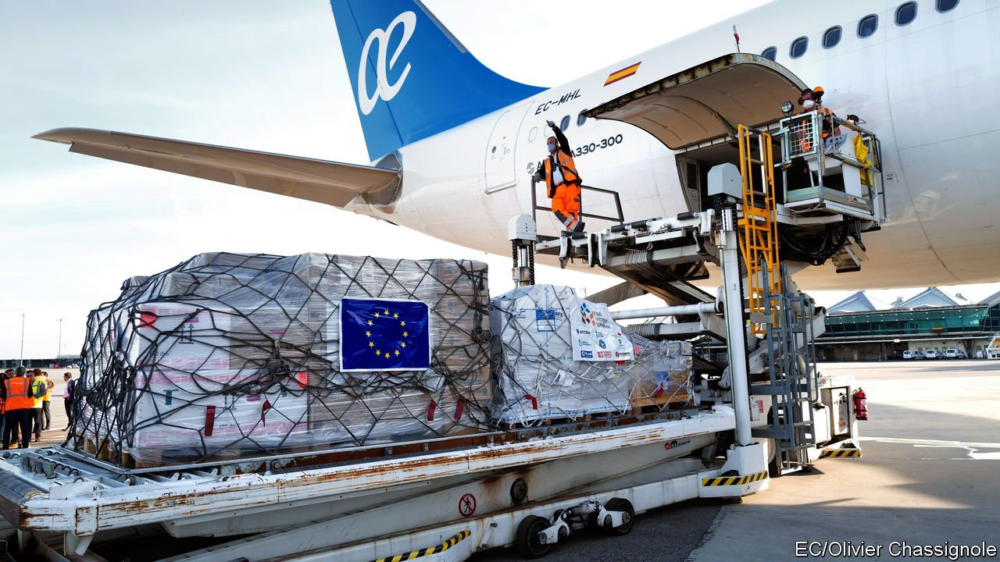
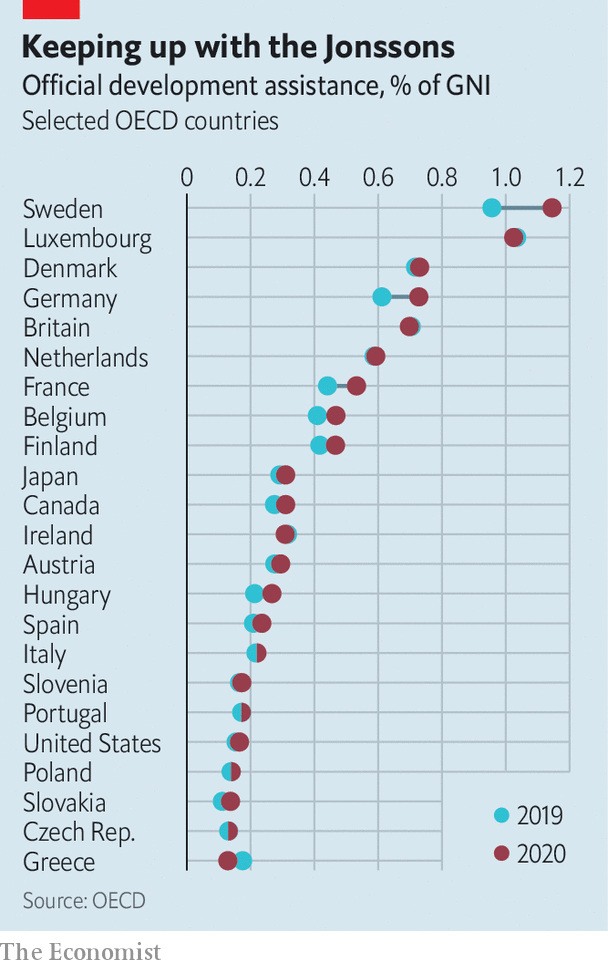

###### Unsustained development goals

# Foreign-aid champion Europe is giving more than ever 

##### But far too little to meet its promises and fight covid-19 

 

> Jul 1st 2021 

EUROPEAN COUNTRIES are the world’s most generous givers of foreign aid, or official development assistance (ODA). The EU and European governments donate close to half the global total. Populist parties tend to dislike foreign aid, and one might think that Europe’s rightward tilt would have caused it to drop. Indeed, aid did fall in the early 2010s during the euro-zone crisis, and again from 2017 to 2019. Yet in 2020 both global and European ODA rose to their highest levels ever: $161bn worldwide and $80bn from Europe.

Part of the reason was covid-19. EU members provided over $9bn in fresh pandemic-related aid to poor countries, mostly for health care. (Norway, not an EU member but one of Europe’s bigger donors, added a further $300m.) On average, European countries’ ODA rose to 0.5% of their gross national income (GNI). The average among all donor countries was 0.32%.


Yet that is far short of what they have promised. In 2015 the world’s wealthy countries signed up to the UN’s Sustainable Development Goals (SDGs), pledging to donate at least 0.7% of GNI to help poor countries meet a set of development targets by 2030. Only six donor countries met that benchmark in 2020, all of them European: Sweden, Norway, Luxembourg, Denmark, Germany and Britain. Boris Johnson’s plan to cut ODA to 0.5% of GNI means Britain will drop out of the club.

 


Even the more generous donors’ numbers can be misleading. Many countries count money spent on refugees who arrive in their territory as part of their foreign-aid budget. Sheltering refugees in Europe, however noble and necessary, does little for the countries they come from. Yet during the refugee crisis of 2015-16 this accounting trick made it look as though European ODA was rising. When refugee arrivals slowed, ODA seemed to drop again.

The refugee crisis led some European countries to shift aid towards preventing migration. This won support in unlikely quarters: in France, the hard-right National Rally party of Marine Le Pen backs aid as a way to keep Africans in Africa. But it leads to projects that poor countries do not need, and is unlikely to work. When people get richer they migrate more, because they can afford it. “Sadly, ODA is always more a reflection of the politics and society in donor countries rather than issues of need in developing countries,” says Andrew Sherriff of the European Centre for Development Policy Management.

ODA remains insufficient to achieve the SDGS’ targets, such as universal education and basic health care. The pandemic has made those goals harder to reach, keeping students out of school and interrupting childhood vaccination programmes. Donations to COVAX, an international vaccine fund, are far behind what is needed. And new foreign-aid commitments are tiny in comparison with the massive domestic spending that European countries have unleashed since covid-19 arrived. The EU set up a €750bn ($910bn) recovery fund for its members. No such fund exists for the world’s least-developed countries.

Sony Kapoor of Re-Define, a think-tank, advocates front-loading ODA by borrowing now against the future commitments donors have made. That could provide hundreds of billions of dollars to help poor countries vaccinate their populations and keep their kids in school. European voters may not be feeling generous at the moment, but increasing aid will seldom do as much good as it could now. ■

